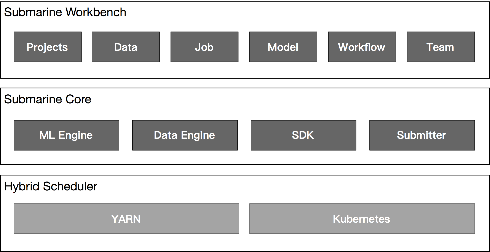

# Apache Submarine

> Cloud Native Machine Learning Platform
>
> Apache Submarine is a unified AI platform which allows engineers and data scientists to run Machine Learning and Deep Learning workload in distributed cluster.

在资源管理平台（如Yarn/K8s）运行深度学习框架（Tensorflow, PyTorch）的项目，覆盖整个机器学习的全过程：

**算法开发、模型批量训练、模型增量训练、模型在线服务和模型管理**；

- **数据预处理**：通过notebook中spark和python，进行数据预处理
- **机器学习**：支持多种机器学习框架用于模型训练
- **基础设施**：支持Yarn，K8s，Docker的资源调度


## RoadMap

2021/10/13日：当前Submarine，缺少模型管理的相关功能，还不能用于生产。


### 模型管理服务

模型服务，模型版本，模型监控


## 背景

- 手工建立机器学习算法模型并不容易：已经存在的算法库和预训练好的模型，以供复用；
- IDEs很难达到“你看到的就是想要的”效果：Notebooks（Zepplin或Jupyter），交互式代码、共享、可视化、调试等；
- ML应用难以迁移部署（复杂依赖）：容器化部署；
- 机器学习工程师很难学习碎片化的工具和库：主要的开源框架TF/Pytorch，以及进一步封装的Keras库；
- 不同的库构建的模型难以在一个机器学习pipeline中共用：企业级标准的机器学习框架TF/Pytorch/Keras共享，以及ONNX；
- 很难构建一个数据管道，将数据从原始数据源转换为 ML 应用程序所需的输入：开源大数据行业在为数据流、转换等提供、简化、统一流程和构建块方面发挥着重要作用


## 痛点

机器学习工作流程包含以下四部分：

```
1) From different data sources such as edge, clickstream, logs, etc.
   => Land to data lakes  
   
2) From data lake, data transformation: 
   => Data transformations: Cleanup, remove invalid rows/columns, 
                            select columns, sampling, split train/test
                            data-set, join table, etc.
   => Data prepared for training.
                            
3) From prepared data: 
   => Training, model hyper-parameter tuning, cross-validation, etc. 
   => Models saved to storage. 
   
4) From saved models: 
   => Model assurance, deployment, A/B testing, etc.
   => Model deployed for online serving or offline scoring.
```

通常数据科学家负责项目 2）- 4），1）通常由不同的团队处理（许多公司称为数据工程团队，一些数据工程团队还负责部分数据转换）

### 流程复杂/上线时间长

> 从原始数据到模型的复杂工作流程/步骤，不同步骤所需的不同工具，难以对工作流程进行更改，并且不防错

从原始数据到可用模型是一个复杂的工作流程，在与许多不同的数据科学家交谈后，我们了解到训练新模型并推送到生产的典型过程可能需要几个月到 1-2 年的时间。

- 数据转换需要像 Spark/Hive 这样的大规模工具和像 Pandas 这样的小工具；
- 模型训练需要在 XGBoost、Tensorflow、Keras、PyTorch 之间切换；
- 构建数据管道需要 Apache Airflow 、Oozie、Azkaban等。

有许多出色的标准化开源工具可以用于许多此类目的。但是，需要对数据管道的特定部分进行更改如何？在训练数据中添加几列用于实验如何？在投入生产之前，如何训练模型、将模型推送到验证、A/B 测试？**所有这些步骤都需要在不同的工具、UI 之间跳转，并且很难进行更改，并且在这些过程中无法防错**。

### 底层资源管理平台的依赖

机器学习平台所需的作业/服务能够运行，需要一个底层资源管理平台。资源管理平台有多种选择，各有优缺点。

- K8s 并没有对像 Spark/Flink/Hive 那样提供好的支持工作；
- 从 YARN 转移到 K8s 会存在差距和大量工作，维护一个单独的 K8s 集群也是基于 Hadoop 的数据基础设施的开销。

### 底层平台组件的交互

> 数据科学家被迫与较低级别的平台组件交互

数据科学家被迫学习底层平台知识，以便能够构建真实世界的机器学习工作流。

大多数数据科学家来说，他们是 ML 算法/库、特征工程等方面的专家。他们也最熟悉 Python、R，其中一些人了解 Spark、Hive 等。

如果他们被**要求与较低级别的组件进行交互**，例如微调 Spark 作业的性能；或因资源限制而无法启动故障排除作业；或编写 K8s/YARN 作业规范并安装卷，正确设置网络。他们会挠头，通常无法有效地执行这些操作。

### 遵守数据安全/治理要求


### 没有减少常规ML代码开发

数据准备好后，数据科学家需要做几项常规任务来构建 ML 管道。为了了解现有的数据集，通常需要对数据集进行拆分，对数据集进行统计。这些任务有一个共同的代码重复部分，这降低了数据科学家的效率。

**帮助开发人员促进 ML 管道开发的抽象层/框架可能很有价值**。这比开发者只需要填充回调函数来专注于他们的关键逻辑要好。


## 架构

     +-----------------------------------------------------------------+
     |            Submarine UI / CLI / REST API / SDK                  |
     |                 Mini-Submarine                                  |
     +-----------------------------------------------------------------+
    
     +--------------------Submarine Server-----------------------------+
     | +---------+ +---------+ +----------+ +----------+ +------------+|
     | |Data set | |Notebooks| |Experiment| |Models    | |Servings    ||
     | +---------+ +---------+ +----------+ +----------+ +------------+|
     |-----------------------------------------------------------------|
     |                                                                 |
     | +-----------------+ +-----------------+ +---------------------+ |
     | |Experiment       | |Compute Resource | |Other Management     | |
     | |Manager          | |   Manager       | |Services             | |
     | +-----------------+ +-----------------+ +---------------------+ |
     |   Spark, template              YARN/K8s/Docker                  |
     |   TF, PyTorch, pipeline                                         |
     |                                                                 |
     + +-----------------+                                             +
     | |Submarine Meta   |                                             |
     | |    Store        |                                             |
     | +-----------------+                                             |
     |                                                                 |
     +-----------------------------------------------------------------+
    
      (You can use http://stable.ascii-flow.appspot.com/#Draw to draw such diagrams)





### 角色

用户：单个数据科学家或者数据工程师，具备资源配额、认证等；

团队：用户属于一个或多个团队，团队对artifacts共享（如notebook、模型等）具备ACLS；

管理员：SRE，管理用户配额、认证、团队等；


## 设计与实现

### Environment

环境配置文件（或简称环境）定义了一组库和 Docker 映像，以便运行notebook和experiment。

- Docker镜像定义环境的基础层；
- 定义一组库（如Python/R）进行安装；
- 可以通过 CLI/SDK 添加/列出/删除/选择环境；


### Experiment

#### 设计

离线的任务，可以是Shell、R、Python 命令、Spark作业、SQL查询或者工作流。

- Experiments可以通过UI/CLI/SDK提交；
- Experiments可以通过UI/CLI/SDK进行监控和管理；
- Experiments不跟具体的资源管理平台绑定（如K8s/Yarn）；

##### Adhoc experiment

**目标：**

- 运行 adhoc 脚本；
- 在Yarn/K8s上运行TF/Pytorch程序；
- 作业可以访问HDFS/S3上的模型和数据；
- 通过简单配置，可以运行分布式的TF/Pytorch；
- 支持运行用户指定的Docker镜像；
- 支持自定GPU和其它资源；

##### Predefined experiment library

训练deepfm模型的示例：

```json
{
  "input": {
    "train_data": ["hdfs:///user/submarine/data/tr.libsvm"],
    "valid_data": ["hdfs:///user/submarine/data/va.libsvm"],
    "test_data": ["hdfs:///user/submarine/data/te.libsvm"],
    "type": "libsvm"
  },
  "output": {
    "save_model_dir": "hdfs:///user/submarine/deepfm",
    "metric": "auc"
  },
  "training": {
    "batch_size" : 512,
    "field_size": 39,
    "num_epochs": 3,
    "feature_size": 117581,
    ...
  }
}
```

**目标：**

- 预先定义的实验库可以用户共享（基于同一个平台）；
- 用户可以通过UI/REST API添加新的或者修改预定义的实验库；
- 支持AutoML，超参调优；

##### pipeline

**目标：**

- pipeline是experiments的DAG，被当作特殊类型的experiment；
- 用户可以提交/终止一个pipeline；
- pipeline可以通过UI/API继续宁创建和提交；

#### [实现](https://submarine.apache.org/docs/designDocs/environments-implementation/)


### Notebook

**目标**

- 用户可以创建/编辑/删除notebook；
- Notebooks可以被持久化，以便从错误中恢复；
- 用户可以追踪Notebook的历史版本；
- Notebook可以被不同的用户共享；
- 用户可以定义一个notebook的一组参数，运行像job那样执行单个notebook；
- 不同的用户可以同时协作同一个notebook；


### Server


### Model

**模型训练**：

- Submarine-SDK 提供跟踪/指标 API，允许开发人员从 Submarine Workbench UI 添加跟踪/指标和查看跟踪/指标。

  

**模型管理**：

- 模型工件由实验或notebook生成；
- 模型由来自一个或多个文件的artifacts组成；
- 用户可以选择保存、标记、打版本生成的模型；
- 模型保存后，用户可以对模型进行在线模型服务或离线评分；

**模型服务**

- 模型保存后，用户可以指定一个服务脚本、一个模型并创建一个Web服务来为模型提供服务；
- 通过 CLI/API/UI 管理（添加/停止）模型服务端点。


### Security

有 4 种对象需要访问控制：

- 资产属于 Submarine 系统，包括notebook、实验和结果、模型、预定义的实验库、环境配置文件。
- 数据安全。（谁拥有什么数据，每个用户可以访问什么数据）。
- 用户凭据。（如LDAP）。
- 其他安全性，例如 Git repo 访问等。

对于数据安全/用户凭证/其他安全，它将委托给第三方库，例如 Apache Ranger、IAM 角色等。

属于 Submarine 系统的资产将由 Submarine 自己处理。

**管理员操作**

- 管理员使用“用户管理系统”来加入新用户、上传用户凭据、分配资源配额等。
- 管理员可以创建新用户、新团队、更新用户/团队映射。或者删除用户/团队。
- 管理员可以设置用户的资源配额（如果与系统默认值不同）、权限、上传/更新必要的凭据（如 Kerberos 密钥表）。
- 如果 DE/DS 具有管理员访问权限，则 DE/DS 也可以是管理员。（就像特权用户一样）。当集群仅由用户共享或仅由小团队共享时，这将非常有用。
- `Resource Quota Management System`帮助管理员管理团队、组织的资源配额。资源可以是机器资源，如 CPU/内存/磁盘等。它还可以包括非机器资源，如基于 $$ 的预算。


### Storage

#### 设计

##### 数据集

- 需要标记数据集，这些数据集将用于训练并由不同用户跨平台共享。
- 对实际数据的访问将由 Apache Ranger / Hive Metastore 等 3rd 方系统处理，这超出了 Submarine 的范围。。

#### [实现](https://submarine.apache.org/docs/designDocs/storage-implementation/#implementation-considerations-for-ml-related-objects)


## 资源管理

### Yarn

对于Yarn的支持，采用TonY，其是LinkedIn开源的，在Hadoop上使用Tensorflow（具体见**深度学习框架**）。

### K8s


### HA


### Services Deployment
