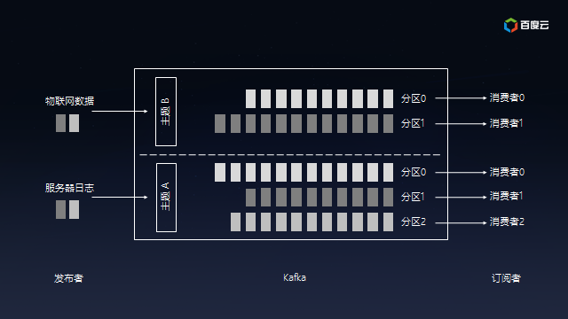

# Kafka

> 分布式流处理平台

流处理平台具有三个关键能力：

1. 发布和订阅消息(流)，在这方面，它类似于一个消息队列或企业消息系统。
2. 以容错(故障转移)的方式存储消息(流)。
3. 在消息流发生时处理它们。

## 场景

1. 构建实时的流数据管道，可靠地获取系统和应用程序之间的数据。
2. 构建实时流的应用程序，对数据流进行转换或反应。

## 术语

#### Topic

Kafka将消息分门别类，**每一类的消息称之为一个主题**（Topic）。

#### Producer

**发布消息**的对象称之为主题生产者（Kafka topic producer）。

#### Consumer

**订阅消息**并处理发布的消息的对象称之为主题消费者（consumers）。

#### Broker

已发布的消息保存在一组服务器中，称之为Kafka集群。集群中的每一个服务器都是一个代理（Broker）。 消费者可以订阅一个或多个主题（topic），并从Broker拉数据，从而消费这些已发布的消息。

#### Partition

produce发送的消息分发到不同的partition中，consumer接受数据的时候是按照group来接受：

- 在发送一条消息时，可以指定这条消息的key，Producer根据这个**key和Partition机制**来判断应该将这条消息发送到哪个Parition。
- kafka确保每个**partition只能同一个group中的同一个consumer消费**，如果想要重复消费，那么需要其他的组来消费。

## 架构

### Producer

### Consumer

### Streams

### Connectors

## 设计

### 日志Log

对于每个topic，Kafka集群都会维护一个分区log，就像下图中所示：

每一个分区都是一个顺序的、不可变的消息队列， 并且可以持续的添加。分区中的消息都被分了一个序列号，称之为偏移量(offset)，在每个分区中此偏移量都是唯一的。

### 存储

kafka 写数据：

- 基于 OS 层面的 Page Cache 来写数据；
- 采用磁盘顺序写的方式；

通过零拷贝技术，就不需要把 OS Cache 里的数据拷贝到应用缓存，再从应用缓存拷贝到 Socket 缓存了，两次拷贝都省略了，所以叫做零拷贝。

### 分区

