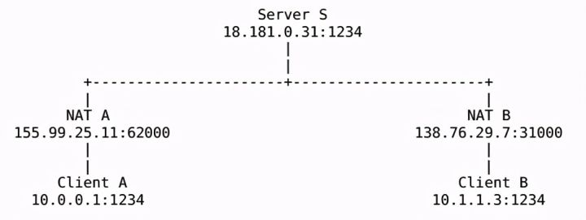

# 内网穿透

内网穿透，也即NAT穿透，为了使某一**特定源IP地址和源端口号的数据不被NAT设备屏蔽而正确路由到内网主机**。

## 目的

在任何地方，通过网络可以访问家里笔记本上的应用服务？

## 思路

- IP有两种，IPV4、IPV6；**只有IPV4会有内网穿透的情况**；
- **NAT**：一个区域内的所有设备连在一起并统一和主干道上其他区域设备联系，对外只共用一个公网IP来标识自己，对内则分配一些够用的私有地址；
- NAT做的事情：私有IP+端口《--》公网IP+端口
  - 识别一个连接只需5元组即可：`协议、源地址、源端口、目的地址、目的端口`
- 内网穿透，本质就是**对公网IP或者端口做文章**，从而实现自定义访问

### 购买公网ip

- 一台自己拥有的能够操作的、具有公网IP的机子A（物理机、虚拟机都可以）；
- 需要进行端口映射/转发，让本地局域网的机子和机子A建立联系，从而实现内网穿透；
- nat123、花生壳、frp、只要是类似的，都是这种模式：使用其他能操作的公网ip进行转发；

### 直连公网主机端口

- 一般情况下，NAT转换出去的端口是随机的，但你我们手机或电脑上玩的各种软件是可以和他们自己的服务器进行双向通信的；
- 在他们通信的时候，相互获取了**对方的公网IP+端口**（有些app是固定的域名）；
- p2p连接，还是VPN，只要是类似的，就是这种模式；
- 在两端都安装使用辅助的客户端才行（可以理解为获取对方地址相互连接，甚至还可以加密提高安全性）；

### UDP打洞（UDP hole punching）

P2P通信技术，被广泛采用的，名为“P2P打洞“。P2P打洞技术依赖于通常防火墙和cone NAT允许正当的P2P应用程序在中间件中打洞且与对方建立直接链接的特性。

- **只有当**两个NAT都是Cone NAT（或者非NAT的防火墙）时才能工作。

- 客户端A无法和客户端B直接建立一个UDP通信会话。如果A直接给B的公网地址138.76.29.7:31000发送UDP数据，NAT B将很可能会无视进入的数据（除非是Full Cone NAT），因为源地址和端口与S不匹配，而最初只与S建立过会话。B往A直接发信息也类似；
- 假设**A开始给B的公网地址发送UDP数据的同时**，给服务器S发送一个中继请求，**要求B开始给A的公网地址发送UDP信息**。A往B的输出信息会导致NAT A打开一个A的内网地址与与B的外网地址之间的新通讯会话，B往A亦然。一旦新的UDP会话在两个方向都打开之后，客户端A和客户端B就能直接通讯，而无须再通过引导服务器S了。

#### 如何获取NAT的外网地址和端口号？

Server通过登陆**消息的IP头和UDP头**得到该客户端的外网相关信息。

## 代理和转发

- **ip数据包经由路由转发的时候源ip，目的ip是不会改变的**；
- **NAT为特殊应用，会修改源IP为网关自己外网IP**；
- **代理会改源ip和目的ip**；
  - TOA功能的支持，主要原理是在4层TCP协议的options字段名中增加源IP和PORT信息。
  - 普通的c程序侦听时是基于tcp4协议，而go语言是基于tcp6

