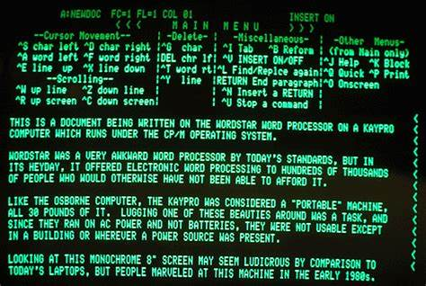

# 操作系统概述

> 讲义：https://jyywiki.cn/OS/2023/build/lect1.ipynb
>
> 课外书籍：**Operating Systems: Three Easy Pieces（V1.00）** 
>
> - [Preface 前言](./book_os_three_pieces/00-preface.pdf)
> - [第 1 章 - Dialogue on the Book](./book_os_three_pieces/01-dialogue-threeeasy.pdf)
> - [第 2 章 - Introduction to Operating Systems](./book_os_three_pieces/02-intro.pdf)
>
> 虚拟化：CPU 分时共享，虚拟化内存（虚拟地址空间）
>
> 并发：多线程
>
> 持久化：IO


本课程讨论**狭义的操作系统**

- 操作系统：硬件和软件的中间层
  - 对单机 (多处理器) 作出抽象
  - 支撑多个程序执行
- 学术界谈论的 “操作系统” 是更广义的 “System”
  - 例子：对多台计算机抽象 (分布式系统)


**操作系统：软件硬件之间的桥梁**

- 本课程中的软件：多线程 Linux 应用程序
- 本课程中的硬件：现代多处理器系统

------

(**设计/应用视角**) 操作系统为应用提供什么服务？

- **操作系统 = 对象 + API**
- 课程涉及：POSIX + 部分 Linux 特性

------

(**实现/硬件视角**) 如何实现操作系统提供的服务？

- **操作系统 = C 程序**
  - 完成初始化后就成为 interrupt/trap/fault handler
- 课程涉及：xv6, 自制迷你操作系统


## 历史发展

### ENIAC: 1946.2.14

“图灵机” 的数字电路实现

- 执行完一条指令后，可以根据结果跳转到任意一条指令 (用物理线路 “hard-wire”)
- 重编程需要重新接线：[Emulator](https://www.cs.drexel.edu/~bls96/eniac/) and [Programming the ENIAC](https://ieeexplore.ieee.org/stamp/stamp.jsp?tp=&arnumber=8467000)


### 1940s 

#### 计算机硬件

电子计算机的实现

- 逻辑门：[真空电子管](https://www.bilibili.com/video/av59005720)
- 存储器：延迟线 (delay lines)
- 输入/输出：打孔纸带/指示灯


#### 计算机软件

打印平方数、素数表、计算弹道

- 大家还在和真正的 “bugs” 战斗


#### 操作系统

> 没有操作系统。

能把程序放上去就很了不起了

- 程序直接用指令操作硬件
- 不需要画蛇添足的程序来管理它


### 1950S

更快更小的逻辑门 (晶体管)、更大的内存 (磁芯)、丰富的 I/O 设备

- I/O 设备的速度已经严重低于处理器的速度，**中断机制出现** (1953)


#### 计算机软件

更复杂的通用的数值计算

- 高级语言和 API 诞生 (Fortran, 1957)：一行代码，一张卡片
  - 80 行的规范沿用至今 (细节：打印机会印刷本行代码)


#### 计算机软件 (cont'd)

Fortran 已经 “足够好用”

- 自然科学、工程机械、军事……对计算机的需求暴涨

```
C---- THIS PROGRAM READS INPUT FROM THE CARD READER,
C---- 3 INTEGERS IN EACH CARD, CALCULATE AND OUTPUT
C---- THE SUM OF THEM.
  100 READ(5,10) I1, I2, I3
   10 FORMAT(3I5)
      IF (I1.EQ.0 .AND. I2.EQ.0 .AND. I3.EQ.0) GOTO 200
      ISUM = I1 + I2 + I3
      WRITE(6,20) I1, I2, I3, ISUM
   20 FORMAT(7HSUM OF , I5, 2H, , I5, 5H AND , I5,
     *   4H IS , I6)
      GOTO 100
  200 STOP
      END
```

#### 操作系统

> 库函数 + 管理程序排队运行的调度代码。

写程序 (戳纸带)、跑程序都是非常费事的

- 计算机非常贵 ($50,000−$1,000,000$50,000−$1,000,000)，一个学校只有一台

- 算力成为一种服务：**多用户轮流共享计算机**，hunman operator 负责调度

**操作系统的概念开始形成**

- 操作 (operate) 任务 (jobs) 的系统 (system)
  - “批处理系统” = 程序的自动切换 (换卡) + 库函数 API
  - Disk Operating Systems (DOS)
    - 操作系统中开始出现 “设备”、“文件”、“任务” 等对象和 API

### 1960S

#### 计算机硬件

集成电路、总线出现

- 更快的处理器
- 更快、更大的内存；虚拟存储出现
  - **可以同时载入多个程序而不用 “换卡” 了**
- 更丰富的 I/O 设备；完善的中断/异常机制


#### 计算机软件

更多的高级语言和编译器出现

- COBOL (1960), APL (1962), BASIC (1965)
  - Bill Gates 和 Paul Allen 在 1975 年实现了 Altair 8800 上的 BASIC 解释器

计算机科学家们已经在今天难以想象的计算力下开发惊奇的程序


#### 操作系统

> 能载入多个程序到内存且调度它们的管理程序。

为防止程序之间形成干扰，操作系统自然地将共享资源 (如设备) 以 API 形式管理起来

- 有了进程 (process) 的概念
- 进程在执行 I/O 时，可以将 CPU 让给另一个进程
  - 在多个地址空间隔离的程序之间**切换**
  - 虚拟存储使一个程序出 bug 不会 crash 整个系统

操作系统中自然地增加进程管理 API

- 既然可以在程序之间切换，为什么不让它们**定时切换**呢？
- Multics (MIT, 1965)：**现代分时操作系统**诞生

### 1970s+

#### 计算机硬件

集成电路空前发展，个人电脑兴起，“计算机” 已与今日无大异

- CISC 指令集；中断、I/O、异常、MMU、网络
- 个人计算机 (PC 机)、超级计算机……


#### 计算机软件

PASCAL (1970), C (1972), …

- 今天能办到的，那个时代已经都能办到了——上天入地、图像声音视频、人工智能……
- 个人开发者 (Geek Network) 走上舞台




#### 操作系统

> 分时系统走向成熟，UNIX 诞生并走向完善，奠定了现代操作系统的形态。

- 1973: 信号 API、管道 (对象)、grep (应用程序)
- 1983: BSD socket (对象)
- 1984: procfs (对象)……
- UNIX 衍生出的大家族
  - 1BSD (1977), GNU (1983), MacOS (1984), AIX (1986), Minix (1987), Windows (1985), Linux 0.01 (1991), Windows NT (1993), Debian (1996), Windows XP (2002), Ubuntu (2004), iOS (2007), Android (2008), Windows 10 (2015), ……


### 今天的操作系统

> 通过 “虚拟化” **硬件资源**为程序运行提供服务的软件。

空前复杂的系统之一

- 更复杂的处理器和内存
  - 非对称多处理器 (ARM big.LITTLE; Intel P/E-cores)
  - Non-uniform Memory Access (NUMA)
  - 更多的硬件机制 Intel-VT/AMD-V, TrustZone/~~SGX~~, TSX, ...
- 更多的设备和资源
  - 网卡、SSD、GPU、FPGA...
- 复杂的应用需求和应用环境
  - 服务器、个人电脑、智能手机、手表、手环、IoT/微控制器……

