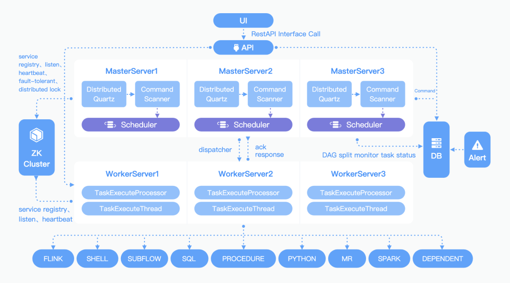

[toc]

# Apache Dolphin Scheduler

> 分布式易扩展的可视化DAG工作流任务调度系统。

以DAG的方式将Task组装起来，实时监控任务的运行状态，支持重试、从指定节点恢复失败、暂停和Kill任务等操作。

## 特性

- 可视化DAG，简单操作、实时查看，支持数万任务运行；
- 调用高可用，流程容错、失败重试、回滚、转移等；
- 丰富的任务类型，跨语言，自定义插件；
- 任务依赖，流程依赖；
- 任务日志/告警机制；
- 补数，数据重刷；

## 架构

