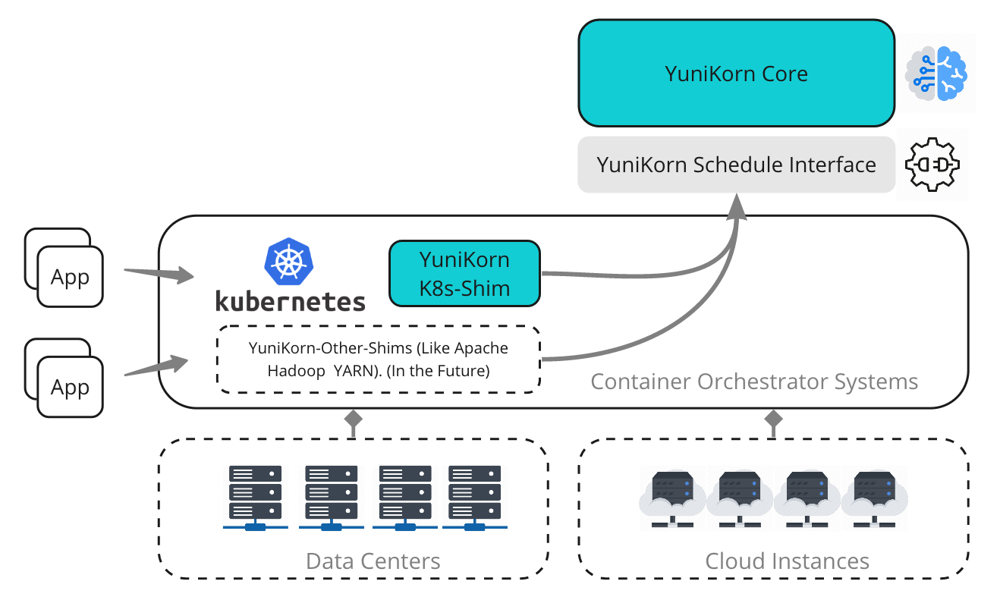

# Apache Yunikorn（Incubating）

> YuniKorn是对kubernetes 服务和批任务负载的调度增强。YuniKorn能够代替Kubernetes默认的调度器

***2022/11/25***

Cloudera发起并开源的项目，定位于跨平台的通用调度器，当前可以支持Kubernetes，YARN的支持还在开发中。

## 功能

- **调度能力**：内置全面的调度功能，包括层次队列、 跨队列的资源公平性、作业排序 (FIFO/FAIR)、 可插拔节点排序策略、抢占等。
- **K8s资源调度器**：完全兼容 K8s，是默认 K8s 调度的替代方案，但功能更强大。 对现有的 K8s 应用程序完全透明。
- **云原生**：支持本地和云端用例，在云上运行时，它与弹性伸缩控制器共同协作，以带来最大的资源弹性和更好的吞吐量。

### 应用感知调度

识别用户、作业或者队列，并在做出调度决策时，考虑更多与它们相关的因素，如资源、排序等。

能够对资源配额、资源公平性和优先级进行细粒度控制，这是多租户计算系统最重要的需求。

### 层次资源队列

队列的层次结构可以在逻辑上映射到组织结构。这为不同租户提供了对资源的细粒度控制。

最小/最大队列容量来为每个租户设定其弹性资源配额。

### 作业排序和排队

**排序策略**决定哪个应用程序可以首先获得资源，如果剩余的容量不够，它们可以排队等待，直到释放一些资源。简化客户端操作。

### 资源公平性

### 资源预留

**自动为未完成的请求进行资源预留**，避免这个 Pod 需要的资源被后来提交的更小的、更不挑剔的 Pod 所挤占。 

在批处理工作负载场景中非常重要，因为当对**集群提交大量异构 Pod 时，很有可能一些 Pod 会处于“饥饿”状态**，即使它们提交得更早。

### 吞吐量

与默认调度程序相比，YuniKorn实现了2 倍~4 倍的性能提升。

## 架构



### TODO(https://yunikorn.apache.org/zh-cn/docs/next/design/architecture)

## 安装

### 部署模式

> 插件模式还未达到标准模式的成熟度

- ***标准模式*** ：YuniKorn作为自定义模式运行Kubernetes调度程序
- ***插件模式*** ：YuniKorn被实现为默认Kubernetes调度框架之上的一组插件。

建议同时**运行准入控制器(admin controller)**，这会确保只有一个调度程序在Kubernetes集群中处于活动状态。

当准入控制器运行时，所有pod将会绕过Kubernetes的默认调度器，除了YuniKorn本身的pod。

### helm 安装

- 默认安装`scheduler`、`web-server`、`admission-controller`，采用标准模式；
- `enableSchedulerPlugin`配置设置为`true`，采用插件模式；

```shell
helm repo add yunikorn https://apache.github.io/yunikorn-release
helm repo update
kubectl create namespace yunikorn
helm install yunikorn yunikorn/yunikorn --namespace yunikorn
```


## 指导（TODO）

https://yunikorn.apache.org/zh-cn/docs/next/user_guide/usergroup_resolution

### GangScheduling


## 使用

### Spark On K8s with Yunikorn(TODO)
