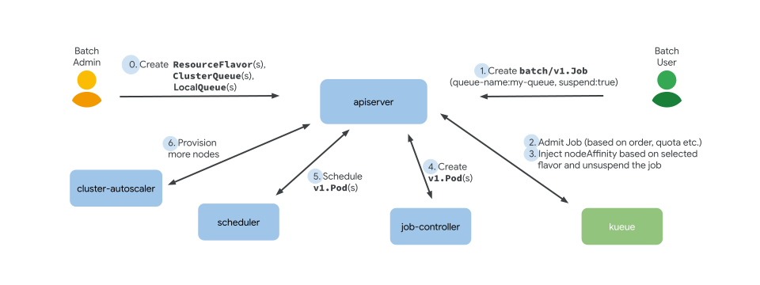

# [Kueue](https://kueue.sigs.k8s.io/)

> Kueue is a kubernetes-native system that manages quotas and how jobs consume them. Kueue decides when a job should wait, when a job should be admitted to start (as in pods can be created) and when a job should be preempted (as in active pods should be deleted).

功能：

- 作业（Job）管理
- 资源管理
- 动态资源回收：
- 集成性：内置支持多种 Jobs，如 BatchJob, Kubeflow training Job, RayJob 等；

## 框架



### Resource Flavor

> An object that you can define to describe what resources are available in a cluster.

用于表示异构的资源（并不实际定义资源，只是用来区分异构的资源节点）：

- `spec.nodeLabels`：将资源跟节点关联；

```yaml
apiVersion: kueue.x-k8s.io/v1beta1
kind: ResourceFlavor
metadata:
  name: "spot"
spec:
  # 资源关联的节点的标签
  nodeLabels:
    instance-type: spot
  # 资源关联的节点的污点，Workload PodSet必须能够容忍这些污点，才可以调度到节点上
  nodeTaints:
  - effect: NoSchedule
    key: spot
    value: "true"
  // extra tolerations that will be added to the pods 
  tolerations:
  - key: "spot-taint"
    operator: "Exists"
    effect: "NoSchedule"
```

kueue 会对 Workload 的 Yaml （如 `batch.v1/job`）进行修改，添加`nodeLabels`/`nodeTaints`。

### Cluster Queue

> A cluster-scoped resource that governs a pool of resources, defining usage limits and fair sharing rules.

为一个或多个 ResourceFlavor 设置配额来定义资源池。

```yaml
apiVersion: kueue.x-k8s.io/v1alpha2
kind: ClusterQueue
metadata:
  name: research-pool
spec:
  namespaceSelector: {}
  resourceGroups:
  - coveredResources: ["cpu", "memory", "pods"]
    flavors:
    # 对应ResourceFlavor中的metadata.name，
    # 按顺序分配，如果先前允许的作业消耗了所有现有的 on-demand 配额，但不是所有的 spot 配额，则 Kueue 会使用 spot 配额来允许作业
    - name: ondemand
      # 定义可用的资源大小，如 cpu,memory,pods,quota
      resources:
      - name: "cpu"
        nominalQuota: 9
      - name: "memory"
        nominalQuota: 36Gi
      - name: "pods"
        nominalQuota: 5
    - name: spot
      resources:
      - name: "cpu"
        nominalQuota: 18
      - name: "memory"
        nominalQuota: 72Gi
      - name: "pods"
        nominalQuota: 100
```

资源借用：

- `spec.cohort`：ClusterQueue 属于同一个 cohort 的可以互相借用未使用的资源；
- `spec.resourceGroups[].resources[]`
  - `borrowingLimit`：定义可以借用的最大限制
  - `lendingLimit`：定义可以借出去的最大限制

### Local Queue

> A namespaced resource that groups closely related workloads belonging to a single tenant.

`LocalQueue`的定义如下所示：指向 ClusterQueue，给租户使用；

```yaml
apiVersion: kueue.x-k8s.io/v1beta1
kind: LocalQueue
metadata:
  namespace: team-a 
  name: team-a-queue
spec:
  clusterQueue: cluster-queue 
```

### Workload

工作负载，如 `batch/v1.job`

- Kueue does not directly manipulate Job objects. Instead, Kueue manages Workload objects that represent the resource requirements of an arbitrary workload
-  Kueue **automatically creates a Workload for each Job object** and syncs the decisions and statuses.

```yaml
apiVersion: kueue.x-k8s.io/v1beta1
kind: Workload
metadata:
  name: sample-job
  namespace: team-a
spec:
  active: true
  # LocalQueue name
  queueName: team-a-queue
  podSets:
  - count: 3
    name: main
    template:
      spec:
        containers:
        - image: gcr.io/k8s-staging-perf-tests/sleep:latest
          imagePullPolicy: Always
          name: container
          resources:
            requests:
              cpu: "1"
              memory: 200Mi
        restartPolicy: Never
```

