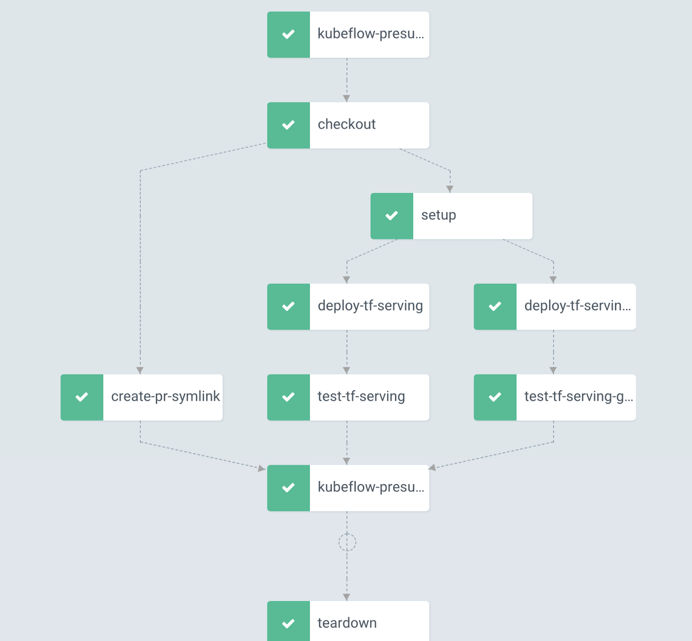

# 工作流引擎

## Argo Workflow

>  an open source container-native workflow engine for orchestrating parallel jobs on Kubernetes.

是一个云原生工作流引擎，专注于**编排并行任务**。它的特点如下：

1. 使用 Kubernetes 自定义资源(CR)定义工作流，其中工作流中的每个步骤都是一个容器。
2. 将多步骤工作流建模为一系列任务，或者使用有向无环图（DAG）描述任务之间的依赖关系。
3. 可以在短时间内轻松运行用于机器学习或数据处理的计算密集型作业。
4. argo workflows 可以看作 Tekton 的加强版，因此显然也可以通过 argo workflows 运行 CI/CD 流水线(Pipielines)。

Argo workflows 则**假设「任务」之间是有依赖关系**的，针对这个依赖关系，它提供了两种协调编排「任务」的方法：Steps 和 DAG。

可以根据用户提交的编排模板，很容易的构建出一个有相互依赖关系的工作流。Argo Workflow 就可以处理这些依赖关系，并且按照用户设定的顺序依次运行。



### 功能

#### 分类

> 当 Workflow （前端/后端/测试等）越来越多的时候，如果不做分类，一堆 WorkflowTemplate 堆在一起就会显得特别混乱。

通过 **namespace / labels** 进行分类。

#### 触发

- 手动触发：手动提交一个 Workflow

- 定时触发：[CronWorkflow](https://argoproj.github.io/argo-workflows/cron-workflows/)
- 通过 Git 仓库变更触发：借助 [argo-events](https://github.com/argoproj/argo-events) 可以实现此功能，详见其文档

#### secrets 管理

流水线，可以从 kubernetes secrets/configmap 中获取信息(Git 私钥、Harbor 仓库凭据、CD 需要的 kubeconfig)，将信息注入到环境变量中、或者以文件形式挂载到 Pod 中。

#### Artifacts

支持接入对象存储，做全局的 Artifact 仓库，本地可以使用 MinIO.

#### 镜像构建

Kaniko 对构建缓存的支持也很好，可以直接将缓存存储在容器镜像仓库中。


### 自定义资源

#### [Workflow](https://argoproj.github.io/argo-workflows/fields/#workflow)


### 示例

#### CLI

提交运行

```shell
$ argo submit -n argo --watch https://raw.githubusercontent.com/argoproj/argo-workflows/master/examples/hello-world.yaml
```

`hello-world.yaml`如下：

```yaml
apiVersion: argoproj.io/v1alpha1
kind: Workflow
metadata:
  generateName: hello-world-
  labels:
    workflows.argoproj.io/archive-strategy: "false"
  annotations:
    workflows.argoproj.io/description: |
      This is a simple hello world example.
      You can also run it in Python: https://couler-proj.github.io/couler/examples/#hello-world
spec:
  entrypoint: whalesay
  templates:
  - name: whalesay
    container:
      image: docker/whalesay:latest
      command: [cowsay]
      args: ["hello world"]
```


## [Tekton Pipelines](https://tekton.dev/)


## [Apache Airflow](https://airflow.apache.org/)


## [Couler](https://couler-proj.github.io/couler/)

> a unified interface for constructing and managing workflows on different workflow engines, such as [Argo Workflows](https://github.com/argoproj/argo), [Tekton Pipelines](https://tekton.dev/), and [Apache Airflow](https://airflow.apache.org/).


## 示例

```python
import couler.argo as couler
from couler.argo_submitter import ArgoSubmitter

couler.run_container(
    image="docker/whalesay", command=["cowsay"], args=["hello world"]
)

submitter = ArgoSubmitter()
result = couler.run(submitter=submitter)
```

