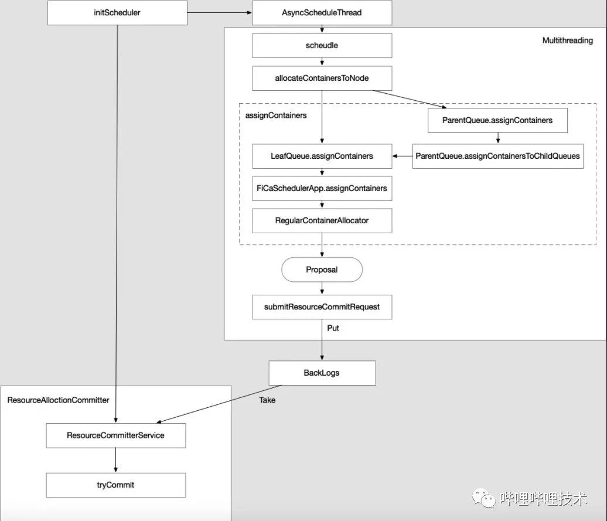

# Yarn实战优化

[Apache YARN 在 B 站的优化实践](https://mp.weixin.qq.com/s/kXp7Am02TwQeSPlT3ybEEg)

## RM调度优化

Yarn调度逻辑伪码：（TODO：Check）

- 调度锁的占用时间过长，

```java
scheduler.lock
sortNodes;
for( node : Nodes ) {
   sortQueues;
   for (queue : Queues) {
     sortApps;
     assignContainer;
   }
}
scheduler.unlock
```

心跳驱动调度（Heartbeat-Driven Scheduler）：RM管控的节点数量超过4000，无法将集群的利用率持续打满

优化思路：[Global Scheduling，YARN-5139，未解决](https://issues.apache.org/jira/browse/YARN-5139)

- 多线程调度：“提出Proposal”（多线程）、“消费Proposal”（单线程）
- 批量节点调度



## 