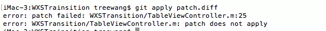
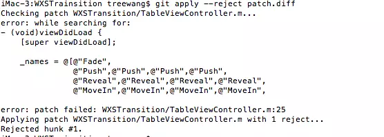

# Git Patch & Diff

Git 提供两种补丁方案：

- git diff 生成的 UNIX 标准补丁 .diff 文件：
  - .diff文件只是记录文件改变的内容，不带有commit记录信息，多个commit可以合并成一个diff文件。
- git format-patch生成的Git专用.patch 文件：
  - .patch文件带有记录文件改变的内容，也带有commit记录信息，**每个commit对应一个patch文件**。


## Git Patch

**某次提交的patch**

```shell
git format-patch [commit sha1 id] -1
```

**某两次提交（含）之间的所有patch**

```objectivec
git format-patch [commit sha1 id]..[commit sha1 id]
```


## Git Diff

```shell
git diff [commit id 1] [commit id 2] > [diff文件名]
```

"-"号开头的表示 `commit-id-2` 相对 `commit-id-1` 减少了的内容。
"+"号开头的表示 `commit-id-2` 相对 `commit-id-1` 增加了的内容。


## 应用Patch或Diff

**检查patch/diff是否能正常打入:**

```undefined
git apply --check [path/to/xxx.patch]
git apply --check [path/to/xxx.diff]
```

**打入patch/diff**：

```undefined
git apply [path/to/xxx.patch]
git apply [path/to/xxx.diff]
```


## 冲突解决

打补丁过程中可能会出现冲突的情况，显示打入失败，如图：



解决冲突：

1. 使用 以下命令行，自动合入 patch 中不冲突的代码改动，同时保留冲突的部分：

   ```shell
   git  apply --reject  xxxx.patch
   ```

   可以在终端中显示出冲突的大致代码：

   

   同时会生成后缀为 .rej 的文件，保存没有合并进去的部分的内容，可以参考这个进行冲突解决（可以重新生成patch文件，或者执行后续等手工修改rej文件）

2. 解决完冲突后删除后缀为 .rej 的文件，并执行`git add.`添加改动到暂存区；

3. 接着执行`git am --resolved`或者`git am --continue`

**说明：在打入patch冲突时，可以执行`git am --skip`跳过此次冲突，也可以执行`git am --abort`回退打入patch的动作，还原到操作前的状态。**