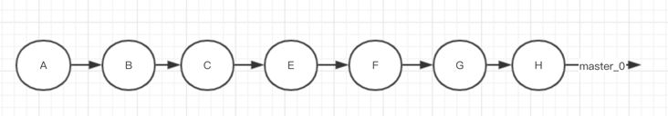
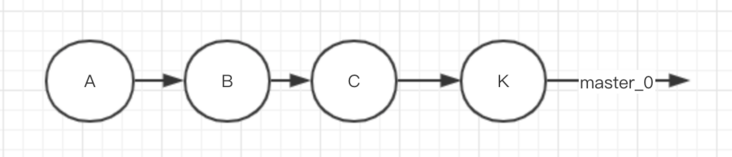
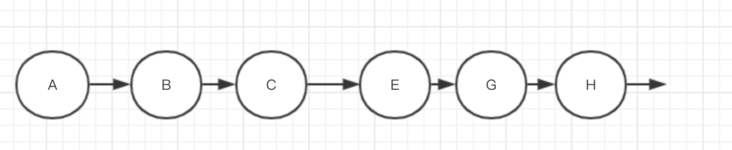

[toc]

# Git

## rebase

两个分支master和feature，其中feature是在提交点B处从master上拉出的分支

master上有一个新提交M，feature上有两个新提交C和D


把master分支合并到feature分支（这一步的场景就可以类比为我们在自己的分支feature上开发了一段时间了，准备从主干master上拉一下最新改动）

```shell
git checkout feature
git rebase master

# 这两条命令等价于git rebase master feature
```

下图为变基后的提交节点图，解释一下其工作原理：


- feature：待变基分支、当前分支
- master：基分支、目标分支

当执行rebase操作时，git会从两个分支的共同祖先开始提取待变基分支上的修改，然后将待变基分支指向基分支的最新提交，最后将刚才提取的修改应用到基分支的最新提交的后面。


拉公共分支最新代码的时候使用rebase，往公共分支上合代码的时候，使用merge。


## 命令

```shell
git checkout name #进入name的branch
```

### clone

```shell
# 克隆<branch>分支，只包含最新的一个的commit
git clone -b <branch> <remote_repo> --depth=1
```

### branch

```shell
git branch name  #创建名为name的branch
git branch <new-branch-name> <tag-name> #基于tag创建branch
git branch -d name #删除本地分支name
git branch -m A B #将A分支重命名为B
```

### tag

```shell
git tag name -m "infos" 	#创建名为name的tag
git tag -d name             #删除本地名为name的tag
```

### pull

```shell
# 取回origin主机的next分支，与本地的master分支合并，需要写成下面这样。
git pull origin next:master
```

### push

```shell
git push origin name  #将name的tag push到远端
git push origin :name #删除远程分支name
git push origin --delete tag <tagname>  #删除远端的tag
```

### cherry-pick

git cherry-pick可以理解为”挑拣”提交，它会获取某一个分支的单笔提交，并作为一个新的提交引入到你当前分支上。 当我们需要在本地合入其他分支的提交时，如果我们不想对整个分支进行合并，而是**只想将某一次提交合入到本地当前分支上，那么就要使用git cherry-pick**。

例如要将A分支的一个commit合并到B分支：

首先切换到A分支

- git checkout A
- git log

找出要合并的commit ID :

例如  0128660c08e325d410cb845616af355c0c19c6fe

然后切换到B分支上

- git checkout B

- git cherry-pick  0128660c08e325d410cb845616af355c0c19c6fe

然后就将A分支的某个commit合并到了B分支了

### merge

```shell
git merge dev         # 将所在分支和dev分支合并
```


在 merge pull request 的时候，默认是有三种选项的，分别是

- 普通的 merge (**fast-forward**)
  - 别人的commit记录会以此出现




 


- squash merge （ git merge --squash devel ）
  - 别人的多个commit记录会合并成一个未提交的修改，需要手工commit（无法保留原作者信息）




- rebase merge（git上的merge request中的squash commit）
  - 先切换到 devel 分支（不一样咯）：git checkout devel
  - 变基：git rebase -i master
  - 切换回目标分支：git checkout master
  - 合并: git merge devel
  - （H）是合并的merge记录。





### ignore

```shell
# git ignore不生效，因为文件之前加入了版本控制中，需要将该文件删除，先把本地缓存删除（改变成未track状态），然后再提交：
git rm -r --cached .
git add .
git commit -m 'update .gitignore'

# .gitkeep文件：因为Git会忽略空的文件夹，但是文件夹内有内容，则会纳入版本控制，.gitkeep名字只是习惯；
```

### config

```shell
# git代理的配置
git config --global  http.sslVerify  false
git config --global http.proxy $$ 
git config --global https.proxy $$ 
git config --global url.https://github.com/.insteadOf git://github.com/
```

.git/config中添加

```ini
# 保存用户名和密码
[credential]
helper = store

```

