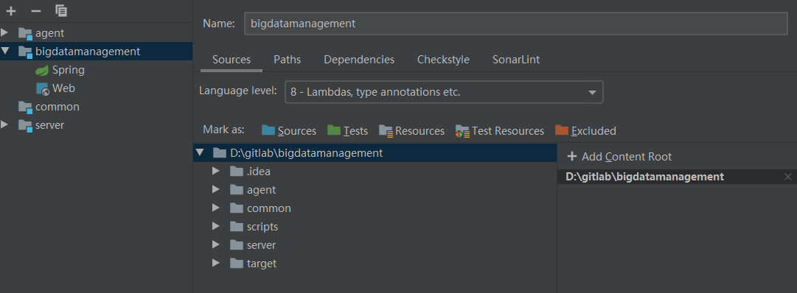

[toc]

# Jetbrain

## IDEA

**maven helper** 

- 查看 maven树形依赖以及冲突。

**SequenceDiagram**

- 自动生成项目调用的时序图

**BytecodeViewer、jclasslib** 

- 字节码查看器

**Edit Bytecode**

- 字节码编辑工具：

**Statistic**

- 代码行数、注释行数统计工具；


## CLION

### include第三方头文件

如jni.h，需要在CMakeList.txt中包含，注意空格和引号

include_directories("D:/Program Files/Java/jdk1.8.0_211/include")

include_directories("D:/Program Files/Java/jdk1.8.0_211/include/win32")

 

## PyCharm

- pycharm添加文件头注释

File->settings->Editor->File and Code Templates->Python Script

添加以下代码：

```python
#!/usr/bin/env python
# -*- coding: utf-8 -*-
# @Time  : ${DATE} ${TIME}
# @Author : Aries
# @Site  : ${SITE}
# @File  : ${NAME}.py
# @Software: ${PRODUCT_NAME}
```


## 问题

### 运行Test，不生成对应的测试代码，报Class Not Found！

在多项目结构中，注意父pom（packaging是pom）的配置，不应该配置`source`等，更不能跟server等子module一样。


