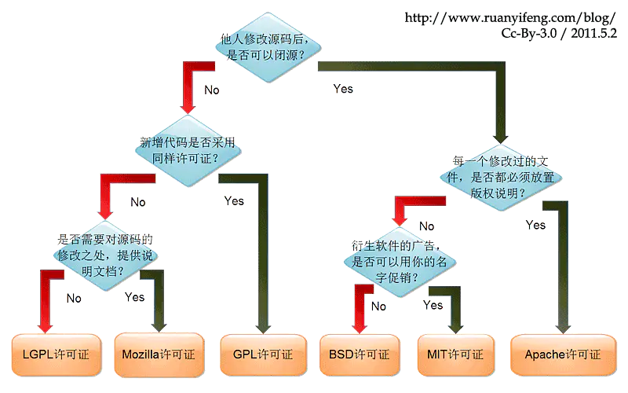

[toc]

# 开源协议说明

## AGPL 协议（Affero General Public License）

GPL（2.x ~ 3.x） 协议还有一个非常大的“漏洞”，就是软件“发布” 才必须开源。也就是说，我的软件不发布，即使使用 GPL (2.x ~ 3.x) 也可以不用开源。

在GPL上增加一条限制：**如果使用AGPL许可的软件与用户通过网络进行交互，也需要提供源代码给用户，所有的修改也要给用户。**