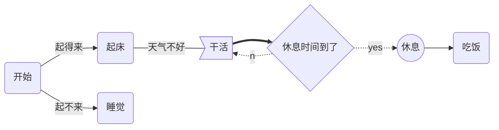
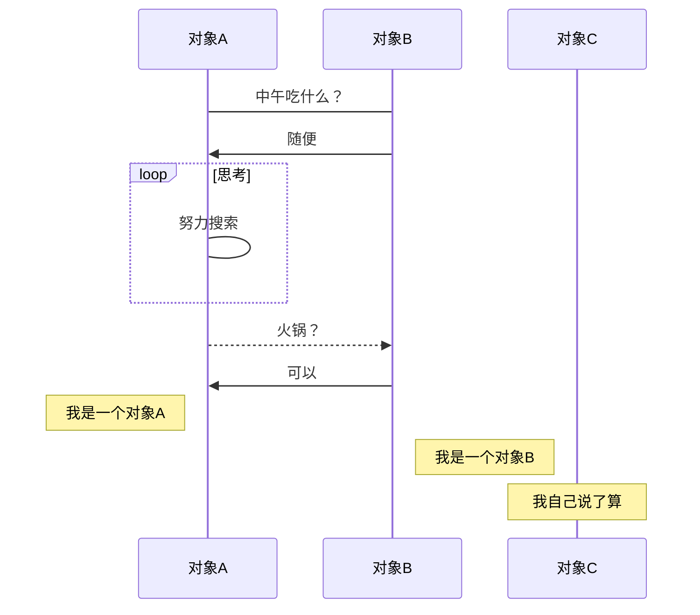

# mermaid

## 流程图

基本语法：

- `graph` 指定流程图方向：`graph LR` 横向，`graph TD` 纵向
- 元素的形状定义：
  - `id[描述]` 以**直角**矩形绘制
  - `id(描述)` 以**圆角**矩形绘制
  - `id{描述}` 以**菱形**绘制
  - `id>描述]` 以**不对称矩形**绘制
  - `id((描述))` 以**圆形**绘制
- 线条定义：
  - `A-->B` 带箭头指向
  - `A---B` 不带箭头连接
  - `A-.-B` 虚线连接
  - `A-.->B` 虚线指向
  - `A==>B` 加粗箭头指向
  - `A--描述---B` 不带箭头指向并在线段中间添加描述
  - `A--描述-->B` 带描述的箭头指向
  - `A-.描述.->B` 带描述的虚线连指向
  - `A==描述==>B` 带描述的加粗箭头指向

## 时序图

线段样式

- `->` ： 实线连接
- `-->` ：虚线连接
- `->>` ：实线箭头指向
- `-->>` ：虚线箭头指向

