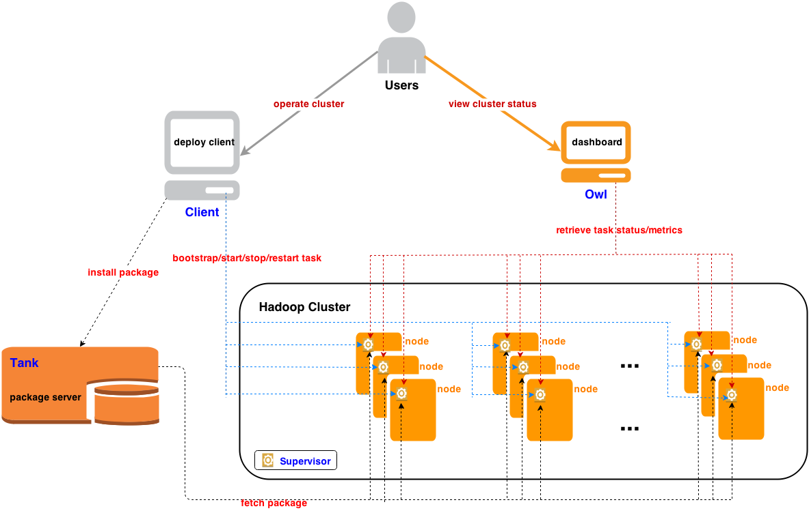

# MinOS

> 小米的集群监控和管理工具。
>
> Minos is a distributed deployment and monitoring system.

https://github.com/XiaoMi/minos

- 由小米大数据团队自主研发，免费、开源
- 不强制要求布署为系统服务，能够灵活支持同机多实例
- 灵活便捷的包管理，对开发团队更为友好
- 直观的WebUI Dashboard，方便的Command Line Tool
- 抽象出service/job/task的概念，直观的配置文件描述
- 既支持集群级别的管理，也支持指定job/task级别的管理
- 支持一键安装，方便用户使用
- 方便扩展支持其它服务: Minos is beyond a hadoop deployment system!

## 架构



**Client**

- 命令行工具，集群管理入口

**Tank**

- 包管理服务器
- Revision No, Timestamp, Package Name唯一标识Package

**Supervisor**

- 进程管理与监控服务器
- 基于开源的Supervisor(http://supervisord.org/)二次开发（supervisor重启可以恢复已有进程监控（通过文件）的功能）
- 通过xmlrpc通信，不再依赖ssh

**Owl**

- Metrics收集，存储，展示
- 存储基于Opentsdb(http://opentsdb.net/)，具有强大的线型扩展性

## 安装

```shell
./build.sh build
```

1. call build_virtualenv.sh

2. call virtual_bootstrap.sh：创建 Python 的 virtual env，安装目录的python目录；

3. call build.py


编译和启动 tank

```shell
./build.sh start tank --tank_ip 172.16.2.125 --tank_port 8086
```

1. call build_tank.py
