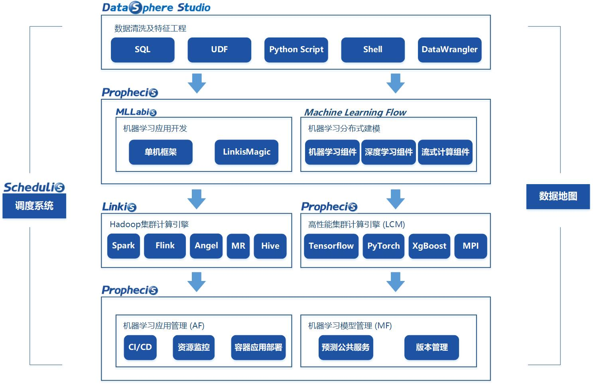
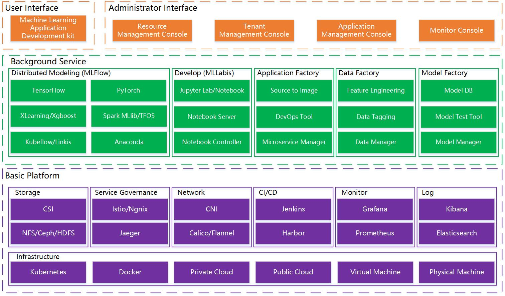

# Prophecis

## 架构

### MachineLearningFlow

- 分布式机器学习模型工具，单机和分布式模式的模型训练函数；

- 机器学习模型到部署的全流水线；
- 支持Tensorflow，Python，XGBoost等机器学习框架；

### MLLabis

- 机器学习开发和探索工具；
- 基于Jupyter Lab的在线IDE；
- 支持GPU和Hadoop集群，支持R、Python、Julia，以及Debug和TensorBoard插件；

### Model Factory

- 模型存储，模型部署，AB 测试，模型管理等服务；

### Data Factory

- 特征工程工具，数据标签工具，物料管理等；

### Application Factory

- 基于青云的开源系统KubeSphere定制开发，提供CI/CD和DevOps工具，GPU集群监控和预警功能。

## cc

### configcenter(cc)

### cc-gateway

/cc  => controllercenter

/aide  => aide

/di => di-restapi

/mf => mf  (model factory：当前还未提供)

路由注册的原理，认证的原理，

## di

### trainingdata

### trainer

### storage

### restapi

### lcm

### jobmonitor

## infrastructure

### ectd

### mango

### storage

## mllabis

### aide

即**/notebook-server**

## ui

### bdap-ui

## minio(?)

## notebook-controller(?)

### notebook-controller

### metacontroller