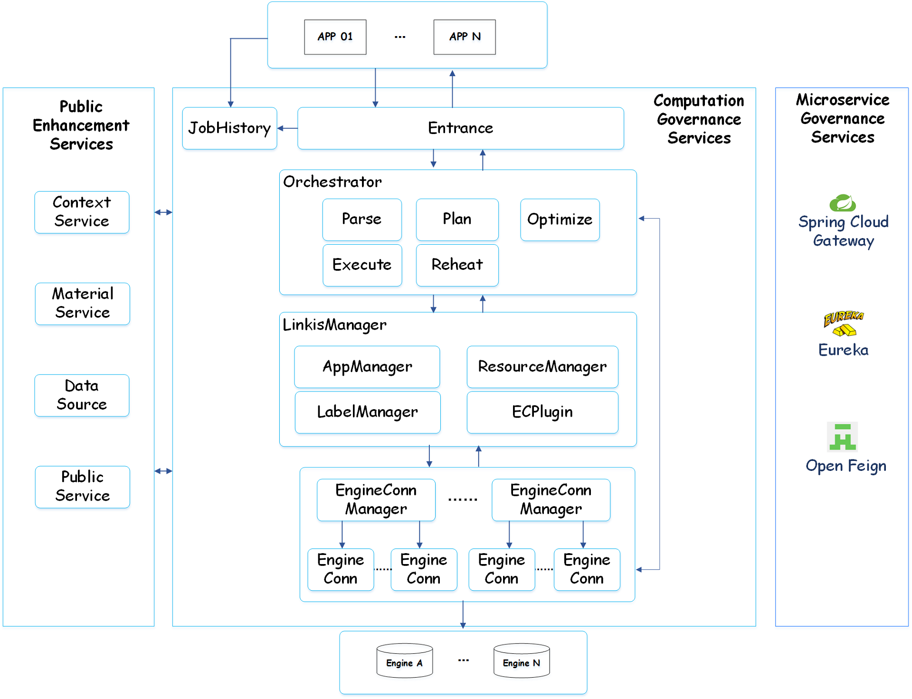

采用Eureka作为服务注册/发现中心，

- @EnableEurekaServer
- @EnableDiscoveryClient

## Linkis

### LinkisGatewayApplication（网关服务）

**LINKIS-MG-GATEWAY**

### SpringCloudEurekaApplication（服务注册中心）

**LINKIS-MG-EUREKA**

### LinkisECMApplication（引擎连接管理）

**LINKIS-CG-ENGINECONNMANAGER**

### LinkisEngineConnPluginServer（引擎连接插件服务）

**LINKIS-CG-ENGINEPLUGIN**

### LinkisEntranceApplication（computing governance entrance service）

**LINKIS-CG-ENTRANCE**

### LinkisManagerApplication（computing governance management service）

**LINKIS-CG-LINKISMANAGER**

### LinkisCSApplication（上下文服务）

**LINKIS-PS-CS**

### LinkisPublicServiceApp（公用服务）

**LINKIS-PS-PUBLICSERVICE**

属于 link-jobhistory 工程

### LinkisDataSourceApplication（？未启动）

### LinkisBMLApplication（？未启动）

## DSS

### DSSApiServiceServerApplication

**DSS-APISERVICE-SERVER**

### DSSDatapipeServerApplication

**DSS-DATAPIPE-SERVER**

### DSSFowExecutionServerApplication

**DSS-FLOW-ENTRANCE**

### DSSOrchestratorServerApplication

**DSS-FRAMEWORK-ORCHESTRATOR-SERVER-DEV**

### DSSProjectServerApplication

**DSS-FRAMEWORK-PROJECT-SERVER**

### DSSWorkflowServerApplication

**DSS-WORKFLOW-SERVER-DEV**

## 插件服务

### Visualis

- Visualis 相对 Davince 的源码的改动点
- 依赖 linkis-gateway 
- 默认内置hive源（hivedatasource），类型是hive，而不是jdbc，可以直接显示，不需要配置
  - 源定制代码，依赖 linkis-datasource 获取 hive 的db, table, column；
  - 执行SQL时，通过Spark-SQL ujesjob(linkis 0.9.1)执行，调用EntracenServer.execute

- 组织和权限功能被移除
- 不再支持Davinci原生的登录和用户管理方式
- Visualis与DataSphere Studio共享用户session，从DSS的登录页面登录后，即可无缝跳转到Visualis。   
  - 在数据库层面，Visualis的用户改为从linkis_user表中读取。（linkis表是dss创建的）
  - 原生的user表不再使用

- Visualis的项目可以没有所属组织，允许只属于个人的项目存在。   Visualis的项目与DSS的项目保持完全同步，在数据库层面，从dss_project表中读取。
  - 原生的project表不再使用（与dss_project强耦合）

### Qualitis

### Schedulis

### ExchangeIs

