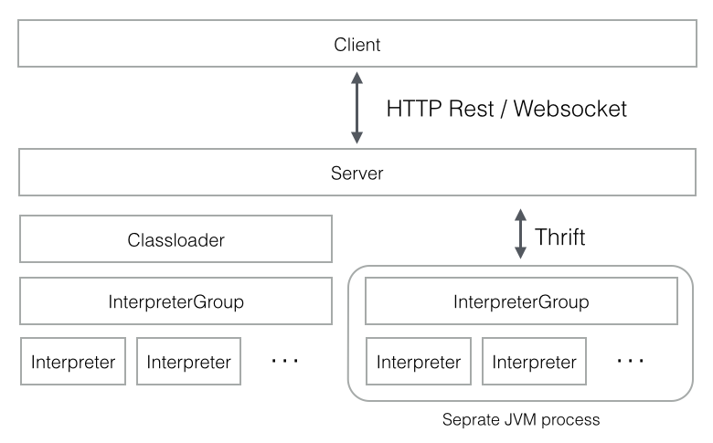

# Zeeplin


## 原理



## 部署

### docker

```bash
docker run -p 8080:8080 --rm --name zeppelin apache/zeppelin:0.9.0

# To persist logs and notebook directories, use the volume option for docker container.
docker run -p 8080:8080 --rm -v $PWD/logs:/logs -v $PWD/notebook:/notebook -e ZEPPELIN_LOG_DIR='/logs' -e ZEPPELIN_NOTEBOOK_DIR='/notebook' --name zeppelin apache/zeppelin:0.9.0

```

### 单机模式


### 集群模式（当前官网没有说明)

[[Umbrella] Distributed zeppelin cluster services](https://issues.apache.org/jira/browse/ZEPPELIN-3471)


## 解释器

### 绑定

Shared Mode，Scoped Mode，Isolated Mode

|     Mode     |                       Each notebook...                       |                           Benefits                           |                       Disadvantages                        |                       Sharing objects                        |
| :----------: | :----------------------------------------------------------: | :----------------------------------------------------------: | :--------------------------------------------------------: | :----------------------------------------------------------: |
|  **shared**  | Shares a single session in a single interpreter process (JVM) | Low resource utilization and it's easy to share data between notebooks | All notebooks are affected if the interpreter process dies |                      Can share directly                      |
|  **scoped**  |  Has its own session in the same interpreter process (JVM)   |         Less resource utilization than isolated mode         | All notebooks are affected if the interpreter process dies | Can't share directly, but it's possible to share objects via [ResourcePool](https://zeppelin.apache.org/docs/0.9.0/interpreter/spark.html#object-exchange) |
| **isolated** |               Has its own Interpreter Process                | One notebook is not affected directly by other notebooks (**per note**) |  Can't share data between notebooks easily (**per note**)  | Can't share directly, but it's possible to share objects via [ResourcePool](https://zeppelin.apache.org/docs/0.9.0/interpreter/spark.html#object-exchange) |

In the case of the **per user** scope (available in a multi-user environment), Zeppelin manages interpreter sessions on a per user basis rather than a per note basis. For example:

- In **scoped + per user** mode, `User A`'s notes **might** be affected by `User B`'s notes. (e.g JVM dies, ...) Because all notes are running on the same JVM
- On the other hand, **isolated + per user** mode, `User A`'s notes will not be affected by others' notes which running on separated JVMs

### 运行模式

#### local

#### k8s pod

#### yarn

### GPU的支撑

yarn模式暂时（0.9版本）不支持申请gpu资源，需要定制；

k8s模式，通过修改pod的yml配置，可以申请gpu资源；


## 多用户

### Shiro认证


### Notebook权限

默认note创建后是public可见，可以配置private。

Note的权限分为"**Read**, **Run**, **Write**, **Manage**"。


### 用户模拟

> User impersonation enables to run zeppelin interpreter process as a web frontend user.
>
> Impersonation模式支持以其它用户运行解释器进程（其他用户需要真实存在，且可以免密ssh）。
