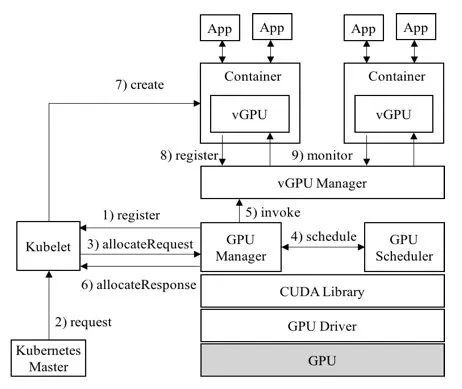

# GPU虚拟化

GPU 天然适合向量计算。常用场景及 API：

| 场景         | API                    |
| ------------ | ---------------------- |
| 游戏渲染     | OpenGL，DirectX，Metal |
| 媒体编解码   | VAAPI，VDPAU           |
| 深度学习计算 | Cuda，OpenCL           |

## 背景

基本痛点：

- 容器的GPU利用率不够高，特别是推理任务；
- 为了提高GPU的利用率、避免算力浪费，需要在单个GPU上运行多个容器；

### 方案

常见的NVIDIA GPU虚拟化技术方案有：

- NVIDIA GRID(vGPU)：Nvidia官方，不支持容器；
- NVIDIA MPS（MPI机制）：容错性不好，无显存隔离；
- cGPU（阿里云）：内核劫持（在Nvidia Driver层）；
- vCUDA（腾讯TKE）：CUDA劫持，GPU共享和算力隔离；
- qGPU（腾讯）：内核劫持，GPU共享和算力隔离；
- vGPU（第四范式）：CUDA劫持，GPU共享和算力隔离；
- [AliyunContainerService/*gpushare*-scheduler-extender](https://github.com/AliyunContainerService/gpushare-scheduler-extender)：GPU共享，不支持算力隔离；
- [elastic-ai](https://github.com/elastic-ai)/**[elastic-gpu](https://github.com/elastic-ai/elastic-gpu)**：？？

### 腾讯TKE的vCUDA（开源）

> https://github.com/tkestack/vcuda-controller
>
> https://github.com/tkestack/gpu-manager
>
> https://github.com/tkestack/gpu-admission

#### 资源隔离

在Cuda driver API之上，它通过劫持对Cuda driver API的调用来做到资源隔离。

1）对于显存，一旦该任务申请显存后占用的显存大小大于config中的设置，就报错。

2）对于计算资源，存在硬隔离和软隔离两种方式，共同点是当任务使用的GPU SM利用率超出资源上限，则暂缓下发API调用。不同点是如果有资源空闲，软隔离允许任务超过设置，动态计算资源上限。而硬隔离则不允许超出设置量。

#### 并行模式

分时复用的模式，单个任务完成时间（JCT）都会受到较大的影响。

### 第4范式vGPU（开源）

> https://github.com/4paradigm/k8s-device-plugin/

基于NVIDIA官方插件(NVIDIA/k8s-device-plugin)，在保留官方功能的基础上，实现了对物理GPU进行切分，并对显存和计算单元进行限制，从而模拟出多张小的vGPU卡。

**显存隔离使用的是经典CUDA劫持方法，通过预估获得context大小；使用监控隔离的方案隔离算力**

在k8s集群中，基于这些切分后的vGPU进行调度，使不同的容器可以安全的共享同一张物理GPU，提高GPU的利用率。

此外，插件还可以对显存做虚拟化处理（使用到的显存可以超过物理上的显存），运行一些超大显存需求的任务，或提高共享的任务数，可参考性能测试报告。

#### 使用场景

1. 显存、计算单元利用率低的情况，如在一张GPU卡上运行10个tf-serving。
2. 需要大量小显卡的情况，如教学场景把一张GPU提供给多个学生使用、云平台提供小GPU实例。
3. 物理显存不足的情况，可以开启虚拟显存，如大batch、大模型的训练

#### 功能

- 指定每张物理GPU切分的vGPU的数量
- 限制vGPU的显存
- 限制vGPU的计算单元
- 对已有程序零改动

#### 限制

- 分配到节点上任务所需要的vGPU数量，不能大于节点实际GPU数量，你可以使用[vGPU调度器](https://github.com/4paradigm/k8s-vgpu-scheduler)来避免这个限制；
- 将节点上所有虚拟GPU设备设定为同一大小？？

#### 已知问题

- 开启虚拟显存时，如果某张物理GPU的显存已用满，而这张GPU上还有空余的vGPU，此时分配到这些vGPU上的任务会失败。
- 目前仅支持计算任务，不支持视频编解码处理。

### 

