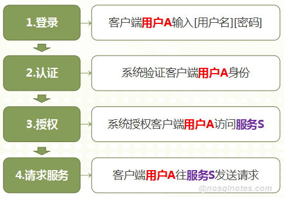
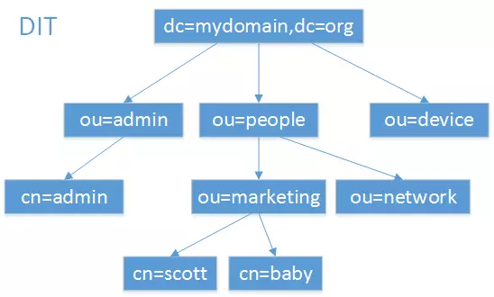

# 认证


## Kerberos

Kerberos是一个常用的认证与授权协议，主要用于计算机网络的身份鉴别(Authentication)，其特点是**用户只需输入一次身份验证信息就可以凭借此验证获得的票据(ticket-granting ticket)访问多个服务**，即SSO(Single Sign On)。由于在每个Client和Service之间建立了共享密钥，使得该协议具有相当的安全性。

### GSSAPI

**GSSAPI为 Generic Security Services Application Program Interface** 的缩写，即：通用安全服务应用程序接口，GSSAPI是一个IETF标准。

### SPNEGO

**Simple and Protected [GSSAPI](https://en.wikipedia.org/wiki/GSSAPI) Negotiation Mechanism** (**SPNEGO**) 即简单且受保护的GSSAPI协商机制，是客户端-服务器软件用于协商安全技术选择的GSSAPI过程。

当客户端想要向服务器认证身份，但是客户端和服务器都不知道对方支持什么认证协议。这时需要使用SPNEGO来选择双方都支持的GSSAPI ，以便接下来的认证过程以及后续安全信息传输的正常进行。

### 基本概念

Princal(安全个体)：被认证的个体，有一个名字和口令

KDC(key distribution center ) : 是一个网络服务，提供ticket 和临时会话密钥

- AS (Authentication Server)： 认证服务器，AS 的作用就是验证 Client 端的身份，验证通过就会给一张 TGT（Ticket Granting Ticket）票给 Client。
- Ticket Granting Server（TGS）：TGS 的作用是通过 AS 发送给 Client 的票（TGT）换取访问 Server 端的票。


### 流程

使用Kerberos时，一个客户端需要经过三个步骤来获取服务:

认证：客户端向认证服务器发送一条报文，并获取一个含时间戳的Ticket-Granting Ticket（TGT）。

授权：客户端使用TGT向Ticket-Granting Server（TGS）请求一个服务Ticket。

服务请求：客户端向服务器出示服务Ticket，以证实自己的合法性。该服务器提供客户端所需服务，在Hadoop应用中，服务器可以是namenode或jobtracker。



用户身份认证与服务授权都是不同的服务角色提供的。参与的各方角色包括：

- **Client**: Application Client 应用客户端
- **AS**: Authentication Server 用来认证用户身份
- **TGS**: Ticket-Granting Service 用来授权服务访问
- **SS**: Service Server 用户所请求的服务

http://www.nosqlnotes.com/technotes/kerberos-protocol/

**Kerberos**认证与授权的几个关键步骤：

1. **[Login]** 用户输入用户名/密码信息进行登录。
2. **[Client/AS]** Client到AS进行认证，获取TGT。
3. **[Client/TGS]** Client基于TGT以及Client/TGS Session Key去TGS去获取Service Ticket(Client-To-Server Ticket)。
4. **[Client/Server]** Client基于 Client-To-Server Ticket以及Client/Server SessionKey去Server端请求建立连接，该过程Client/Server可相互进行认证。
5. **[Client/Server]** 连接建立之后，Client可正常往Server端发送服务请求。

第1步，在**Client**端完成对密码信息的单向加密。

第2步，基于**JAAS**进行认证。

第3，4步，则基于**GSS-API**进行交互。

第4，5步建立连接与发送服务请求的过程，则通常基于**SASL**框架。

### 安装

```shell
yum install krb5-server krb5-libs krb5-auth-dialog
```

会在KDC主机上生成配置文件***/etc/krb5.conf***和***/var/kerberos/krb5kdc/kdc.conf***，它们分别反映了***realm name*** 以及 ***domain-to-realm mappings***。


`kinit`：命令行用户认证

- 在同一个OS用户下，所以两个不同的Kerberos用户在进行Kinit操作后都会覆盖`/tmp/krb5cc_{uid}`文件，导致Kerberos的票据信息串掉。


## LDAP

LDAP（Light Directory Access Portocol），它是基于X.500标准的**轻量级目录访问协议**。

**目录数据库和关系数据库不同，它有优异的读性能，但写性能差，并且没有事务处理、回滚等复杂功能，不适于存储修改频繁的数据。**

目前有 **OpenLDAP** 和 **Apache DS** ；

### 基本模型

#### 目录树概念

- 目录树：在一个目录服务系统中，整个目录信息集可以表示为一个目录信息树，**树中的每个节点是一个条目**。

- **条目：每个条目就是一条记录**，每个条目有自己的唯一可区别的名称（**DN**）。

- 对象类：与某个实体类型对应的一组属性，**对象类是可以继承的**，这样父类的必须属性也会被继承下来。

- 属性：描述条目的某个方面的信息，**一个属性由一个属性类型和一个或多个属性值组成**，属性有必须属性和非必须属性。

| **关键字** | **英文全称**       | **含义**                                                     |
| ---------- | ------------------ | ------------------------------------------------------------ |
| **dc**     | Domain Component   | **域名的部分，其格式是将完整的域名分成几部分**，如域名为example.com变成dc=example,dc=com（一条记录的所属位置） |
| **uid**    | User Id            | 用户ID songtao.xu（一条记录的ID）                            |
| **ou**     | Organization Unit  | 组织单位，组织单位可以包含其他各种对象（包括其他组织单元），如“oa组”（一条记录的所属组织） |
| **cn**     | Common Name        | 公共名称，如“Thomas Johansson”（一条记录的名称）             |
| **sn**     | Surname            | 姓，如“许”                                                   |
| **dn**     | Distinguished Name | “uid=songtao.xu,ou=oa组,dc=example,dc=com”，一条记录的位置（唯一） |
| **rdn**    | Relative dn        | 相对辨别名，类似于文件系统中的相对路径，它是与目录树结构无关的部分，如“uid=tom”或“cn= Thomas Johansson” |

#### 数据组织方式

