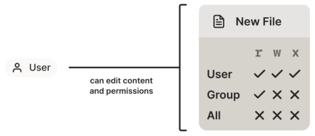
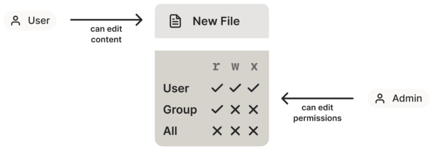
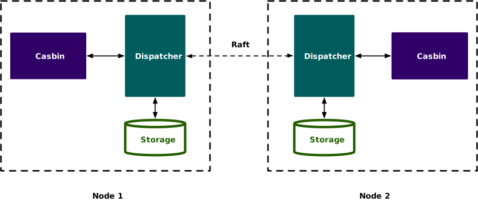

# 授权

> 授权发生在系统成功验证您的身份后，最终会授予您访问资源（如信息，文件，数据库，资金，位置，几乎任何内容）的完全权限。

## 权限模型

### 自主访问控制 DAC

最早出现的是 DAC（Discretionary Access Control），在 DAC 中 **object owner** 有权**设置该 object 的访问权限**。

- 通过授予 individuals/groups 以 read/write/execute 权限， object (file) 的创建者能完全控制该 object 的内容和权限。
- 适用于**普通用户的文件权限**控制



问题：**其权限传播可控性差**，**合规性很难保证，机密文件很容易被恶意 reshare 出去**。

### MAC（强制访问控制）

> **数字系统中，MAC 在理论要比在实际中简单** （easier in theory than in practice）
>
> - 一个功能完整的（full-on）MAC 系统是很难真正实现的。

 由 **administrator**（管理员）或 **administrative rule**（管理员级别的规则） 来**定义 rules**。



MAC：文件 owner 只能设置一个文件 type，这个 type 包含了哪些权限是由 admin 或 policy 设置的。 用户能编辑文件内容，但无法修改文件权限。

因此在 MAC 模型中，**一个人做某些事情的 能力是无法再分享给其他人**的，从而避免了文件被 reshare 的问题。

**双因素登录**：2FA as MAC

- 密码可以共享，但硬件 token 不能。密码是 DAC，而硬件 token 是 MAC。假设了第二因素（the second factor，即硬件 token）是不可分享的。


### RBAC

> RBAC 是 **MAC 的一个子集**，它是一种特殊类型的 MAC。

基于资源的权限控制，**用户 -> 角色 -> 资源** 的映射关系。

RBAC0：用户与角色、角色与权限间建立关系，每种关系均为多对多；

RBAC1：在RBAC-0的基础上，增加角色的继承关系（用于部门的上下级的权限范围）；

RBAC2：基于RBAC0模型，增加对角色的一些限制：角色互斥、基数约束、先决条件角色等；

RBAC3：统一模型，包含RBAC1和RBAC2；


### ABAC

> **对 RBAC 的改进，加了一些细节**（属性，Attributes）

 `基于属性的访问控制`，可以使用主体、客体或动作的属性，而不是字符串本身来控制访问。

- 支持动态的属性判断等；
- **属性**可以是位置、客户端设备平台、认证类型、用户的 http cookies 等
- **属性的解析和认证**工作是**中心式的**，大部分都实现 在各家的 **identity provider** 中
- 当系统判断是否授予某个用户对某资源的访问权限时，ABAC 系统 **除了检查他们的 RBAC role（group）**，还会检查**这个人携带的各种属性**。


## 单点登录 SSO

| 功能点             | SSO单点登录 | OAuth2.0 |
| ------------------ | ----------- | -------- |
| 统一认证           | 支持度高    | 支持度高 |
| 统一注销           | 支持度高    | 支持度低 |
| 多个系统会话一致性 | 强一致      | 弱一致   |
| 第三方应用授权管理 | 不支持      | 支持度高 |
| 自有系统授权管理   | 支持度高    | 支持度低 |
| Client级的权限校验 | 不支持      | 支持度高 |
| 集成简易度         | 比较简单    | 难度中等 |


## OAuth 2.0

> OAuth2.0的应用场景可以理解为单点登录的升级版，单点登录解决了多个系统间会话的共享，OAuth2.0在此基础上增加了应用之间的权限控制。

**数据的所有者告诉系统，同意授权第三方应用进入系统，获取这些数据。系统从而产生一个短期的进入令牌（token），用来代替密码，供第三方应用使用。**

### 授权模式

授权码（Authorization Code）：**第三方应用先申请一个授权码，然后再用该码获取令牌。**

- OAuth2.0标准授权步骤，Server端向Client端下放Code码，Client端再用Code码换取授权Token；

隐藏式（Implicit）：**纯前端应用，直接向前端颁发令牌**

- 无法使用授权码模式时的备用选择，Server端使用URL重定向方式直接将Token下放到Client端页面；

密码式（Password）：**只适用于其他授权方式都无法采用的情况，而且必须是用户高度信任的应用。**

- Client直接拿着用户的账号密码换取授权Token；

客户端凭证（Client Credentials）：**适用于没有前端的命令行应用，即在命令行下请求令牌。**

- Server端针对Client级别的Token，代表应用自身的资源授权；


## Casbin

> 开源的访问控制库，支持各种**访问控制模型**以强制全面执行授权。
>
> - 不做身份认证；
> - 不管理用户列表或角色列表。
> - 基于内存做快速匹配；


### 访问模型

`model.conf` 定义权限模型，支持

- [**ACL (Access Control List, 访问控制列表)**](https://en.wikipedia.org/wiki/Access_control_list)
  - **具有 [超级用户](https://en.wikipedia.org/wiki/Superuser) 的 ACL**
  - **没有用户的 ACL**: 对于没有身份验证或用户登录的系统尤其有用。
  - **没有资源的 ACL**: 某些场景可能只针对资源的类型, 而不是单个资源, 诸如 `write-article`, `read-log`等权限。 它不控制对特定文章或日志的访问。
- **[RBAC (基于角色的访问控制)](https://en.wikipedia.org/wiki/Role-based_access_control)**
  - **支持资源角色的RBAC**: 用户和资源可以同时具有角色 (或组)。
  - **支持域/租户的RBAC**: 用户可以为不同的域/租户设置不同的角色集。
- **[ABAC (基于属性的访问控制)](https://en.wikipedia.org/wiki/Attribute-Based_Access_Control)**: 支持利用`resource.Owner`这种语法糖获取元素的属性。
- **[RESTful](https://en.wikipedia.org/wiki/Representational_state_transfer)**: 支持路径, 如 `/res/*`, `/res/: id` 和 HTTP 方法, 如 `GET`, `POST`, `PUT`, `DELETE`。
- **拒绝优先**: 支持允许和拒绝授权, 拒绝优先于允许。
- **优先级**: 策略规则按照先后次序确定优先级，类似于防火墙规则。

#### 存储

model 只能加载，不能保存，因为model 不是动态组件，不应该在运行时进行修改。

- [支持从文件、代码、字符串加载](https://casbin.org/zh/docs/model-storage)


### 用户权限配置

> 不同语言支持的配置源见[官网](https://casbin.org/zh/docs/adapters)
>
> - 抽象接口见 [如何编写 Adapter](https://casbin.org/zh/docs/adapters#%E5%A6%82%E4%BD%95%E7%BC%96%E5%86%99-adapter)

#### 自动保存

- 支持自动保存机制的adapter可以**自动**向存储回写内存中单个policy规则的变更（删除/更新）；
- 通过`Enforcer.EnableAutoSave()` 函数来开启或关闭该机制，默认开启；

注：与自动回写机制不同，调用`SavePolicy()`会直接删除所有存储中的policy规则并将当前`Casbin enforcer`存储在内存中的policy规则悉数持久化到存储中。


### 模型语法

#### Common

至少应包含四个部分: `[request_definition], [policy_definition], [policy_effect], [matchers]`

- 如果 model 使用 RBAC，还需要添加`[role_definition]`部分。

`[request_definition]` 是访问请求的定义。

```ini
[request_definition]
r = sub, obj, act
```

- `sub, obj, act` 表示经典三元组: 访问实体 (Subject)，访问资源 (Object) 和访问动作 (Action)。


`[policy_definition]` 是策略的定义。（用户权限配置的每条会跟这里的某个策略匹配）

- 如权限 `p, alice, data1, read` 表示匹配策略`p`；

```ini
[policy_definition]
# eft 表示决策结果（当不指定规则的决策结果时,取默认值allow）
# p = sub, obj, act, eft

p = sub, obj, act
p2 = sub, act
```


`[policy_effect]` 部分是对policy生效范围的定义，

- 多个**policy rule同时匹配访问请求request**时,该如何对多个决策结果进行集成以实现统一决策；

```ini
[policy_effect]
# p.eft 表示策略规则的决策结果，可以为allow 或者deny
e = some(where (p.eft == allow))
```


`[matchers]` 是策略匹配器的定义（匹配规则的定义是影响性能的因素，短路求值优化）

```ini
[matchers]
m = r.sub == p.sub && r.obj == p.obj && r.act == p.act
```


#### 内置的匹配函数

对于 matcher，内置很多的匹配函数，对于 jcasbin，包括

```java
fm.addFunction("keyMatch", new KeyMatchFunc());
fm.addFunction("keyMatch2", new KeyMatch2Func());
fm.addFunction("keyMatch3", new KeyMatch3Func());
fm.addFunction("keyMatch4", new KeyMatch4Func());
fm.addFunction("keyMatch5", new KeyMatch5Func());
fm.addFunction("keyGet", new KeyGetFunc());
fm.addFunction("keyGet2", new KeyGet2Func());
fm.addFunction("regexMatch", new RegexMatchFunc());
fm.addFunction("ipMatch", new IPMatchFunc());
fm.addFunction("eval", new EvalFunc());
fm.addFunction("globMatch", new GlobMatchFunc());
```


#### RBAC的角色

`[role_definition]`原语定义 RBAC 1‘s 中的角色继承关系

```ini
[role_definition]
# 前项继承后项角色的权限
g = _, _
g2 = _, _
```

以policy表示中实际的用户角色映射关系 (或是资源-角色映射关系)，例如:

```text
p, data2_admin, data2, read
g, alice, data2_admin
```

这意味着 `alice` 是角色 `data2_admin`的一个成员。 `alice` 在这里可以是用户、资源或角色。 

在matcher中，应该像下面的例子一样检查角色信息：

```ini
[matchers]
m = g(r.sub, p.sub) && r.obj == p.obj && r.act == p.act
```

这意味着在请求中的`sub`需要具备policy中的role `sub`。


注意：

- RBAC 系统中的用户名称和角色名称不应相同（可以通过”u::" 或 "r::" 的前缀，区分用户还是角色；


#### 域租户的角色定义

RBAC角色可以是全局或是基于特定于域的。 特定域的角色意味着**当用户处于不同的域/租户群体时，用户所表现的角色也不尽相同**。

- 这对于像云服务这样的大型系统非常有用，因为用户通常分属于不同的租户群体。

```ini
[request_definition]
r = sub, dom, obj, act

[policy_definition]
p = sub, dom, obj, act

[role_definition]
# 第三个 _ 表示域/租户的名称, 此部分不应更改。
g = _, _, _

[policy_effect]
e = some(where (p.eft == allow))

[matchers]
m = g(r.sub, p.sub, r.dom) && r.dom == p.dom && r.obj == p.obj && r.act == p.act
```

policy数据可以是：

```ini
p, admin, tenant1, data1, read
p, admin, tenant2, data2, read

# alice在tenant1域中具有admin角色，但在tenant2域中具有user角色
g, alice, admin, tenant1
g, alice, user, tenant2
```


#### RBAC 示例

```ini
[request_definition]
r = sub, obj, act

[policy_definition]
p = sub, obj, act

[role_definition]
g = _, _

[policy_effect]
e = some(where (p.eft == allow))

[matchers]
m = g(r.sub, p.sub) && r.obj == p.obj && r.act == p.act
```


### RBAC的支持说明

| RBAC版本 | 支持级别                                                     | 说明                                                         |
| -------- | ------------------------------------------------------------ | ------------------------------------------------------------ |
| RBAC0    | 完全支持                                                     | RBAC0 是 RBAC96 的基本版本。 它澄清了使用者、角色和权限之间的关系。 |
| RBAC1    | 完全支持                                                     | Casbin 的 RBAC 支持 RBAC1 的角色层次结构功能，如果 `alice`具有`role1`, `role1`具有`role2`，则 `alice` 也将拥有 `role2` 并继承其权限。 |
| RBAC2    | 支持互斥处理([示例](https://casbin.org/zh/docs/syntax-for-models#policy-effect))，但quantitative 限制不支持 | RBAC2 在RBAC0 的基础上添加了约束。因此，RBAC2可以处理政策中相互排斥的问题。 |
| RBAC3    | 支持互斥处理([示例](https://casbin.org/zh/docs/syntax-for-models#policy-effect))，但quantitative 限制不支持 | RBAC3 是 RBAC1 和 RBAC2 的组合。 RBAC3 支持 RBAC1 和 RBAC2 中的角色等级和制约因素。 |


### ABAC 的支持说明

https://casbin.org/zh/docs/abac


### 使用

> 见 [Casbin SpringBoot 使用](https://gitee.com/oscsc/web-tech/authz/casbin/)。
>
> - Go 的支持度最好，Java 次之。


#### 执行器

Enforce 加载时，会将所有的数据都加载到内存中（`loadPolicy`）。

类型（以Go语言为主，Java 无 CachedEnforcer）：

- **Enforce**：非线程安全，对于策略的改动，会触发`Watch`/`WatchEx`；
- **CachedEnforcer**：将结果缓存（通过rw锁保证并发安全），内部使用`Enforce`）（因此仍不是并发安全）；
- **SyncedEnforcer**：使用 rw 锁提供同步访问，线程安全；
- **DistributedEnforcer**：基于`SyncedEnforcer`；

#### 适配器

自动保存机制（`Auto-Save`），支持**自动**向存储回写内存中单个policy规则的变更（删除/更新）

调用`SavePolicy()`会直接删除所有存储中的policy规则并将当前`Casbin enforcer`存储在内存中的policy规则悉数持久化到存储中。 因此，当内存中的policy规则过多时，直接调用`SavePolicy()`会引起一些性能问题。

#### 监视器

> https://casbin.org/zh/docs/watchers

保持多个Casbin执行器实例之间的一致性

- Java 的 **RedisWatch** 通过**`loadPolicy`重新构造内存**保证一致性（Redis仅用于发送更新消息），对于大量Rules可能存在性能问题；

**WatcherEx**：支持多个实例之间的增量同步，但目前尚未实现 `WatcherEx`。 

- Go 的 [**RedisWatchEx**](https://github.com/casbin/redis-watcher) 支持增量同步，Redis的消息提供不同类型的事件；
- 对于 Java 而言，**暂时没有第三方库实现** `WatcherEx`，且需要配合**DistributedEnforcer**（提供Self相关方法，更新策略不会循环触发Watch）；
- 不推荐使用 WatchEx，因为当服务异常时没法保证一致性，推荐使用 Dispatcher 实现；

#### 分发器

> Users need to ensure that the state of all instances is consistent before using dispatcher.

提供同步递增策略变化的方法，以`raft`一致性协议为基础保证多个casbin实例间的一致性。

当前只有 Go 语言提供 [Hashicorp Raft Dispatcher](https://github.com/casbin/hraft-dispatcher)。



### Casdoor

> An open-source Identity and Access Management (IAM) / Single-Sign-On (SSO) platform with web UI supporting OAuth 2.0, OIDC, SAML and CAS.

支持 OAuth 2.0、OIDC 和 SAML 的 UI 优先集中式身份验证/单点登录 (SSO) 平台，与 Casbin RBAC 和 ABAC 权限管理集成

- 对子应用的鉴权，通过[`/api/enforce`](https://casdoor.org/zh/docs/permission/exposed-casbin-apis#enforce)，**不能获取所有的权限id，供前端进行菜单/按钮显示**；
