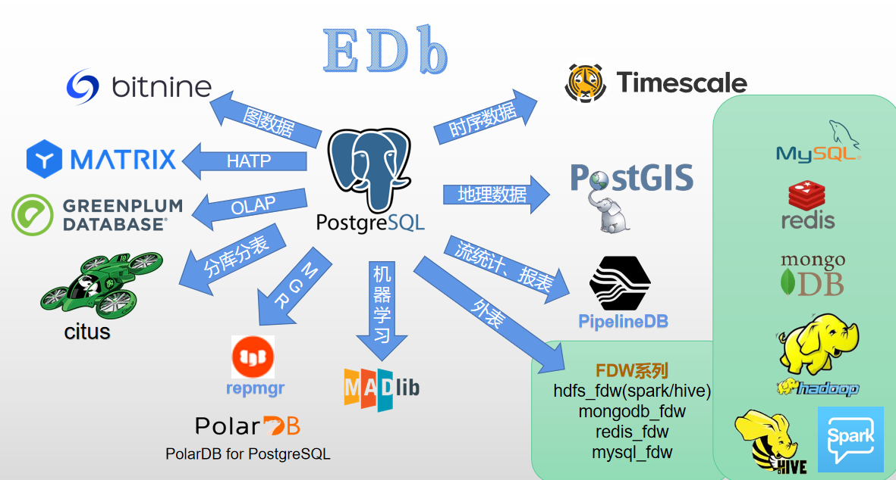

# 后端开发技术栈

## 负载均衡

流量的均匀转发，多个后端服务器，需要**分布式缓存进行会话标识**或者**无状态服务**。

常用的是4层和7层负载：

- 4层负载：在TCP层进行负载；

- 7层负载：在HTTP层进行负载；

一般有LVS，Nginx等；

## 网关

**微服务的入口**，可以进行统一的权限控制、灰度发布、流量控制等功能。

一般有Nginx系列（Nginx/Openresty/Kong/ApiSix），Zuul，Spring Cloud Gateway等。

## 微服务生态

微服务框架中，一般有个统一的对外服务，可以实现负载均衡/权限控制等功能。

如华为贡献的Apache ServiceComb，Spring Cloud，K8s + Istio。

重要的构成：

- [服务发现（服务注册）和服务间通信](./servicemesh.md)

## 数据库

PostgreSQL是开源界用的最多的数据库。

## 缓存

Redis

## 分布式数据库

HBase、TiDB

## 消息队列

消息中间件，解耦服务调用间关系

rocketmq，kafka，Apache Pulsar。

## 对象存储

文件存储、图片存储，在一般的后端服务中，文件规模不大，但数量较多。

如OSS，Apache Ozone，MinIO。
