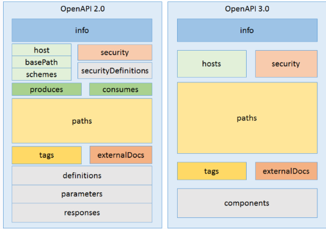

# 接口管理


## 接口版本间改动

> 微服务的不同版本间，可以查看接口的改动。

基本思路：每个版本都有对应的 OpenAPI 规范的 Yaml 描述文件，通过[OpenAPI Tools](https://github.com/OpenAPITools/openapi-diff)进行接口版本比对；

每个版本如何具备对应的OpenAPI的yaml描述文件？


### 思路1：根据Yaml生成Controller层注解代码

> 开发接口先写OpenAPI 3 的 yaml 文件，然后生成对应的Controller层的接口。（可行，但对于开发不太友好，注解比yaml容易写）

- [openapi-generator和maven-plugin](https://github.com/OpenAPITools/openapi-generator): 根据Yaml生成客户端/服务端的桩代码，且不生成辅助代码

```
<generateApiDocumentation>false</generateApiDocumentation>
<generateSupportingFiles>false</generateSupportingFiles>
<skipOperationExample>true</skipOperationExample>
```

具体代码见 [根据Yaml生成SpringBoot接口](https://gitee.com/luckyQQQ/lifelearning/tree/master/java/spring/spring-boot-openapi-generator)


### **思路2：根据Controller**层注解代码生成Yaml

> github上有直接根据注解进行静态解析，生成对应的yaml接口文档，如 https://github.com/UbiqueInnovation/springboot-swagger3 ，但是鲁棒性不够；

工具：

- [springdoc-openapi](https://github.com/springdoc/springdoc-openapi) : 在SpringBoot中使用OpenAPI 3的注解；

- [springdoc-openapi-maven-plugin](https://github.com/springdoc/springdoc-openapi-maven-plugin) : 根据 OpenAPI 3的注解生成OpenAPI 3的Yaml，依赖于 `spring-boot-maven` 插件

- Maven在**集成测试阶段**（integration-test）运行openapi插件（通过`mvn verify`）。


问题点：

- 但是在CI阶段，一般不进行verify，仅package不会运行spring，也就无法生成 Yaml；

具体代码见 [根据注解生成Yaml](https://gitee.com/luckyQQQ/lifelearning/tree/master/java/spring/springboot-springdoc-openapi-generate-yaml)


## OpenAPI/Swagger 3

### 规范

https://github.com/swagger-api/swagger-codegen

- 支持json和yaml文件解析，自动生成多种语言的API客户端和服务器stub；
- swagger配置规范说明，https://swagger.io/specification；
- swagger maven plugin，https://github.com/garethjevans/swagger-codegen-maven-plugin；




### springboot 集成（[springdoc](https://github.com/springdoc/springdoc-openapi)）

> springfox 不支持 springboot 2.4 以上的版本，最新更新时间为 2020/10/14号。

[springdoc 与 springboot 的版本兼容性](https://springdoc.org/v2/#what-is-the-compatibility-matrix-of-springdoc-openapi-with-spring-boot：

| spring-boot Versions | Minimum springdoc-openapi Versions |
| :------------------- | :--------------------------------- |
| `3.0.x`              | `2.0.x`+                           |
| `2.7.x`, `1.5.x`     | `1.6.0`+                           |
| `2.6.x`, `1.5.x`     | `1.6.0`+                           |
| `2.5.x`, `1.5.x`     | `1.5.9`+                           |
| `2.4.x`, `1.5.x`     | `1.5.0`+                           |
| `2.3.x`, `1.5.x`     | `1.4.0`+                           |
| `2.2.x`, `1.5.x`     | `1.2.1`+                           |
| `2.0.x`, `1.5.x`     | `1.0.0`+                           |


`SpringFox - SpringDoc` 对应关系如下

- `@Api` → `@Tag`
- `@ApiIgnore` → `@Parameter(hidden = true)` or `@Operation(hidden = true)` or `@Hidden`
- `@ApiImplicitParam` → `@Parameter`
- `@ApiImplicitParams` → `@Parameters`
- `@ApiModel` → `@Schema`
- `@ApiModelProperty(hidden = true)` → `@Schema(accessMode = READ_ONLY)`
- `@ApiModelProperty` → `@Schema`
- `@ApiOperation(value = "foo", notes = "bar")` → `@Operation(summary = "foo", description = "bar")`
- `@ApiParam` → `@Parameter`
- `@ApiResponse(code = 404, message = "foo")` → `@ApiResponse(responseCode = "404", description = "foo")`


示例项目见

- [根据Yaml生成SpringBoot接口](https://gitee.com/luckyQQQ/lifelearning/tree/master/java/spring/spring-boot-openapi-generator)
- [根据注解生成Yaml](https://gitee.com/luckyQQQ/lifelearning/tree/master/java/spring/springboot-springdoc-openapi-generate-yaml)


### Swagger 添加自定义注解的信息（TODO）

