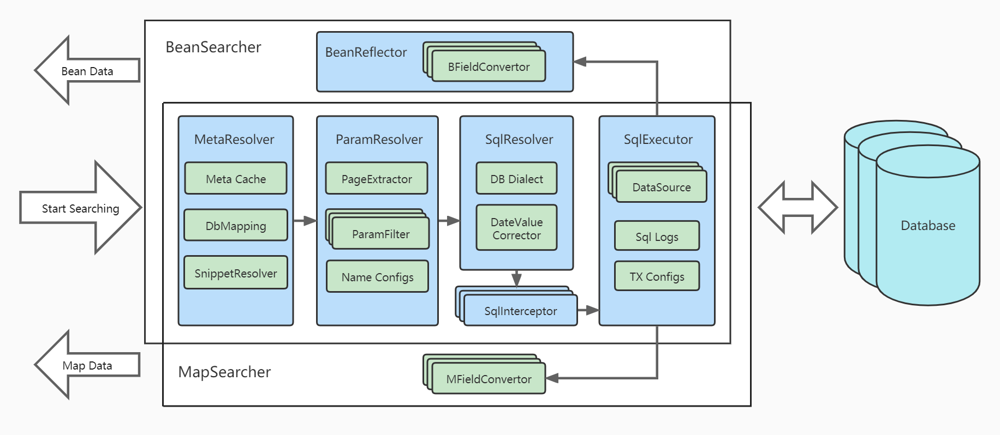

# [BeanSearch](https://bs.zhxu.cn/)

> 专注高级查询的**只读 ORM，天生支持联表**，免 DTO/VO 转换，使一行代码实现复杂列表检索成为可能！
>
> - **推荐** 在 **非事务性** 的 **动态** 检索场景中使用：如管理后台的订单查询等；
>
> - **不建议** 在 **事务性** 的 **静态** 查询场景中使用：如用户注册接口的查询账号已存在的场景；

Bean Searcher 是一个**轻量级数据库条件检索引擎**，它的作用是**从已有的数据库表中检索数据**，它的目的是为了减少后端模板代码的开发，极大提高开发效率，节省开发时间，使得一行代码完成一个列表查询接口成为可能！

- 不依赖具体的 Web 框架（即可以在任意的 Java Web 框架内使用）
- 不依赖具体的 ORM 框架（即可以与任意的 ORM 框架配合使用，没有 ORM 也可单独使用）

## 架构

### 与 Hibernate MyBatis 的区别

首先，Bean Searcher 并不是一个完全的 `ORM` 框架，弥补他们在 `列表检索领域` 的不足。

| 区别点           | Bean Searcher | Hibernate  | MyBatis    |
| ---------------- | ------------- | ---------- | ---------- |
| ORM              | **只读** ORM  | 全自动 ORM | 半自动 ORM |
| 实体类可多表映射 | 支持          | 不支持     | 不支持     |
| 字段运算符       | **动态**      | 静态       | 静态       |
| CRUD             | Only R        | CRUD       | CRUD       |