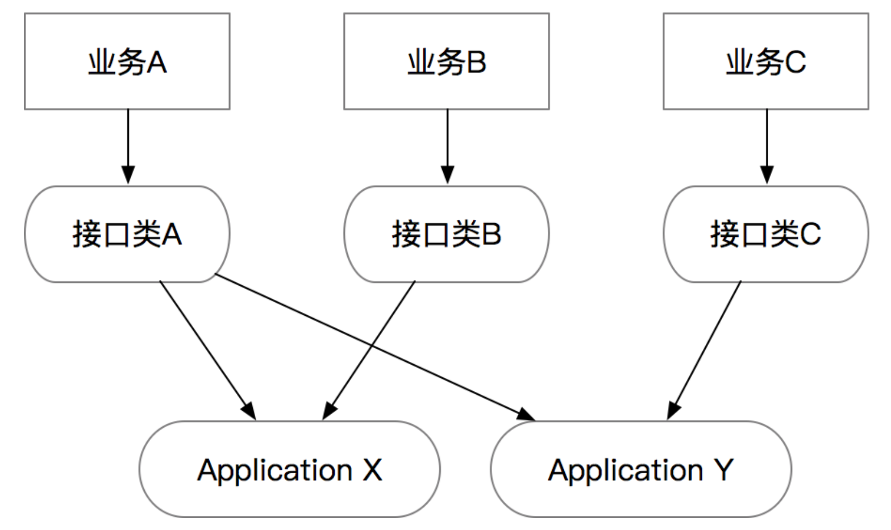
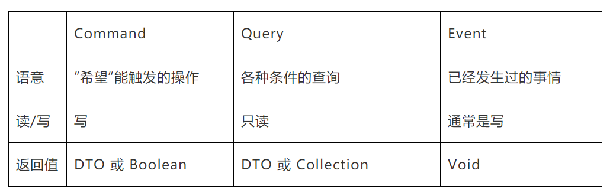
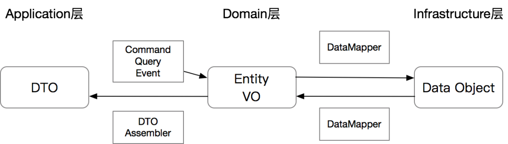
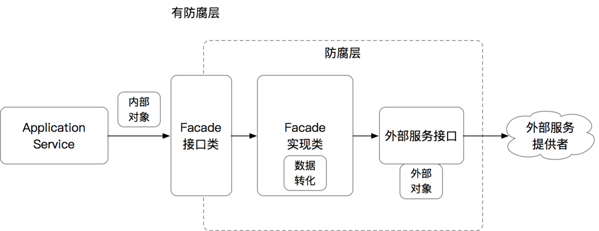
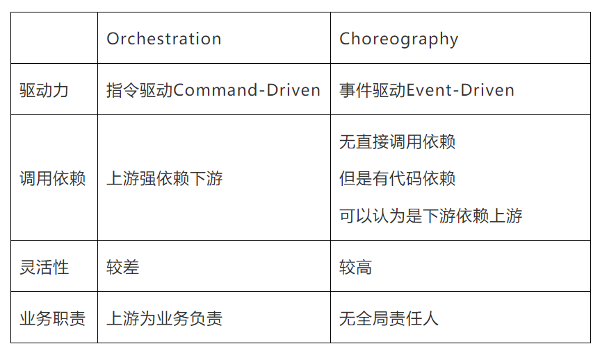
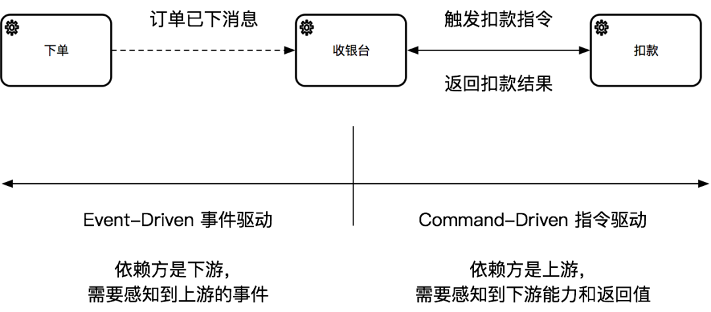

# 代码实战

## Java 代码风格

IDEA 正常的代码格式

**常量和变量**

- 有意义的命名；
- 禁止魔法值，定义有意义的常量/枚举；

**换行与高度**

- 单方法长度不超过80行，单行长度 120字符；

**控制语句**

- 多层嵌套不超过三层，因条件判断和分支逻辑呈指数关系，（卫语句，策略模式，状态模式）；

**注释**

- Nothing is strange：需要注释；
- Less is more：代码自解释；
- Advance with the time：跟代码时刻保持一致；

## POJO

> Plain Ordinary Java Object：只含 get, set, toString 方法 的简单类

DO: Domain Object

BO: Bussiness Object

DTO: Data Transfer Object

VO: Viewer Object

AO: Application Object

## 基本类型和包装类型

使用基本类型还是包装类型：

- 所有的 POJO 类属性必须使用包装数据类型（区分默认值和NULL）；
- RPC方法的返回值和参数必须使用包装数据类型；
- 所有的局部变量推荐使用基本数据类型；


## DDD(领域驱动设计)

> DDD: Domain Driven Design
>
> 参考文献：[殷浩详解DDD：如何避免写流水账代码？](https://mp.weixin.qq.com/s/SjU1DbsXcBD-2DJt9z65zg)

面对老系统重构和迁移场景，有大量代码属于流水账代码，通常能看到开发**在对外的API接口里直接写业务逻辑代码**，或者在**一个服务里大量的堆接口**，导致业务逻辑实际无法收敛，接口**复用性比较差**。

### 示例

订单场景

```java
@RestController
@RequestMapping("/")
public class CheckoutController {
    @Resource
    private ItemService itemService;
    @Resource
    private InventoryService inventoryService;
    @Resource
    private OrderRepository orderRepository;

    @PostMapping("checkout")
    public Result<OrderDO> checkout(Long itemId, Integer quantity) {
        // 1) Session管理
        Long userId = SessionUtils.getLoggedInUserId();
        if (userId <= 0) {
            return Result.fail("Not Logged In");
        }
        
        // 2）参数校验
        if (itemId <= 0 || quantity <= 0 || quantity >= 1000) {
            return Result.fail("Invalid Args");
        }

        // 3）外部数据补全
        ItemDO item = itemService.getItem(itemId);
        if (item == null) {
            return Result.fail("Item Not Found");
        }

        // 4）调用外部服务
        boolean withholdSuccess = inventoryService.withhold(itemId, quantity);
        if (!withholdSuccess) {
            return Result.fail("Inventory not enough");
        }
      
        // 5）领域计算
        Long cost = item.getPriceInCents() * quantity;

        // 6）领域对象操作
        OrderDO order = new OrderDO();
        order.setItemId(itemId);
        order.setBuyerId(userId);
        order.setSellerId(item.getSellerId());
        order.setCount(quantity);
        order.setTotalCost(cost);

        // 7）数据持久化
        orderRepository.createOrder(order);

        // 8）返回
        return Result.success(order);
    }
}
```

### 问题

违背了`SRP（Single Responsbility Principle）`单一职责原则。这段代码里混杂了业务计算、校验逻辑、基础设施、和通信协议等，**在未来无论哪一部分的逻辑变更都会直接影响到这段代码**，当后人不断地在上面叠加新的逻辑时，会使代码复杂度增加、逻辑分支越来越多，最终造成**bug或者没人敢重构**的历史包袱。

### 分层思想

通过不同的**代码分层和规范**，拆分出**逻辑清晰、职责明确的分层和模块**，也便于一些通用能力的沉淀。

主要的几个步骤分为：

- 分离出独立的Interface接口层，负责处理网络协议相关的逻辑。

- 从真实业务场景中，找出具体用例（Use Cases），然后将具体用例通过专用的Command指令、Query查询、和Event事件对象来承接。

- 分离出独立的Application应用层，负责业务流程的编排，响应Command、Query和Event。每个应用层的方法应该代表整个业务流程中的一个节点。

- 处理一些跨层的横切关注点，如鉴权、异常处理、校验、缓存、日志等。

#### Interface接口层

**网络协议和业务逻辑解耦**：业务代码和网络协议混杂在一起，则会直接导致代码跟网络协议绑定，无法被复用。

接口层的组成：

- 网络协议的转化：通常这个已经由各种框架给封装掉了，我们需要构建的类要么是被注解的bean，要么是继承了某个接口的bean。

- 统一鉴权：比如在一些需要AppKey+Secret的场景，需要针对某个租户做鉴权的，包括一些加密串的校验

- Session管理：一般在面向用户的接口或者有登陆态的，通过Session或者RPC上下文可以拿到当前调用的用户，以便传递给下游服务。

- 限流配置：对接口做限流避免大流量打到下游服务

- 前置缓存：针对变更不是很频繁的只读场景，可以前置结果缓存到接口层

- 异常处理：通常在**接口层要避免将异常直接暴露给调用端**，所以需要在接口层做统一的异常捕获，转化为调用端可以理解的数据格式；

- 日志：在接口层打调用日志，用来做统计和debug等。一般微服务框架可能都直接包含了这些功能。

在Interface层，鉴权、Session、限流、缓存、日志等都比较直接，只有一个异常处理的点需要重点说下。

**Result VS Exception**

> Interface层的HTTP和RPC接口，返回值为Result，捕捉所有异常
>
> Application层的所有接口返回值为DTO，不负责处理异常

**AOP异常处理注解**

更简洁的方式：通过对Controller的接口做异常统一处理，避免每个接口都需要写注解。

```java

@PostMapping("checkout")
@ResultHandler
public Result<OrderDTO> checkout(Long itemId, Integer quantity) {
    CheckoutCommand cmd = new CheckoutCommand();
    OrderDTO orderDTO = checkoutService.checkout(cmd);
    return Result.success(orderDTO);
}
```

**接口层的接口的数量和业务间的隔离**

> 一个Interface层的类应该是“小而美”的，应该是面向“一个单一的业务”或“一类同样需求的业务”，需要尽量避免用同一个类承接不同类型业务的需求。

刻意去**追求接口的统一通常会导致方法中的参数膨胀，或者导致方法的膨胀**。

例子：假设有一个宠物卡和一个亲子卡的业务共用一个开卡服务，但是宠物需要传入宠物类型，亲子的需要传入宝宝年龄。

```java
// 可以是RPC Provider 或者 Controller
public interface CardService {
    // 1）统一接口，参数膨胀
    Result openCard(int petType, int babyAge);
    // 2）统一泛化接口，参数语意丢失
    Result openCardV2(Map<String, Object> params);
    // 3）不泛化，同一个类里的接口膨胀
    Result openPetCard(int petType);
    Result openBabyCard(int babyAge);
}
```

一个建议是当一个现有的接口类过度膨胀时，可以考虑对接口类做拆分，拆分原则和SRP一致。

```java

public interface PetCardService {
    Result openPetCard(int petType);
}

public interface BabyCardService {
    Result openBabyCard(int babyAge);
}
```

在DDD分层架构里，接口类的核心作用仅仅是协议层，每类业务的协议可以是不同的，而真实的业务逻辑会沉淀到应用层。Interface和Application的关系是多对多的。希望相对稳定的是Application层的逻辑。




#### Application层

> ApplicationService的接口入参只能是一个Command、Query或Event对象，CQE对象需要能代表当前方法的语意。唯一可以的例外是根据单一ID查询的情况，可以省略掉一个Query对象的创建。

Application层的几个核心类：

- ApplicationService应用服务：最核心的类，**负责业务流程的编排，但本身不负责任何业务逻辑**。

- DTO Assembler：负责将**内部领域模型转化为可对外的DTO**。

- Command、Query、Event对象：作为ApplicationService的入参。

- 返回的DTO：作为ApplicationService的出参。

**CQE**



示例：

```java
List<OrderDO> queryByItemId(Long itemId);
List<OrderDO> queryBySellerId(Long sellerId);
List<OrderDO> queryBySellerIdWithPage(Long sellerId, int currentPage, int pageSize);
```

问题在于：

- 难以扩展：每新增一个参数都有可能需要调用方升级。
- 难以测试：接口一多，职责随之变得繁杂，业务场景各异，测试用例难以维护。
- 这种类型的参数罗列，本身没有任何业务上的”语意“，只是一堆参数而已，无法明确的表达出来意图。

```java
public interface CheckoutService {
    OrderDTO checkout(@Valid CheckoutCommand cmd);
    List<OrderDTO> query(OrderQuery query);
    OrderDTO getOrder(Long orderId); // 注意单一ID查询可以不用Query
}

@Data
public class CheckoutCommand {
    private Long userId;
    private Long itemId;
    private Integer quantity;
}

@Data
public class OrderQuery {
    private Long sellerId;
    private Long itemId;
    private int currentPage;
    private int pageSize;
}
```

这个规范的好处是：提升了接口的稳定性、降低低级的重复，并且让接口入参更加语意化。

**CQE vs DTO**

- CQE是”意图“，所以CQE对象在理论上可以有”无限“个，每个代表不同的意图；
- DTO作为模型数据容器，和模型一一对应，所以是有限

**CQE的校验**

利用java标准JSR303或JSR380的Bean Validation来前置这个校验逻辑。

> CQE对象的校验应该前置，避免在ApplicationService里做参数的校验。
>
> 可以通过JSR303/380和Spring Validation来实现。

前面示例改为：

```java
@Validated // Spring的注解
public class CheckoutServiceImpl implements CheckoutService {
    OrderDTO checkout(@Valid CheckoutCommand cmd) { // 这里@Valid是JSR-303/380的注解
        // 如果校验失败会抛异常，在interface层被捕捉
    }
}
@Data
public class CheckoutCommand {
    @NotNull(message = "用户未登陆")
    private Long userId;
    @NotNull
    @Positive(message = "需要是合法的itemId")
    private Long itemId;
    @NotNull
    @Min(value = 1, message = "最少1件")
    @Max(value = 1000, message = "最多不能超过1000件")
    private Integer quantity;
}
```

**避免复用CQE**

CQE是有“意图”和“语意”的，我们需要尽量避免CQE对象的复用，哪怕所有的参数都一样，只要他们的语意不同，尽量还是要用不同的对象。比如对于Create和Update，虽然只有Id的区别，但两个操作的语意完全不一样，他们的**校验条件可能也完全不一样**，所以不应该复用同一个对象。

> 规范：针对于不同语意的指令，要避免CQE对象的复用。


**DTO Assembler**（mapstruct库）

> ApplicationService应该永远返回DTO而不是Entity。

- **构建领域边界**：ApplicationService的入参是CQE对象，出参是DTO，这些基本上都属于简单的POJO，来确保Application层的内外互相不影响。

- **降低规则依赖**：Entity里面通常会包含业务规则，如果ApplicationService返回Entity，则会导致调用方直接依赖业务规则。如果内部规则变更可能直接影响到外部。

- **通过DTO组合降低成本**：Entity是有限的，DTO可以是多个Entity、VO的自由组合，一次性封装成复杂DTO，或者有选择的抽取部分参数封装成DTO可以降低对外的成本。

DTO、Entity和DataObject之间的关系如下图：



**Result vs Exception**

> Application层只返回DTO，可以直接抛异常，不用统一处理。所有调用到的服务也都可以直接抛异常，除非需要特殊处理，否则不需要刻意捕捉异常。

避免了Result的一些常见且繁杂的`Result.isSuccess`判断。

**Anti-Corruption Layer防腐层**

```java
ItemDO item = itemService.getItem(cmd.getItemId());boolean withholdSuccess = inventoryService.withhold(cmd.getItemId(), cmd.getQuantity());
```

发现我们的ApplicationService会强依赖ItemService、InventoryService以及ItemDO这个对象。如果任何一个服务的方法变更，或者ItemDO字段变更，都会有可能影响到ApplicationService的代码。也就是说，我们自己的代码会因为强依赖了外部系统的变化而变更，这个在复杂系统中应该是尽量避免的。

ACL防腐层的简单原理如下：

- 对于依赖的外部对象，我们抽取出所需要的字段，生成一个内部所需的VO或DTO类。

- 构建一个新的Facade，在Facade中封装调用链路，将外部类转化为内部类。

- 针对外部系统调用，同样的用Facade方法封装外部调用链路



Repository可以认为是一种特殊的ACL，屏蔽了具体数据操作的细节，即使底层数据库结构变更，数据库类型变更，或者加入其他的持久化方式，Repository的接口保持稳定，ApplicationService就能保持不变。


#### 命令驱动/事件驱动

代码依赖关系来看：

- Orchestration：涉及到一个服务调用到另外的服务，对于调用方来说，是强依赖的服务提供方。

- Choreography：每一个服务只是做好自己的事，然后通过事件触发其他的服务，服务之间没有直接调用上的依赖。但要注意的是**下游还是会依赖上游的代码（比如事件类）**，所以可以认为是下游对上游有依赖。





虽然Orchestration 和 Choreography是两种完全不同的业务设计模式，但最终落到Application层的代码应该是一致的，这也是为什么Application层是“用例”而不是“接口”，是相对稳定的存在。


### 结论

Interface层：

- 职责：主要负责承接网络协议的转化、Session管理等。

- 接口数量：避免所谓的统一API，不必人为限制接口类的数量，每个/每类业务对应一套接口即可，接口参数应该符合业务需求，避免大而全的入参。

- 接口出参：统一返回Result。

- 异常处理：应该捕捉所有异常，避免异常信息的泄漏。可以通过AOP统一处理，避免代码里有大量重复代码。

Application层：

- 入参：具像化Command、Query、Event对象作为ApplicationService的入参，唯一可以的例外是单ID查询的场景。

- CQE的语意化：CQE对象有语意，不同用例之间语意不同，即使参数一样也要避免复用。

- 入参校验：基础校验通过Bean Validation api解决。Spring Validation自带Validation的AOP，也可以自己写AOP。

- 出参：统一返回DTO，而不是Entity或DO。

- DTO转化：用DTO Assembler负责Entity/VO到DTO的转化。


- 异常处理：不统一捕捉异常，可以随意抛异常。
