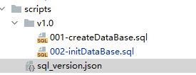

# 刷库

## 作用

1. 维护管理数据库的版本信息，记录当前服务数据库版本。
2. 支持实现连续多版本自动升级。
3. 对数据库操作进行控制，可将多个数据库操作声明成事务。

## [开源Flyway](https://flywaydb.org/documentation/)


### 介绍

1. 可执行数据库脚本语句，进行数据库升级
2. 管理数据版本，记录当前数据的版本信息
3. 版本升级支持事务，一个版本若失败则回滚
4. 刷库需要在服务停止的情况下进行


## 自定义实现

### 核心业务实现逻辑

- 从sql_version.json 中获取所有的版本号及对应的脚本路径
- 读取项目的数据库连接配置，连接数据库
- 从数据库中读取当前的版本号
- 如果version表不存在，则创建version表，设置初始版本0.0，否则，获取version表的版本号字段对应的值
- 循环判断 sql_version.json 中获取所有的版本号
- 如果json版本号 > 表中的版本号，则按序执行对应的sql语句，如3.0版本的时候，不需要执行2.0的sql
- sql执行全部成功，则返回true，否则以异常的形式抛出

### 刷库规范定义

#### bin目录下建upgrade_db.sh文件

```shell
#!/usr/bin/env bash

app_class_name=com.hongcheng.aibigdata.userservice.UserServiceApplication
pid=`jps -vm |grep ${app_class_name} |awk '{print $1}'`
BASE_HOME=$(cd `dirname $0`/../; pwd)

db_class=com.hongcheng.aibigdata.common.db.Upgrade
if [ $pid ]
then
echo "海星服务正在运行，请停止服务后进行刷库"
else
# 单独通过java执行
SQL_PATH=$BASE_HOME/scripts/sql_version.json

java -Dbase.dir=${BASE_HOME} -cp BASE_HOME/lib/*:BASE_HOME/conf/. -Dloader.main=${db_class} org.springframework.boot.loader.PropertiesLauncher $SQL_PATH

if [ $? -eq 0 ]; then
echo "刷库成功"
else
echo "刷库失败，请查看具体异常"
fi
fi
```

#### 集成common.util包

核心代码如下：

```java
import java.io.File;
import java.io.IOException;
import java.io.InputStreamReader;
import java.io.Reader;
import java.nio.charset.StandardCharsets;
import java.sql.Connection;
import java.sql.DatabaseMetaData;
import java.sql.DriverManager;
import java.sql.PreparedStatement;
import java.sql.ResultSet;
import java.sql.SQLException;
import java.sql.Statement;
import java.util.List;
import java.util.Properties;
import com.hongcheng.aibigdata.common.util.JsonUtil;
import org.slf4j.Logger;
import org.slf4j.LoggerFactory;
import org.springframework.beans.factory.config.YamlPropertiesFactoryBean;
import org.springframework.core.io.ClassPathResource;
import org.springframework.core.io.FileSystemResource;
import org.springframework.core.io.Resource;
import org.springframework.util.FileCopyUtils;

/**
* 数据库升级脚本执行
*/
public class Upgrade {
    private static final Logger LOG = LoggerFactory.getLogger(Upgrade.class);
    
    /**
    * Version表只有两个字段（property和value组成，长度限制为 char(64)
    */
    private static final String VERSION_TABLE_NAME = "version";
    
    private static final String APPLICATION_PATH = "application.yml";
    
    /**
    * 参数格式： --script-path $SCRIPT_HOME
    */
    public static void main(String[] args) {
        // 获取脚本的根目录
        String sqlInfoJsonPath = args[0];
        LOG.info("***********************************sql flush appliction start***********************************");
        LOG.info("SQL description file is {}", sqlInfoJsonPath);
        // 进行sql升级
        try {
            //传入StarFish HOME路径
            new Upgrade().upgrade(sqlInfoJsonPath);
        } catch (SQLException e) {
            LOG.error("sql error", e);
        } catch (Exception e) {
            LOG.error("execute error:", e);
        }
    }
    
    private Connection getConnection() {
        YamlPropertiesFactoryBean yaml = new YamlPropertiesFactoryBean();
        yaml.setResources(new ClassPathResource(APPLICATION_PATH));
        Properties properties = yaml.getObject();
        if (properties == null) {
            LOG.error("init dataSource error , please check the config yml");
            throw new NullPointerException("init dataSource properties error");
        }
        try {
            Class.forName(properties.getProperty("spring.datasource.driver-class-name"));
            return DriverManager.getConnection(properties.getProperty("spring.datasource.url"),
                                               properties.getProperty("spring.datasource.username"),
                                               properties.getProperty("spring.datasource.password"));
        } catch (ClassNotFoundException | SQLException e) {
            LOG.error("Find sql driver failed for:{}, exception: {}", properties.getProperty("spring.datasource.driver-class-name"), e);
            System.exit(-1);
        }
        return null;
    }
    
    public boolean upgrade(String sqlInfoJsonPath) throws SQLException, IOException {
        try (Connection conn = getConnection()) {
            //从json中获取所有的版本号及对应的脚本路径
            VersionJsonEntity versionJsonEntity = getVersionJsonEntity(sqlInfoJsonPath);
            if (versionJsonEntity == null) {
                return false;
            }
            List<VersionScriptEntity> versionScriptEntities = versionJsonEntity.getData();
            
            // 2. 从数据库中读取当前的版本号
            String versionDb = "0.0";
            
            //SQL语句具备重复执行不报错，不需要设置autoCommit
            if (!existVersion(conn, VERSION_TABLE_NAME)) {
                // 2.1 如果version表不存在，则创建version表，设置初始版本0.0
                createVersionTable(conn);
                insertVersion(conn, versionDb);
            } else {
                // 2.2 否则，获取version表的版本号字段对应的值
                versionDb = getVersion(conn);
            }
            LOG.info("current database version is {}", versionDb);
            //for循环判断（3.0的时候，不需要执行2.0的sql）
            for (VersionScriptEntity versionScriptEntity : versionScriptEntities) {
                String versionValue = versionScriptEntity.getVersion();
                List<String> sqlPaths = versionScriptEntity.getSql();
                if (compareVersionNum(versionValue, versionDb)) {
                    // 3. 如果json版本号 > 表中的版本号，则执行对应的sql语句
                    LOG.info("start to init database version : {}", versionValue);
                    run(conn, sqlPaths, sqlInfoJsonPath);
                    updateVersion(conn, versionValue);
                    versionDb = versionValue;
                }
            }
            LOG.info("update sql finish");
            // sql执行全部成功，则返回true，否则以异常的形式抛出
        }
        
        return true;
    }
    
    private String loadJson(String fileName) throws IOException {
        LOG.info("load json file {}", fileName);
        File file = new File(fileName);
        Resource resource = new FileSystemResource(file);
        byte[] bytes;
        try {
            bytes = FileCopyUtils.copyToByteArray(resource.getInputStream());
            return new String(bytes);
        } catch (IOException e) {
            LOG.error("load json error {}:", fileName);
            throw e;
        }
        
    }
    
    
    private VersionJsonEntity getVersionJsonEntity(String jsonPath) throws IOException {
        String jsonString = loadJson(jsonPath);
        //采用Java类解析，不解析成JsonNode
        return JsonUtil.decode(jsonString, VersionJsonEntity.class);
    }
    
    /**
    * 判断是否存在version表
    */
    private boolean existVersion(Connection conn, String tableName) throws SQLException {
        boolean flag;
        DatabaseMetaData meta = conn.getMetaData();
        String[] type = {"TABLE"};
        String catalog = conn.getCatalog();
        LOG.info("catalog is {} ", conn.getCatalog());
        ResultSet rs = meta.getTables(catalog, null, tableName, type);
        flag = rs.next();
        LOG.info("check version is :{}", flag);
        return flag;
        
    }
    
    /**
    * 获取版本号
    */
    private String getVersion(Connection conn) throws SQLException {
        //预编译语句
        // where property=version的条件（防止万一后面version表加其它的行）
        String sql = "select value from version where property='version'";
        try (PreparedStatement statement = conn.prepareStatement(sql)) {
            ResultSet rs = statement.executeQuery();
            // 4.处理数据库的返回结果(使用ResultSet类)
            if (rs.next()) {
                return rs.getString("value");
            }
            
        } catch (SQLException e) {
            LOG.error("get version table error");
            throw e;
        }
        return "";
    }
    
    /**
    * 更新版本号
    */
    private boolean updateVersion(Connection conn, String value) throws SQLException {
        //预编译语句
        String sql = "update version set value=? where property = 'version'";
        try (PreparedStatement statement = conn.prepareStatement(sql)) {
            statement.setString(1, value);
            int i = statement.executeUpdate();
            return i == 1;
        } catch (SQLException e) {
            LOG.error("update version table error");
            throw e;
        }
    }
    
    /**
    * 插入版本号
    */
    private boolean insertVersion(Connection conn, String value) throws SQLException {
        //预编译语句
        String sql = "insert into version(property,value) values('version',?)";
        try (PreparedStatement statement = conn.prepareStatement(sql)) {
            statement.setString(1, value);
            int i = statement.executeUpdate();
            return i == 1;
        } catch (SQLException e) {
            LOG.error("insert version table error");
            throw e;
        }
        
    }
    
    /**
    * 建version表
    */
    private boolean createVersionTable(Connection conn) throws SQLException {
        LOG.info("create version table");
        String sql = "CREATE TABLE version(" +
            " `property` VARCHAR(64) NOT NULL," +
            " `value` VARCHAR(64) NOT NULL," +
            "PRIMARY KEY (`property`));";
        try (Statement statement = conn.createStatement()) {
            int i = statement.executeUpdate(sql);
            return i == 1;
        } catch (SQLException e) {
            LOG.error("create version table error");
            throw e;
        }
    }
    
    
    /**
    * 运行指定的sql脚本
    *
    * @param sqlPaths 需要执行的sql脚本的路径集合
    */
    private boolean run(Connection conn, List<String> sqlPaths, String sqlPathHome) throws IOException {
        // 创建ScriptRunner，用于执行SQL脚本
        ScriptRunner runner = new ScriptRunner(conn);
        runner.setErrorLogWriter(null);
        runner.setLogWriter(null);
        // 执行SQL脚本
        for (String sqlPath : sqlPaths) {
            String filePath = sqlPathHome + sqlPath;
            File file = new File(filePath);
            Resource resource = new FileSystemResource(file);
            Reader inputStreamReader = new InputStreamReader(resource.getInputStream(), StandardCharsets.UTF_8);
            runner.runScript(inputStreamReader);
            LOG.info("excute sql ：{}", sqlPath);
        }
        return true;
    }
    
    
    /**
    * 比较版本
    *
    * @return true : first > second, otherwise false
    */
    public boolean compareVersionNum(String versionValue, String versionDb) {
        if (versionValue == null || versionDb == null) {
            return false;
        }
        String[] versionChars = versionValue.split("\\.");
        String[] dbChars = versionDb.split("\\.");
        for (int i = 0; i < versionChars.length; i++) {
            int versionInt = Integer.parseInt(versionChars[i]);
            int versionDbInt = Integer.parseInt(dbChars[i]);
            if (versionInt > versionDbInt) {
                return true;
            } else if (versionInt < versionDbInt) {
                return false;
            }
        }
        return false;
    }
}
```

#### 新建script文件夹

目录结构如下：



sql_version.json

```json
{
  "data": [
    {
      //按版本号执行
      "version": "1.0",
      "sql": [
        //按序执行对应地址的sql脚本
        "/v1.0/001-createDataBase.sql",
        "/v1.0/002-initDataBase.sql"
      ]
    }
  ]
}
```

对应实体类如下：

```java
public class VersionJsonEntity {

    private List<VersionScriptEntity> data;

    public List<VersionScriptEntity> getData() {
        return data;
    }

    public void setData(List<VersionScriptEntity> data) {
        this.data = data;
    }

}
      
public class VersionScriptEntity {
    private String version;
    private List<String> sql;

    public String getVersion() {
        return version;
    }

    public void setVersion(String version) {
        this.version = version;
    }

    public List<String> getSql() {
        return sql;
    }

    public void setSql(List<String> sql) {
        this.sql = sql;
    }
}
```