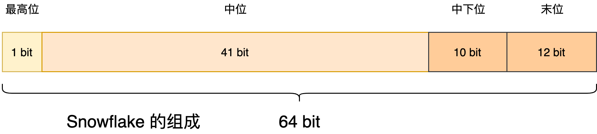

# Id Generator

> 参考：
>
> [1]. [Leaf——美团点评分布式ID生成系统](https://tech.meituan.com/2017/04/21/mt-leaf.html)

**全局唯一ID**应该具备的属性：

1. **全局唯一性**：不能出现重复的 ID 号，既然是唯一标识，这是最基本的要求；
2. **趋势递增**：在 MySQL InnoDB 引擎中使用的是聚集索引，由于多数 RDBMS 使用 B-tree 的数据结构来存储索引数据，在主键的选择上面我们应该尽量使用有序的主键保证写入性能；
3. **单调递增**：保证下一个 ID 一定大于上一个 ID，例如事务版本号、IM 增量消息、排序等特殊需求；
4. **信息安全**：如果 ID 是连续的，恶意用户的爬取工作就非常容易做了，直接按照顺序下载指定 URL 即可；如果是订单号就更危险了，竞争对手可以直接知道我们一天的单量。所以在一些应用场景下，会需要 ID 无规则、不规则。

## UUID

UUID(Universally Unique Identifier)的标准型式包含32个16进制数字，以连字号分为五段，形式为8-4-4-4-12的36个字符，示例：`550e8400-e29b-41d4-a716-446655440000`，到目前为止业界一共有5种方式生成UUID。

**优点：**

- 性能非常高：本地生成，没有网络消耗。

**缺点：**

- 不易于存储：UUID太长，16字节128位，通常以36长度的字符串表示，很多场景不适用。
- 信息不安全：基于MAC地址生成UUID的算法可能会造成MAC地址泄露，这个漏洞曾被用于寻找梅丽莎病毒的制作者位置。
- ID作为主键时在特定的环境会存在一些问题，比如做DB主键的场景下，UUID就非常不适用：
  - MySQL官方有明确的建议主键要尽量越短越好[4]，36个字符长度的UUID不符合要求；
  - 对MySQL索引不利：如果作为数据库主键，在InnoDB引擎下，UUID的无序性可能会引起数据位置频繁变动，严重影响性能。

## Snowflake（Twitter）

Snowflake算法描述：指定机器 & 同一时刻 & 某一并发序列，是唯一的。据此可生成一个**64 bits**的唯一ID（long）。默认采用上图字节分配方式：

- **sign(1bit)**
  固定1bit符号标识，即生成的UID为正数。
- **delta seconds (精确到毫秒，41 位的长度可以使用 69 年)**
  单位：秒，**最多可支持约70年**
- **worker id (10 bits)**
  机器id，最多可支持约1024个。
- **sequence (12 bits)**
  每秒下的并发序列，12 bits可支持**每秒 4096个并发**。

**优点：**

- 毫秒数在高位，自增序列在低位，整个ID都是趋势递增的。
- 不依赖数据库等第三方系统，以服务的方式部署，稳定性更高，生成ID的性能也是非常高的。
- 可以根据自身业务特性分配bit位，非常灵活。

**缺点：**

- 强依赖机器时钟，如果机器上时钟回拨，会导致发号重复或者服务会处于不可用状态。

## Leaf（美团）

### Leaf-segment数据库方案

每次获取一个segment(step决定大小)号段的值。用完之后再去数据库获取新的号段，可以大大的减轻数据库的压力。

**优点：**

- Leaf服务可以很方便的线性扩展，性能完全能够支撑大多数业务场景。
- ID号码是趋势递增的8byte的64位数字，满足上述数据库存储的主键要求。
- 容灾性高：Leaf服务内部有号段缓存，即使DB宕机，短时间内Leaf仍能正常对外提供服务。
- 可以自定义max_id的大小，非常方便业务从原有的ID方式上迁移过来。

**缺点：**

- ID号码不够随机，能够泄露发号数量的信息，不太安全。
- TP999数据波动大，当号段使用完之后还是会hang在更新数据库的I/O上，tg999数据会出现偶尔的尖刺。
- DB宕机会造成整个系统不可用。

### Leaf-snowflake方案

workerId的生成：

- 通过zk的持久化节点，获取序号，并且通过本地文件缓存id，弱依赖ZK；

时间戳问题：

- 每隔一段时间(3s)上报自身系统时间写入ZK的leaf_forever/${self}；
- 机器启动时，比较其他机器注册在zk上的时间，小于一定阈值，则认为时间没问题，成功启动，否则启动失败；
- **做一层重试，然后上报报警系统，更或者是发现有时钟回拨之后自动摘除本身节点并报警**，通过**比较当前时间和上次发号的时间**；
