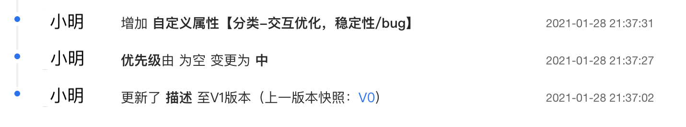
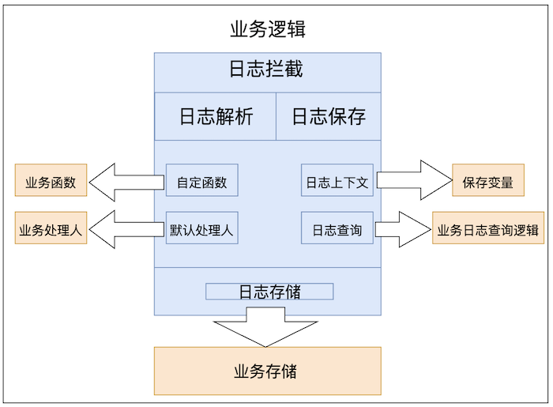
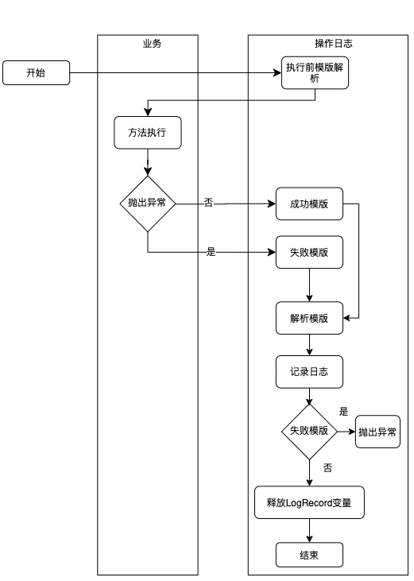
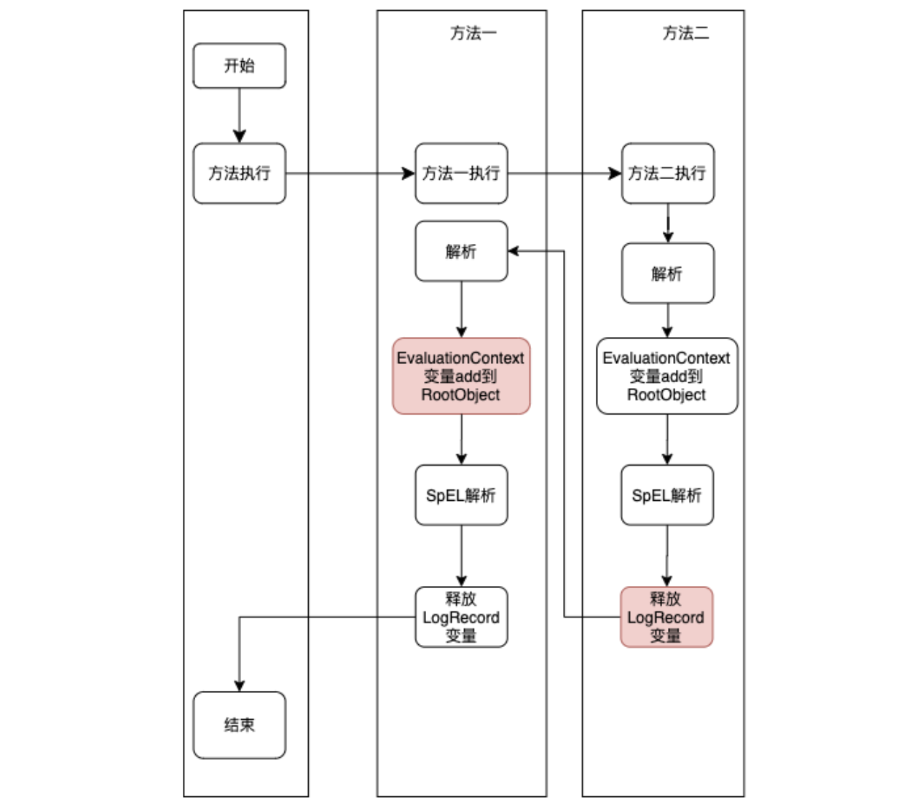

# 操作日志记录

> 来源：[如何优雅地记录操作日志？](https://tech.meituan.com/2021/09/16/operational-logbook.html)

## 场景

## 操作日志的使用场景



### 系统日志和操作日志的区别

**系统日志**：系统日志主要是为**开发排查问题提供依据**，一般打印在日志文件中；系统日志的可读性要求没那么高，日志中会包含代码的信息，比如在某个类的某一行打印了一个日志。

**操作日志**：主要是对**某个对象进行新增操作或者修改操作后记录下这个新增或者修改**，操作日志要求**可读性比较强**，因为它主要是给用户看的，比如订单的物流信息，用户需要知道在什么时间发生了什么事情。再比如，客服对工单的处理记录信息。


## 思路

### 使用 Canal 监听数据库记录操作日志

Canal 是一款基于 MySQL 数据库增量日志解析，提供增量数据订阅和消费的开源组件，通过采用监听数据库 Binlog 的方式，这样可以从底层知道是哪些数据做了修改，然后根据更改的数据记录操作日志。

这种方式的优点是和业务逻辑完全分离。缺点局限性太高，**只能针对数据库的更改做操作日志记录**，如果修改涉及到其他团队的 RPC 的调用，就没办法监听数据库了，举个例子：给用户发送通知，通知服务一般都是公司内部的公共组件，这时候只能在调用 RPC 的时候手工记录发送通知的操作日志了。

### 通过日志文件的方式记录

```java
log.info("订单创建")
log.info("订单已经创建，订单编号:{}", orderNo)
log.info("修改了订单的配送地址：从“{}”修改到“{}”， "金灿灿小区", "银盏盏小区")
```

**问题一：操作人如何记录**

借助 SLF4J 中的 **MDC 工具类，把操作人放在日志上下文**中，然后在日志中统一打印出来。首先在用户的拦截器中把用户的标识 Put 到 MDC 中。

```java
@Component
public class UserInterceptor extends HandlerInterceptorAdapter {
  @Override
  public boolean preHandle(HttpServletRequest request, HttpServletResponse response, Object handler) throws Exception {
    //获取到用户标识
    String userNo = getUserNo(request);
    //把用户 ID 放到 MDC 上下文中
    MDC.put("userId", userNo);
    return super.preHandle(request, response, handler);
  }

  private String getUserNo(HttpServletRequest request) {
    // 通过 SSO 或者Cookie 或者 Auth信息获取到 当前登陆的用户信息
    return null;
  }
}
```

把 userId 格式化到日志中，使用` %X{userId}` 可以取到 MDC 中用户标识。

```
<pattern>"%d{yyyy-MM-dd HH:mm:ss.SSS} %t %-5level %X{userId} %logger{30}.%method:%L - %msg%n"</pattern>
```

**问题二：操作日志如何和系统日志区分开**

通过配置 Log 的配置文件，把有关操作日志的 Log 单独放到一日志文件中。

```xml
//不同业务日志记录到不同的文件
<appender name="businessLogAppender" class="ch.qos.logback.core.rolling.RollingFileAppender">
    <File>logs/business.log</File>
    <append>true</append>
    <filter class="ch.qos.logback.classic.filter.LevelFilter">
        <level>INFO</level>
        <onMatch>ACCEPT</onMatch>
        <onMismatch>DENY</onMismatch>
    </filter>
    <rollingPolicy class="ch.qos.logback.core.rolling.TimeBasedRollingPolicy">
        <fileNamePattern>logs/业务A.%d.%i.log</fileNamePattern>
        <maxHistory>90</maxHistory>
        <timeBasedFileNamingAndTriggeringPolicy class="ch.qos.logback.core.rolling.SizeAndTimeBasedFNATP">
            <maxFileSize>10MB</maxFileSize>
        </timeBasedFileNamingAndTriggeringPolicy>
    </rollingPolicy>
    <encoder>
        <pattern>"%d{yyyy-MM-dd HH:mm:ss.SSS} %t %-5level %X{userId} %logger{30}.%method:%L - %msg%n"</pattern>
        <charset>UTF-8</charset>
    </encoder>
</appender>
        
<logger name="businessLog" additivity="false" level="INFO">
    <appender-ref ref="businessLogAppender"/>
</logger>
```

然后在 Java 代码中单独的记录业务日志。

```java
//记录特定日志的声明
private final Logger businessLog = LoggerFactory.getLogger("businessLog");
 
//日志存储
businessLog.info("修改了配送地址");
```

**问题三：如何生成可读懂的日志文案**

可以采用 LogUtil 的方式，也可以采用切面的方式生成日志模板，后续内容将会进行介绍。这样就可以把日志单独保存在一个文件中，然后通过日志收集可以把日志保存在 Elasticsearch 或者数据库中，接下来看下如何生成可读的操作日志。

### 通过 LogUtil 的方式记录日志

```java
LogUtil.log(orderNo, "订单创建", "小明") //模板
LogUtil.log(orderNo, "订单创建，订单号"+"NO.11089999",  "小明")
String template = "用户%s修改了订单的配送地址：从“%s”修改到“%s”"
LogUtil.log(orderNo, String.format(tempalte, "小明", "金灿灿小区", "银盏盏小区"),  "小明")
```

当业务变得复杂后，记录操作日志放在业务代码中会导致业务的逻辑比较繁杂，最后导致 LogUtils.logRecord() 方法的调用存在于很多业务的代码中，对于代码的可读性和可维护性来说是一个灾难。

### 方法注解实现操作日志

```java
@LogRecord(content="修改了配送地址")
public void modifyAddress(updateDeliveryRequest request){
    // 更新派送信息 电话，收件人、地址
    doUpdate(request);
}
```

在注解的操作日志上记录固定文案，这样业务逻辑和业务代码可以做到解耦，让我们的业务代码变得纯净起来。但上面的文案是静态的，没有包含动态的文案。


## 方案：AOP 动态模板

模板解析的方式有很多种，这里使用了 SpEL（Spring Expression Language，Spring表达式语言）来实现。

- 假定获取当前登陆用户的方式是 `UserContext.getCurrentUser()`；

```java
@LogRecord(content = "修改了订单的配送人员：从“#oldDeliveryUserId”, 修改到“#request.userId”",
           operator = "#{T(com.meituan.user.UserContext).getCurrentUser()}", bizNo="#request.deliveryOrderNo")
public void modifyAddress(updateDeliveryRequest request, String oldDeliveryUserId){
    // 更新派送信息 电话，收件人、地址
    doUpdate(request);
}
```

**去掉添加的额外参数`oldDeliveryUserId`**：自定义函数

**将userId换成用户名，展示更友好**：自定义函数

**支持自定义函数是先执行，还是后执行**：比如更新时，需要查询当前的配送人员，如果后执行，则

```java
// 使用大括号把 Spring 的 SpEL 表达式包裹起来，这样做的好处：
// 一是把 SpEL（Spring Expression Language，Spring表达式语言）和自定义函数区分开便于解析；
// 二是如果模板中不需要 SpEL 表达式解析可以容易的识别出来，减少 SpEL 的解析提高性能
@LogRecord(content = "修改了订单的配送员：从“{queryOldUser{#request.deliveryOrderNo()}}”, 修改到“{getUserName{#request.userId}}”",
        bizNo="#request.deliveryOrderNo()")
public void modifyAddress(updateDeliveryRequest request){
    // 更新派送信息 电话，收件人、地址
    doUpdate(request);
}
```


## 实现

AOP 拦截器实现的，整体主要分为 **AOP 模块**、**日志解析模块**、**日志保存模块**、**Starter 模块**；

组件提供了4个扩展点，分别是：**自定义函数**、**默认处理人**、**业务保存和查询**；业务可以根据自己的业务特性定制符合自己业务的逻辑。



###  AOP 拦截逻辑

针对 @LogRecord 注解分析出需要记录的操作日志，然后把操作日志持久化，这里把注解命名为 @LogRecordAnnotation。

```java
@Target({ElementType.METHOD})
@Retention(RetentionPolicy.RUNTIME)
@Inherited
@Documented
public @interface LogRecordAnnotation {
    String success();

    String fail() default "";

    String operator() default "";

    String bizNo();

    String category() default "";

    String detail() default "";

    String condition() default "";
}
```

增加了 fail、category、detail、condition 等参数，这几个参数是为了满足特定的场景，后面还会给出具体的例子。

| 参数名    | 描述                             | 是否必填 |
| :-------- | :------------------------------- | :------- |
| success   | 操作日志的文本模板               | 是       |
| fail      | 操作日志失败的文本版本           | 否       |
| operator  | 操作日志的执行人                 | 否       |
| bizNo     | 操作日志绑定的业务对象标识       | 是       |
| category  | 操作日志的种类                   | 否       |
| detail    | 扩展参数，记录操作日志的修改详情 | 否       |
| condition | 记录日志的条件                   | 否       |

执行逻辑：



注意：

- 当使用 LogRecordAnnotation 的方法里面嵌套了另一个使用 LogRecordAnnotation 方法时，需要使用栈进行变量上下文的保存；

```java
public class LogRecordContext {
	// 如果支持线程池可以使用阿里巴巴开源的 TTL 框架
    private static final InheritableThreadLocal<Stack<Map<String, Object>>> variableMapStack = new InheritableThreadLocal<>();
   //其他省略....
}
```




### 难点（自定义函数）

**自定义函数的如何解析和实现，并且需要区分函数的执行时机。**


