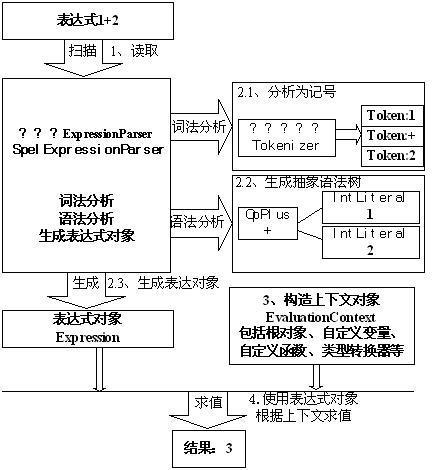

# Spring Expression Language

**表达式语言给静态Java语言增加了动态功能。**

SpEL是单独模块，只依赖于core模块，不依赖于其他模块，可以单独使用。

SpEL支持如下表达式：

**一、基本表达式：** 字面量表达式、关系，逻辑与算数运算表达式、字符串连接及截取表达式、三目运算及Elivis表达式、正则表达式、括号优先级表达式；

**二、类相关表达式：** 类类型表达式、类实例化、instanceof表达式、变量定义及引用、赋值表达式、自定义函数、对象属性存取及安全导航表达式、对象方法调用、Bean引用；

**三、集合相关表达式：** 内联List、内联数组、集合，字典访问、列表，字典，数组修改、集合投影、集合选择；不支持多维内联数组初始化；不支持内联字典定义；

**四、其他表达式**：模板表达式。

**注：SpEL表达式中的关键字是不区分大小写的。**


## 示例

```java
import org.junit.Test;
import org.springframework.expression.EvaluationContext;
import org.springframework.expression.Expression;
import org.springframework.expression.ExpressionParser;
import org.springframework.expression.spel.standard.SpelExpressionParser;
import org.springframework.expression.spel.support.StandardEvaluationContext;

public class SpelTest {
    @Test
    public void test1() {
        ExpressionParser parser = new SpelExpressionParser();
        Expression expression = parser.parseExpression("('Hello' + ' World').concat(#end)");
        EvaluationContext context = new StandardEvaluationContext();
        context.setVariable("end", "!");
        System.out.println(expression.getValue(context));
    }
}
```

1）创建解析器：**SpEL使用ExpressionParser接口表示解析器，提供SpelExpressionParser默认实现；**

2）解析表达式：使用ExpressionParser的parseExpression来解析相应的表达式为Expression对象。

3）构造上下文：准备比如变量定义等等表达式需要的上下文数据。

4）求值：通过Expression接口的getValue方法根据上下文获得表达式值。


## 原理



1. 首先定义表达式：“1+2”；
2. 定义解析器`ExpressionParser`实现，SpEL提供默认实现`SpelExpressionParser`；
   - `SpelExpressionParser`解析器内部使用`Tokenizer`类进行词法分析，即把字符串流分析为记号流，记号在SpEL使用`Token`类来表示；
   - 有了记号流后，解析器便可根据记号流生成内部抽象语法树；在SpEL中语法树节点由`SpelNode`接口实现代表：如`OpPlus`表示加操作节点、`IntLiteral`表示int型字面量节点；使用`SpelNodel`实现组成了抽象语法树；
   - 对外提供Expression接口来简化表示抽象语法树，从而隐藏内部实现细节，并提供`getValue`简单方法用于获取表达式值；SpEL提供默认实现为SpelExpression；
3. 3.定义表达式上下文对象（可选），SpEL使用`EvaluationContext`接口表示上下文对象，用于设置根对象、自定义变量、自定义函数、类型转换器等，SpEL提供默认实现`StandardEvaluationContext`；
4. 4.使用表达式对象根据上下文对象（可选）求值（调用表达式对象的`getValue`方法）获得结果。


### ExpressionParser接口

```java
public interface ExpressionParser {
 Expression parseExpression(String expressionString) throws ParseException;
 // 自定义ParseContext，内置有TemplateParserContext实现类
 Expression parseExpression(String expressionString, ParserContext context) throws ParseException;
}
```

示例：

```java
@Test
public void testParserContext() {
    ExpressionParser parser = new SpelExpressionParser();
    // 定义表达式是模块，表达式前缀为“#{”，后缀为“}”；
    // 使用parseExpression解析时传入的模板必须以“#{”开头，以“}”结尾，如"#{'Hello '}#{'World!'}"。
    ParserContext parserContext = new ParserContext() {
        @Override
        public boolean isTemplate() {
            return true;
        }

        @Override
        public String getExpressionPrefix() {
            return "#{";
        }

        @Override
        public String getExpressionSuffix() {
            return "}";
        }
    };
    String template = "#{'Hello '}#{'World!'}";
    Expression expression = parser.parseExpression(template, parserContext);
    System.out.println(expression.getValue());
}
```

### EvaluationContext接口

表示上下文环境，默认实现是`org.springframework.expression.spel.support.StandardEvaluationContext`类，使用`setRootObject`方法来设置根对象，使用`setVariable`方法来注册自定义变量，使用`registerFunction`来注册自定义函数等等。

### Expression接口

表示表达式对象，默认实现是`org.springframework.expression.spel.standard.SpelExpression`，提供`getValue`方法用于获取表达式值，提供`setValue`方法用于设置对象值。


## 语法

### 基本表达式

#### 字面量表达式

字面量包括：字符串、数字类型（int、long、float、double）、布尔类型、null类型。

```java
@Test
public void test2() {
    ExpressionParser parser = new SpelExpressionParser();

    String str1 = parser.parseExpression("'Hello World!'").getValue(String.class);
    int int1 = parser.parseExpression("1").getValue(Integer.class);
    long long1 = parser.parseExpression("-1L").getValue(long.class);
    double double1 = parser.parseExpression("1.1E+2").getValue(double.class);
    Object null1 = parser.parseExpression("null").getValue(Object.class);
}
```

#### 算数运算表达式

SpEL支持**加(+)、减(-)、乘(*)、除(/)、求余（%）、幂（^）**运算。

```java
int result1 = parser.parseExpression("1+2-3*4/2").getValue(Integer.class);
// 求余
int result2 = parser.parseExpression("4%3").getValue(Integer.class);
//幂运算
int result3 = parser.parseExpression("2^3").getValue(Integer.class);
```

#### 关系表达式

**等于（==）、不等于(!=)、大于(>)、大于等于(>=)、小于(<)、小于等于(<=)，区间（between，闭区间）运算**。

```java
boolean result = parser.parseExpression("1 between {1, 2}").getValue(boolean.class);
```

#### 逻辑表达式

且（and或者&&）、或(or或者||)、非(!或NOT)。

#### 字符串连接及截取表达式

使用`+`进行字符串连接，使用`'value'[0]`来截取一个字符；

#### 三目运算

三目运算符 **“表达式1?表达式2:表达式3”**用于构造三目运算表达式

#### Elivis运算符

**“表达式1?:表达式2”**，当表达式1为非null时则返回表达式1，当表达式1为null时则返回表达式2

#### 正则表达式

使用`str matches regex`，如`'123' matches '\d{3}'`将返回true；

#### 括号优先级表达式

使用“(表达式)”构造，括号里的具有高优先级。


### 类相关表达式

#### 类类型表达式

使用类类型表达式还可以进行访问**类静态方法及类静态字段**。

`T(Type)`来表示`java.lang.Class`实例，`Type`必须是类全限定名，`java.lang`包除外，即该包下的类可以不指定包名；

```java
@Test
public void testClassTypeExpression() {
    ExpressionParser parser = new SpelExpressionParser();
    //java.lang包类访问
    Class<String> result1 = parser.parseExpression("T(String)").getValue(Class.class);
    //其他包类访问
    String expression2 = "T(com.javacode2018.spel.SpelTest)";
    Class<SpelTest> value = parser.parseExpression(expression2).getValue(Class.class);
    //类静态字段访问
    int result3 = parser.parseExpression("T(Integer).MAX_VALUE").getValue(int.class);
    //类静态方法调用
    int result4 = parser.parseExpression("T(Integer).parseInt('1')").getValue(int.class);
}
```

#### 类实例化

类实例化同样使用java关键字`new`，类名必须是全限定名，但java.lang包内的类型除外

```java
@Test
public void testConstructorExpression() {
    ExpressionParser parser = new SpelExpressionParser();
    String result1 = parser.parseExpression("new String('路人甲java')").getValue(String.class
    Date result2 = parser.parseExpression("new java.util.Date()").getValue(Date.class);
}
```

#### instanceof表达式

跟Java内使用同义

```java
@Test
public void testInstanceOfExpression() {
    ExpressionParser parser = new SpelExpressionParser();
    Boolean value = parser.parseExpression("'路人甲' instanceof T(String)").getValue(Boolean.class);
    System.out.println(value);
}
```

#### 变量定义及引用

定义：EvaluationContext接口的`setVariable(variableName, value)`方法定义；

使用：`#variableName`引用，通过`.`调用类实例的方法，使用`#root`引用根对象，使用`#this`引用当前上下文对象；

```java
@Test
public void testVariableExpression() {
    ExpressionParser parser = new SpelExpressionParser();
    EvaluationContext context = new StandardEvaluationContext();
    context.setVariable("name", "路人甲java");
    context.setVariable("lesson", "Spring系列");

    //获取name变量，lesson调用类实例方法
    String name = parser.parseExpression("#name").getValue(context, String.class);
    System.out.println(name);
    int lesson = parser.parseExpression("#lesson.length").getValue(context, Integer.class);
    System.out.println(lesson);

    //StandardEvaluationContext构造器传入root对象，可以通过#root来访问root对象
    context = new StandardEvaluationContext("我是root对象");
    String rootObj = parser.parseExpression("#root").getValue(context, String.class);
    System.out.println(rootObj);  // 我是root对象

    //#this用来访问当前上线文中的对象
    String thisObj = parser.parseExpression("#this").getValue(context, String.class);
    System.out.println(thisObj);  // 我是root对象
}
```


#### 自定义函数

只支持**类静态方法注册为自定义函数**，使用`StandardEvaluationContext`的`registerFunction`方法进行注册自定义函数

```java
@Test
public void testFunctionExpression() throws SecurityException, NoSuchMethodException {
    //定义2个函数,registerFunction和setVariable都可以，不过从语义上面来看用registerFunction更恰当
    StandardEvaluationContext context = new StandardEvaluationContext();
    Method parseInt = Integer.class.getDeclaredMethod("parseInt", String.class);
    context.registerFunction("parseInt1", parseInt);

    ExpressionParser parser = new SpelExpressionParser();
    System.out.println(parser.parseExpression("#parseInt1('3')").getValue(context, int.class));
    
    String expression1 = "#parseInt1('3')";
    System.out.println(parser.parseExpression(expression1).getValue(context, boolean.class));
}
```

#### 表达式赋值

使用`Expression#setValue`方法可以给表达式赋值

```java
@Test
public void testAssignExpression1() {
    Object user = new Object() {
        private String name;

        public String getName() {
            return name;
        }

        public void setName(String name) {
            this.name = name;
        }

        @Override
        public String toString() {
            return "$classname{" +
                    "name='" + name + '\'' +
                    '}';
        }
    };
    {
        //user为root对象
        ExpressionParser parser = new SpelExpressionParser();
        EvaluationContext context = new StandardEvaluationContext(user);
        parser.parseExpression("#root.name").setValue(context, "路人甲java");
        System.out.println(parser.parseExpression("#root").getValue(context, user.getClass()));
    }
    {
        //user为变量
        ExpressionParser parser = new SpelExpressionParser();
        EvaluationContext context = new StandardEvaluationContext();
        context.setVariable("user", user);
        parser.parseExpression("#user.name").setValue(context, "路人甲java");
        System.out.println(parser.parseExpression("#user").getValue(context, user.getClass()));
    }
}
```

#### 对象属性存取及安全导航表达式

如`a.property.property`这种点缀式获取；

修改对象属性值则可以通过**赋值表达式**或Expression接口的`setValue`方法修改。

- 对于属性名首字母是不区分大小写的；
- 安全导航运算符`(对象|属性)?.属性`，用来避免`?.`前边的表达式为null时抛出空指针异常，而是返回null；

```java
public static class Car {
    private String name;

    public String getName() {
        return name;
    }

    public void setName(String name) {
        this.name = name;
    }

    @Override
    public String toString() {
        return "Car{" +
                "name='" + name + '\'' +
                '}';
    }
}

public static class User {
    private Car car;

    public Car getCar() {
        return car;
    }

    public void setCar(Car car) {
        this.car = car;
    }

    @Override
    public String toString() {
        return "User{" +
                "car=" + car +
                '}';
    }
}

@Test
public void test5() {
    User user = new User();
    EvaluationContext context = new StandardEvaluationContext();
    context.setVariable("user", user);

    ExpressionParser parser = new SpelExpressionParser();
    //使用.符号，访问user.car.name会报错，原因：user.car为空
    try {
        System.out.println(parser.parseExpression("#user.car.name").getValue(context, String.class));
    } catch (EvaluationException | ParseException e) {
        System.out.println("出错了：" + e.getMessage());
    }
    //使用安全访问符号?.，可以规避null错误
    System.out.println(parser.parseExpression("#user?.car?.name").getValue(context, String.class));

    Car car = new Car();
    car.setName("保时捷");
    user.setCar(car);

    System.out.println(parser.parseExpression("#user?.car?.toString()").getValue(context, String.class));
}
```

#### 对象方法调用

跟Java语法一样；如`'haha'.substring(2,4)`将返回“ha”；而对于**根对象可以直接调用方法**；

#### Bean引用

SpEL支持使用`@`符号来引用Bean，在引用Bean时需要使用`BeanResolver`接口实现来查找Bean，Spring提供`BeanFactoryResolver`实现。

```java
@Test
public void test6() {
    DefaultListableBeanFactory factory = new DefaultListableBeanFactory();
    User user = new User();
    Car car = new Car();
    car.setName("保时捷");
    user.setCar(car);
    factory.registerSingleton("user", user);

    StandardEvaluationContext context = new StandardEvaluationContext();
    context.setBeanResolver(new BeanFactoryResolver(factory));

    ExpressionParser parser = new SpelExpressionParser();
    User userBean = parser.parseExpression("@user").getValue(context, User.class);
    System.out.println(userBean);
    System.out.println(userBean == factory.getBean("user"));
}
```

### 集合相关表达式

#### 内联List

使用`{表达式，……}`定义内联List，如`{1,2,3}`将返回一个整型的ArrayList，而“{}”将返回空的List：

- 字面量表达式列表，不可修改；

```java
@Test
public void test7() {
    ExpressionParser parser = new SpelExpressionParser();
    //将返回不可修改的空List
    List<Integer> result2 = parser.parseExpression("{}").getValue(List.class);
    //对于字面量列表也将返回不可修改的List
    List<Integer> result1 = parser.parseExpression("{1,2,3}").getValue(List.class);
    
    //对于列表中只要有一个不是字面量表达式，将只返回原始List，不会进行不可修改处理
    String expression3 = "{{1+2,2+4},{3,4+4}}";
    List<List<Integer>> result3 = parser.parseExpression(expression3).getValue(List.class);
    result3.get(0).set(0, 1);
}
```

### **内联数组**

和 Java 数组定义类似，只是在定义时进行多维数组初始化。

```java
int[][][] result4 = parser.parseExpression("new int[1][2][3]{{1}{2}{3}}").getValue(int[][][].class);
```

#### 集合，字典元素访问

使用`集合[索引]`访问集合元素，使用`map[key]`访问字典元素；

```java
//SpEL内联List访问  
int result1 = parser.parseExpression("{1,2,3}[0]").getValue(int.class);  

//SpEL目前支持所有集合类型的访问  
Collection<Integer> collection = new HashSet<Integer>();  
collection.add(1);  
collection.add(2);  

EvaluationContext context2 = new StandardEvaluationContext();  
context2.setVariable("collection", collection);  
int result2 = parser.parseExpression("#collection[1]").getValue(context2, int.class);  

//SpEL对Map字典元素访问的支持  
Map<String, Integer> map = new HashMap<String, Integer>();  
map.put("a", 1);  

EvaluationContext context3 = new StandardEvaluationContext();  
context3.setVariable("map", map);  
int result3 = parser.parseExpression("#map['a']").getValue(context3, int.class);
```

#### 列表，字典，数组元素修改

可以使用赋值表达式或Expression接口的`setValue`方法修改；

```java
@Test
public void test8() {
    ExpressionParser parser = new SpelExpressionParser();

    //修改list元素值
    List<Integer> list = new ArrayList<Integer>();
    list.add(1);
    list.add(2);

    EvaluationContext context1 = new StandardEvaluationContext();
    context1.setVariable("collection", list);
    parser.parseExpression("#collection[1]").setValue(context1, 4);
    int result1 = parser.parseExpression("#collection[1]").getValue(context1, int.class);
    System.out.println(result1);

    //修改map元素值
    Map<String, Integer> map = new HashMap<String, Integer>();
    map.put("a", 1);
    EvaluationContext context2 = new StandardEvaluationContext();
    context2.setVariable("map", map);
    parser.parseExpression("#map['a']").setValue(context2, 4);
    Integer result2 = parser.parseExpression("#map['a']").getValue(context2, int.class);
    System.out.println(result2);
}
```

#### 集合投影

根据集合中的元素中通过选择来构造另一个集合，该集合和原集合具有相同数量的元素；

SpEL使用`(list|map).![投影表达式]`来进行投影运算，类似执行`map`映射：

- “#this”代表每个集合或数组元素；
- Map投影最终只能得到List结果，对于投影表达式中的`#this`将是`Map.Entry`，所以可以使用`value`来获取值，使用`key`来获取键。

```java
@Test
public void test9() {
    ExpressionParser parser = new SpelExpressionParser();

    //1.测试集合或数组
    List<Integer> list = new ArrayList<Integer>();
    list.add(4);
    list.add(5);
    EvaluationContext context1 = new StandardEvaluationContext();
    context1.setVariable("list", list);
    // 所有元素 + 1
    Collection<Integer> result1 = parser.parseExpression("#list.![#this+1]").getValue(context1, Collection.class);
    result1.forEach(System.out::println);

    System.out.println("------------");
    //2.测试字典
    Map<String, Integer> map = new HashMap<String, Integer>();
    map.put("a", 1);
    map.put("b", 2);
    EvaluationContext context2 = new StandardEvaluationContext();
    context2.setVariable("map", map);
    // "#map.![#this.value+1]"
    List<Integer> result2 = parser.parseExpression("#map.![value+1]").getValue(context2, List.class);
    result2.forEach(System.out::println);
}
```

#### 集合选择

根据原集合通过条件表达式选择出满足条件的元素并构造为新的集合；

SpEL使用`(list|map).?[选择表达式]`，其中选择表达式结果必须是boolean类型，如果**true则选择的元素将添加到新集合**中，false将不添加到新集合中。

- Map的选择结果还是Map，跟投影不一样；

```java
@Test
public void test10() {
    ExpressionParser parser = new SpelExpressionParser();

    //1.测试集合或数组
    List<Integer> list = new ArrayList<Integer>();
    list.add(4);
    list.add(7);
    EvaluationContext context1 = new StandardEvaluationContext();
    context1.setVariable("list", list);
    Collection<Integer> result1 = parser.parseExpression("#list.?[#this>4]").getValue(context1, Collection.class);
    result1.forEach(System.out::println);
    
}
//2.测试字典
Map<String, Integer> map = new HashMap<String, Integer>();
map.put("a", 1);
map.put("b", 2);
map.put("c", 3);
EvaluationContext context2 = new StandardEvaluationContext();
context2.setVariable("map", map);
Map<String, Integer> result2 = parser.parseExpression("#map.?[key!='a']").getValue(context2, Map.class);
```

#### 表达式模板

模板表达式就是由**字面量**与**一个或多个表达式块**组成。每个**表达式块**由`前缀+表达式+后缀`形式组成，如**${1+2}**即表达式块。

- `Error ${#v0} $​{#v1}`表达式表示由字面量“Error ”、模板表达式“#v0”、模板表达式“#v1”组成，其中v0和v1表示自定义变量，需要在上下文定义。

```java
@Test
public void test11() {
    //创建解析器
    SpelExpressionParser parser = new SpelExpressionParser();
    //创建解析器上下文
    ParserContext context = new TemplateParserContext("%{", "}");
    Expression expression = parser.parseExpression("你好:%{#name},我们正在学习:%{#lesson}", context);

    //创建表达式计算上下文
    EvaluationContext evaluationContext = new StandardEvaluationContext();
    evaluationContext.setVariable("name", "路人甲java");
    evaluationContext.setVariable("lesson", "spring高手系列!");
    //获取值
    String value = expression.getValue(evaluationContext, String.class);
    System.out.println(value);
}
```


## 使用

maven配置，默认已经集成在`spring-boot-starter-web`中：

```xml
<dependency>
  <groupId>org.springframework</groupId>
  <artifactId>spring-expression</artifactId>
  <version>5.3.9</version>
  <scope>compile</scope>
</dependency>
```

### 注解风格的配置

基于注解风格的SpEL配置也非常简单，使用@Value注解来指定SpEL表达式，**该注解可以放到字段、方法及方法参数上**。

测试Bean类如下，使用@Value来指定SpEL表达式：

```java
public class SpELBean {  
    @Value("#{'Hello' + world}")  
    private String value;  
}
```

### 在Bean定义中SpEL的问题

“#{我不是SpEL表达式}”不是SpEL表达式，而是公司内部的模板，想换个前缀和后缀该如何实现呢？

`BeanFactoryPostProcessor`接口提供`postProcessBeanFactory`回调方法，它是在**IoC容器创建好但还未进行任何Bean初始化**时被ApplicationContext实现调用，因此在这个阶段把SpEL前缀及后缀修改掉是安全的

```java
import org.springframework.beans.BeansException;
import org.springframework.beans.factory.config.BeanExpressionResolver;
import org.springframework.beans.factory.config.BeanFactoryPostProcessor;
import org.springframework.beans.factory.config.ConfigurableListableBeanFactory;
import org.springframework.context.expression.StandardBeanExpressionResolver;
import org.springframework.stereotype.Component;

@Component
public class SpelBeanFactoryPostProcessor implements BeanFactoryPostProcessor {
    @Override
    public void postProcessBeanFactory(ConfigurableListableBeanFactory beanFactory) throws BeansException {
        BeanExpressionResolver beanExpressionResolver = beanFactory.getBeanExpressionResolver();
        if (beanExpressionResolver instanceof StandardBeanExpressionResolver) {
            StandardBeanExpressionResolver resolver = (StandardBeanExpressionResolver) beanExpressionResolver;
            resolver.setExpressionPrefix("%{");
            resolver.setExpressionSuffix("}");
        }
    }
}
```

