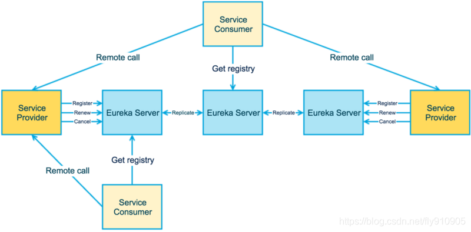

# 服务发现与注册

## 对比

除了Nacos，Eureka，Consul外，仍可以基于Zookeeper/Etcd 自行实现一套服务发现机制。

DNS服务发现，因为固有的缓存缺陷，暂不考虑。

| 特性              | Nacos                         | Eureka                       | Consul                | Etcd               |
| ----------------- | ----------------------------- | ---------------------------- | --------------------- | ------------------ |
| CAP               | CP: 配置中心 AP: 注册中心 | AP                           | CP                    | CP                 |
| 负载均衡策略      | 权重 /metadata/Selector       | Ribbon                       | Fabio                 | ?                  |
| 雪崩保护          | 有                            | 有                           | 无                    | ?                  |
| 服务健康检查      | TCP/HTTP/MYSQL/Client Beat    | Client Beat                  | TCP/HTTP/gRPC/Cmd     | 连接心跳           |
| 多数据中心        | 支持                          | 支持                         | 支持                  | ?                  |
| 跨注册中心同步    | 支持                          | 不支持                       | 支持                  | ?                  |
| 自动注销实例      | 支持                          | 支持                         | 支持                  | ?                  |
| 雪崩保护          | 有                            | 有                           | 无                    | ?                  |
| 访问协议          | HTTP/DNS                      | HTTP                         | HTTP/DNS              | ?                  |
| watch支持         | 支持 long polling/大部分增量  | 支持 long polling/大部分增量 | 全量/支持long polling | 支持 long polling  |
| 编程语言          | Java/go/python                | Java                         | go                    | Java/go/python/lua |
| Spring Cloud 集成 | 支持                          | 支持                         | 支持                  | 支持，2019年最新   |
| Dubbo集成         | 支持                          | 不支持                       | 支持                  | ?                  |
| K8s集成           | 支持                          | 不支持                       | 支持                  | ?                  |

## Consul

Consul 使用 Raft 算法来保证一致性（需要单独部署服务）

- **Service Discovery** : 服务注册与发现，Consul 的客户端可以做为一个服务注册到 Consul，也可以通过 Consul 来查找特定的服务提供者，并且根据提供的信息进行调用。
- **Health Checking**: Consul 客户端会定期发送一些健康检查数据和服务端进行通讯，判断客户端的状态、内存使用情况是否正常，用来监控整个集群的状态，防止服务转发到故障的服务上面。
- **KV Store**: Consul 还提供了一个容易使用的键值存储。这可以用来保持动态配置，协助服务协调、建立 Leader 选举，以及开发者想构造的其它一些事务。
- **Secure Service Communication**: Consul 可以为服务生成分布式的 TLS 证书，以建立相互的 TLS 连接。 可以使用 intentions 定义允许哪些服务进行通信。 可以使用 intentions 轻松管理服务隔离，而不是使用复杂的网络拓扑和静态防火墙规则。
- **Multi Datacenter**: Consul 支持开箱即用的多数据中心，这意味着用户不需要担心需要建立额外的抽象层让业务扩展到多个区域。

## Euerka

> Euerka 2.0 未发布过，1.0 仍在维护。

Eureka的集群中，只要有一台Eureka还在，就能保证注册服务可用（保证可用性），只不过查到的信息可能不是最新的（不保证强一致性）。

### Eureka Server

Eureka server和client之间每隔30秒会进行一次心跳通信，告诉server，client还活着。由此引出两个名词： 

- Renews threshold：server期望在每分钟中收到的心跳次数 
- Renews (last min)：上一分钟内收到的心跳次数。

**client个数为n，阈值为1+2*n（此为一个server且禁止自注册的情况）** 

Eurake有一个配置参数`eureka.server.renewalPercentThreshold`，定义了renews 和renews threshold的比值，默认值为0.85。当server在15分钟内，比值低于percent，即少了15%的微服务心跳，server会进入自我保护状态，`Self-Preservation`。在此状态下，server不会删除注册信息，这就有可能导致在调用微服务时，实际上服务并不存在。 

这种保护状态实际上是考虑了client和server之间的心跳是因为网络问题，而非服务本身问题，不能简单的删除注册信息。

### Eureka Client

TODO： health check

[Netflix Ribbon](https://github.com/Netflix/ribbon)是一个和Eureka共同工作的`IPC`客户端，它负责将请求负载均衡到可用的服务实例上。（维护状态，**[Spring Cloud LoadBalancer](https://cloud.spring.io/spring-cloud-static/spring-cloud-netflix/2.2.2.RELEASE/reference/html/#disabling-ribbon-with-eureka-server-and-client-starters)作为替代**）。

## Nacos

Nacos 支持基于 DNS 和基于 RPC 的**服务发现**，还支持**动态配置服务**。

- 配置主要用于微服务场景，基于 groupId 和 dataId 进行监听；

## Etcd

Etcd 分布式的键值对数据存储系统，基于Raft算法。

- 采用**层次化目录组织**存储数据，类似标准的文件系统；
- 可以监听**特定的Key或者目录**的变化；

基于Etcd，封装提供共享配置、服务的注册和发现。
