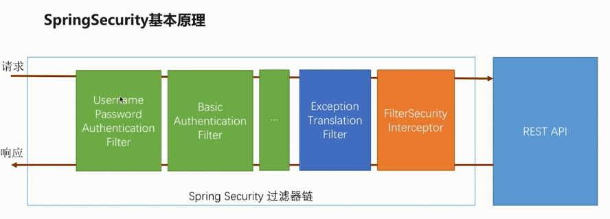
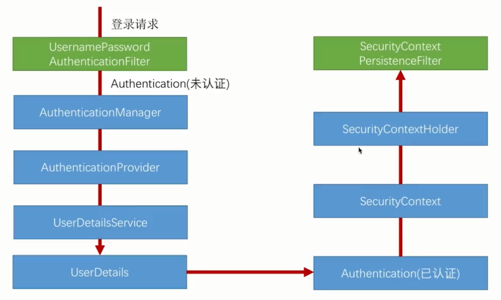

# Spring Security


## 认证流程



其中**UsernamePasswordAuthenticationFilter**和**BasicAuthenticationFilter**是两个核心过滤器。

FilterSecurityInterceptor会对之前这些核心过滤器进行相应判断，并抛出异常（例如身份认证没有通过）。

然后由ExceptionTranslationFilter捕获抛出来的异常，进行相应处理。



AuthenticationManager调用DaoAuthenticationProvider去认证。DaoAuthenticationProvider通过调用UserDetailsService的loadUserByUsername方法来获取UserDetails对象。然后比对UserDetails的密码与认证请求的密码是否一致，一致则表示认证通过。


**AuthenticationManager**

用户认证的管理类，所有的认证请求（比如login）都会通过提交一个token给**AuthenticationManager**的**authenticate**()方法来实现。具体校验动作会由**AuthenticationManager**将请求**转发给具体的实现类**来做。根据实现反馈的结果再调用具体的Handler来给用户以反馈。

**AuthenticationProvider**

**认证的具体实现类**，一个provider是一种认证方式的实现，比如提交的用户名密码是通过和DB中查出的user记录做比对实现的，那就有一个DaoProvider；如果我是通过CAS请求单点登录系统实现，那就有一个CASProvider。

一个AuthenticationManager可以包含多个Provider，每个provider通过实现一个support方法来表示自己支持那种Token的认证。**AuthenticationManager默认的实现类是ProviderManager**。

**UserDetailService**

用户认证通过Provider来做，所以Provider需要拿到系统已经保存的认证信息，**获取用户信息的接口spring-security抽象成UserDetailService**。**getAuthorities**()方法将返回此用户的所拥有的权限

**AuthenticationToken**

所有提交给**AuthenticationManager的认证请求都会被封装成一个Token**的实现，比如最容易理解的UsernamePasswordAuthenticationToken。

**SecurityContext**

当用户通过认证之后，就会为这个**用户生成一个唯一的SecurityContext，里面包含用户的认证信息Authentication**。通过SecurityContext我们可以获取到用户的标识Principle和授权信息GrantedAuthrity。在系统的任何地方只要通过SecurityHolder.getSecruityContext()就可以获取到SecurityContext。


Security才不管你是角色，还是权限。它**只比对字符串**。

比如它有个表达式hasRole("ADMIN")。那它实际上查询的是用户权限集合中是否存在字符串"ROLE_ADMIN"。


**粒度访问控制**，所有URL以"/admin"开头的用户必须拥有角色"ADMIN"才能访问。

```java
protected void configure(HttpSecurity http) throws Exception {
        http.authorizeRequests()
                .antMatchers("/admin/**").access("hasRole('ADMIN')")
                .antMatchers("/user/**").access("hasRole('USER')")
                .anyRequest().authenticated();
    
}
```

