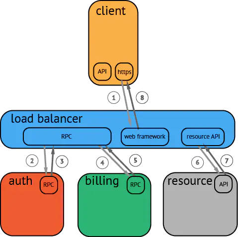

# Trace

Logging：

- 一条一条的记录，而记录本身是离散事件，没有任何直接关系。Logging 可以在 Console、ElasticSearch、Kafka、File 等各种媒介中显示。而 Logging 的格式又可以通过各种 Logging 的实现去定义 Logging 的格式。

Tracing：

- 整个处理链条的间接关系，把各种离散的 Logging 产生联系，让各种处理事件产生一定范围。

## 介绍

- Trace：一次完整的分布式调用跟踪链路。
- Span：跨服务的一次调用； 多个 Span 组合成一次 Trace 追踪记录。

一个完整的调用链跟踪系统，包括**调用链埋点**，**调用链数据收集**，**调用链数据存储和处理**，**调用链数据检索**（除了提供检索的 APIServer，一般还要包含一个酷炫的调用链前端）等若干重要组件。

按照调用时间进行排序的调用过程图示：

## 相关工作

- [Dapper](./pdf/Dapper, a Large-Scale Distributed Systems Tracing Infrastructure（2010）.pdf)：Google 生产环境下的分布式跟踪系统，鼻祖；
- [Zipkin](https://zipkin.io/)：分布式日志链路跟踪系统，OpenZipkin 社区管理；
- [Sleuth](https://spring.io/projects/spring-cloud-sleuth)：Spring Cloud，分布式追踪解决方案，其兼容了Zipkin、OpenTracing；
- [Jaeger](https://github.com/jaegertracing/jaeger)：CNCF，分布式跟踪系统；
- [SkyWalking](https://skywalking.apache.org/)：Apache，Tracing + Metrics + Logging；
- [OpenTelemetry](./opentelemetry.md)：CNCF，集成OpenTracing和OpenCensus两个项目形成，Tracing + Metrics + Logging；

