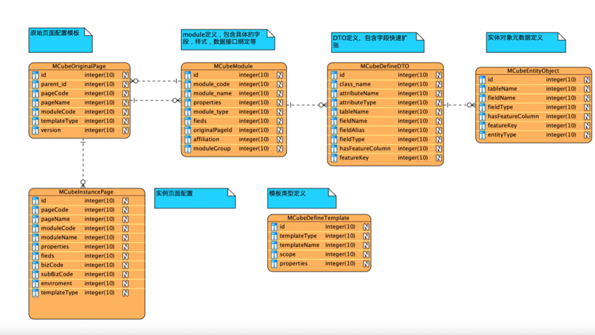
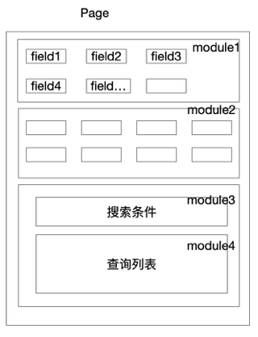
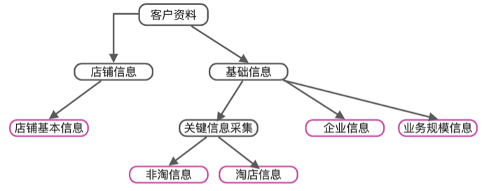
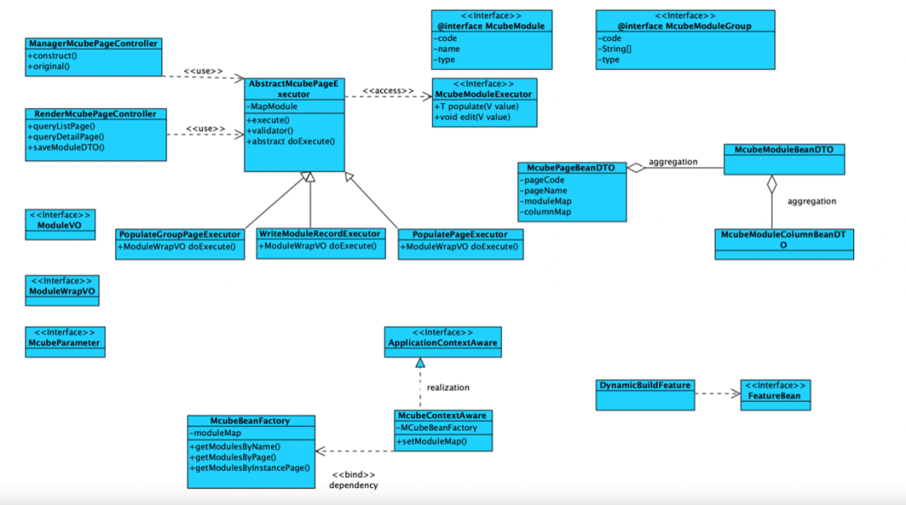
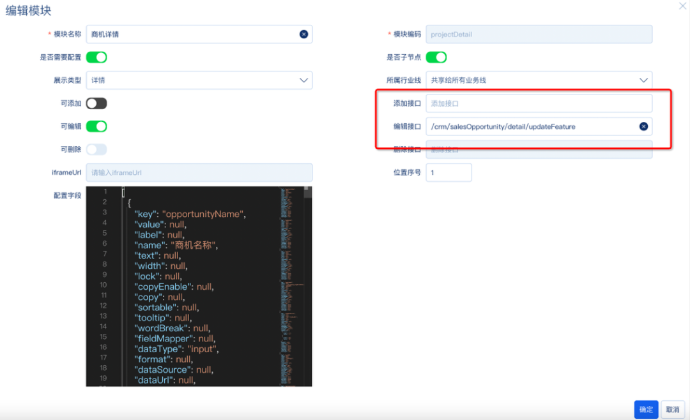

# LCDP

参考：《一种关于低代码平台(LCDP)建设实践与设计思路》

> Low Code Development Platform.
>
> 无需编码（0代码）或通过少量代码就可以快速生成应用程序的开发平台。

背景：

- 业务线特别多，每个业务线对同一个页面都有个性化布局和不同的字段需求；
- 

通过可视化进行应用程序开发的方法（参考可视编程语言），使具有不同经验水平的开发人员可以通过图形化的用户界面，使用拖拽组件和模型驱动的逻辑来创建网页和移动应用程序。

**核心能力**：

- 页面的千人千面，包含同一个页面不同布局、不同字段、不同样式；
- 数据模块的千行千面(千人千面)，根据不同身份执行不同的业务技术逻辑和服务编排；
- page一键创建，没有新的业务组建和新的module情况无需开发接入，0代码上线，运营同学自行配置页面；
- 前端组件复用，在没有新前端组件，前端无需参与开发，后端只需编写module对应的业务接口；
- 实现module可复用，module数据渲染、数据写入，查询条件、浮层、半推页面、页面操作；
- 新增字段扩展0代码，模型字段可以自定义，动态扩展，可定义来自本地数据库、远程接口数据；
- 环境可隔离，测试、预发、生产；
- 平台和业务代码分离，业务上线只需关注业务逻辑本身的代码；
- DO DTO可定义，动态映射；
- 数据枚举动态定义，动态绑定；

## 设计

一般低代码平台，主要分为两部分，**前端页面的渲染**和**后端服务接口绑定**（服务编排等）。

千人千面：

- 后端通过识别出用户的身份，通过接口输出给前端千人千面的个性化schema，前端就通过schema配置动态去渲染。

每次新增业务线（租户）后就有新增字段需求，而且字段的差异还挺多，约占80%：

- 通过定义一个特殊feature字段，存储类型为json，约定好协议，扩展字段按照不同行业存储在json内
  - mysql5.7上，在相同数据量的情况下，虚拟索引和普通索引查询效率基本一致，聚合操作使用虚拟列；

### DB设计

**DO的定义、DTO的定义、module定义（等同VO定义）、原始页面定义（originalPage）、实例化页面配置(instancePage)**

### 渲染页面逻辑

页面在渲染的时候，只需两个接口：

**1、实例页面数据结构 ；2、业务数据。**

前端根据两个接口分成两步渲染：

**1、初始化页面布局；2、填充业务数据。**

**template定义**

即是对页面类型的定义

- 列表页面
- 详情页面
- 半开页面
- 表单提交页面

**page定义**

**定义一张前端页面，分成两个阶段：origin；instance。**

**origin是定义的原始页面，可以理解成java 的Class类，可以构建多个实例页面。**

**instance page是最终渲染的运行态。**

页面结构：一个page 由N个module组成、一个module由N个field组成。

**module定义**

- 代表页面显示区域单元，有多个前端组件组成，是页面容器的布局单元；
- module_code 全局唯一，实例化后的module可被复用、重写、实现多态；
- modules 数据结构为一个 B+tree，只有叶子节点是有具体的实体数据（字段和属性配置）。

**module_type** 定义

对module类型的定义

1、主列表查询模块 MAIN_LIST_MODULE

2、导出模块 EXPORT_MODULE

3、弹出页面模块 FLOAT_PAGE_MODULE

4、搜索条件区域 SEARCH_ARE_MODULE

5、子列表查询模块 SUB_LIST_MODULE

6、编辑表单模块 EDIT_MODULE

7、信息平铺呈现 DISPLAY_FLAT_MODULE

**执行单元（moduleGroup executor）**

为了保证页面的数据填充效率，所以并不是一个module绑定一个服务接口：

- 一个执行单元对应一个或多个module，负责多个module的数据渲染和数据写入；
- moduleGroup executor是一个页面计算单元；
- 通过moduleCode动态路由对应的module group，执行相应的计算单元；
- 每个module 执行单元至少都包含读、新增、编辑和删除接口

**页面上的每一个module就自动绑定了后端的业务接口，实现了前后端一体化搭建。**

 

**field定义**

一个module对应多个field。如果要支持动态扩展，module需要对应一个实体模型。

module只代表一个VO层的部分显示片段，要想达到字段可以动态扩展需要定义一层实体模型的映射关系，这样才能找到**统一的feature对象去解析**，完成DO、DTO、VO的相互自动转换。

当module需要动态扩展的时候，从实体模型中去选择已经定义好的field。

**因为我们的VO也是动态生成的，这样就不需要因为新增一个字段而进行模型变更或者代码发布。即实现0代码上线。**

**运行时类设计图**

每一个模块背后都会绑定一个 moduleGroup executor ，业务开发只需通过对这个executor实现，即可快速完成开发上线，整个过程无需前端参与。简单的字段添加也无需发布上线，我们会通过动态扩展映射背后的DO扩展。



