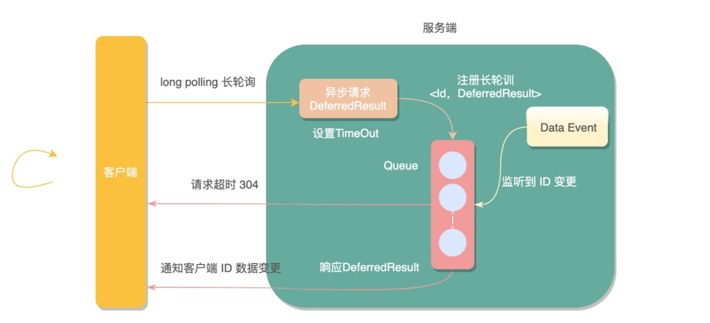

# 消息实时推送方案

> 需求：客户端及时收到服务端的消息通知

## 短轮询

**短轮询**：指定的时间间隔，由浏览器向服务器发出`HTTP`请求，服务器实时返回未读消息数据给客户端，浏览器再做渲染显示。

- 实现：JS定时器；
- 缺点：推送数据并不会频繁变更，无论后端此时是否有新的消息产生，客户端都会进行请求，势必会对服务端造成很大压力，浪费带宽和服务器资源。


## 长轮询(Comet)

客户端主动拉`pull`模型，应用长轮询（`Long Polling`）

- 由服务端控制响应客户端请求的返回时间，来减少客户端无效请求的一种优化手段；
- 客户端发起请求后，服务端不会立即返回请求结果，而是将请求挂起等待一段时间，如果此段时间内服务端数据变更，立即响应客户端请求，若是一直无变化则等到指定的**超时时间后响应请求，客户端重新发起长链接**；



### 实现

- `DeferredResult` 在`servelet3.0`后经过Spring封装提供的一种**异步请求机制**
  - 允许容器线程快速释放占用的资源，不阻塞请求线程，以此接受更多的请求提升系统的吞吐量。
  - 启动**异步**工作线程处理真正的业务逻辑，处理完成调用`DeferredResult.setResult(200)`提交响应结果。
- **一个ID可能会被多个长轮询请求监听**，使用`guava`包的`Multimap`结构，一个key对应多个value。一旦监听到key变化，对应的所有长轮询都会响应；
- 请求超过设置的超时时间，会抛出`AsyncRequestTimeoutException`异常，全局捕获统一返回，前端获取约定好的状态码后再次发起长轮询请求。
- 前端得到**非请求超时的状态码**，知晓数据变更，**主动查询未读消息数接口**，更新页面数据；

**注意**：

- **竞态分析**：如果在前端重新建立连接时，后端接收到新消息，此时前端还没有建立连接，该消息会丢失，**需要根据业务设计相应方案；**

- 

  

具体代码见：[LongPullingCode](https://gitee.com/oscsc/web-tech/tree/master/message_notify/LongPulling)

### 缺点

长轮询相比于短轮询在性能上提升了很多，但依然会产生较多的请求，在响应之后，会引起请求突然激增。


## SSE

服务器发送事件(`Server-sent events`)，简称`SSE`。

SSE在服务器和客户端之间打开一个单向通道，服务端响应的不再是一次性的数据包而**是`text/event-stream`类型的数据流信息**，在有数据变更时从服务器流式传输到客户端。

注：SSE不支持`IE`浏览器，对其他主流浏览器兼容性做的还不错。

### SSE与Websocket的区别

| WebSocket                      | SSE                                          |
| ------------------------------ | -------------------------------------------- |
| 全双工，可以同时发送和接收消息 | 单工，只能服务端单向发送消息                 |
| 独立的协议                     | **基于HTTP协议**                             |
| 需要代理服务器单独支持         | 代理服务器直接支持                           |
| 协议相对复杂                   | **协议相对简单，易于理解和使用**             |
| 默认不支持断线重连             | **默认支持断线重连**                         |
| 默认支持传送二进制数据         | 一般只用来传送文本，二进制数据需要编码后传送 |
| 不支持自定义发送的数据类型     | **支持自定义发送的数据类型**                 |
| 支持CORS                       | 不支持CORS，协议和端口都必须相同             |

- 以1次/秒或者更快的频率向服务端传输数据，那应该用WebSocket；
- 客户端和服务端脚本之间具有网络服务器情况时，一个SSE连接不仅使用一个套接字，还会占用一个Apache线程或进程

### 实现

客户端：通过 `EventSource`建立连接；

- 会自动断线重连（如超时重连），并且会发送`Last-Event-ID` header

服务端：Springboot 通过 `SseEmitter`实现；

- SSE消息的格式为`field:value\nfield:value\n\n`， field 支持如下

  ```java
  空: 即以:开头，表示注释，可以理解为服务端向客户端发送的心跳，确保连接不中断
  data：数据
  event: 事件，默认值为 message，如果是其它事件，前端可以通过 addEventListener 监听不同的事件
  id: 数据标识符用 id 字段表示，相当于每一条数据的编号
  retry: 重连时间
  ```

详细代码见：[SSE 代码](https://gitee.com/oscsc/web-tech/sse)

### Nginx 转发 SSE

- nginx upstream 超时连接关闭（upstream timeout），前端会自动进行重连；

```conf
proxy_set_header Upgrade $http_upgrade;
proxy_set_header Connection "upgrade";
proxy_http_version 1.1;

# Nginx 默认 OFF
proxy_cache off;

# 应该由 server 端发送 X-Accel-Buffering: no; 
# 针对 proxy_pass 的后端配置，好像不需要配置，即使开启前端也会实时响应
# proxy_buffering off;

# 该配置对于SSE不需要
# chunked_transfer_encoding off;
```


## MQTT

`MQTT` 全称(Message Queue Telemetry Transport)：一种基于发布/订阅（`publish`/`subscribe`）模式的`轻量级`通讯协议，通过订阅相应的主题来获取消息，是**物联网**（`Internet of Thing`）中的一个标准传输协议。

将消息的发布者（`publisher`）与订阅者（`subscriber`）进行分离，因此可以在不可靠的网络环境中，为远程连接的设备提供可靠的消息服务，使用方式与传统的MQ有点类似。

### 实现

https://mp.weixin.qq.com/s/U-fUGr9i1MVa4PoVyiDFCg

## Websocket

在`TCP`连接上进行全双工通信的协议

### 实现

springboot整合websocket，先引入`websocket`相关的工具包，和SSE相比额外的开发成本。

```xml
<!-- 引入websocket -->
<dependency>
    <groupId>org.springframework.boot</groupId>
    <artifactId>spring-boot-starter-websocket</artifactId>
</dependency>
```

使用`@ServerEndpoint`注解标注当前类为一个websocket服务器，客户端可以通过`ws://localhost:7777/webSocket/10086`来连接到WebSocket服务器端。

```java
@Component
@Slf4j
@ServerEndpoint("/websocket/{userId}")
public class WebSocketServer {
    //与某个客户端的连接会话，需要通过它来给客户端发送数据
    private Session session;
    private static final CopyOnWriteArraySet<WebSocketServer> webSockets = new CopyOnWriteArraySet<>();
    // 用来存在线连接数
    private static final Map<String, Session> sessionPool = new ConcurrentHashMap<String, Session>();
   
    @OnOpen
    public void onOpen(Session session, @PathParam(value = "userId") String userId) {
        try {
            this.session = session;
            webSockets.add(this);
            sessionPool.put(userId, session);
            log.info("websocket消息: 有新的连接，总数为:" + webSockets.size());
        } catch (Exception e) {
        }
    }
    /** 接收消息 */
    @OnMessage
    public void onMessage(String message) {
        log.info("websocket消息: 收到客户端消息:" + message);
    }
    
    /** 发送单点消息 */
    public void sendOneMessage(String userId, String message) {
        Session session = sessionPool.get(userId);
        if (session != null && session.isOpen()) {
            try {
                log.info("websocket消: 单点消息:" + message);
                session.getAsyncRemote().sendText(message);
            } catch (Exception e) {
                e.printStackTrace();
            }
        }
    }
}
```

前端初始化打开WebSocket连接，并监听连接状态，接收服务端数据或向服务端发送数据。

```javascript
<script>
    var ws = new WebSocket('ws://localhost:7777/webSocket/10086');
    // 获取连接状态
    console.log('ws连接状态：' + ws.readyState);
    //监听是否连接成功
    ws.onopen = function () {
        console.log('ws连接状态：' + ws.readyState);
        //连接成功则发送一个数据
        ws.send('test1');
    }
    // 接听服务器发回的信息并处理展示
    ws.onmessage = function (data) {
        console.log('接收到来自服务器的消息：');
        console.log(data);
        //完成通信后关闭WebSocket连接
        ws.close();
    }
    // 监听连接关闭事件
    ws.onclose = function () {
        // 监听整个过程中websocket的状态
        console.log('ws连接状态：' + ws.readyState);
    }
    // 监听并处理error事件
    ws.onerror = function (error) {
        console.log(error);
    }
    function sendMessage() {
        var content = $("#message").val();
        $.ajax({
            url: '/socket/publish?userId=10086&message=' + content,
            type: 'GET',
            data: { "id": "7777", "content": content },
            success: function (data) {
                console.log(data)
            }
        })
    }
</script>
```

### nginx 转发 Websocket

```conf
proxy_set_header Upgrade $http_upgrade;
proxy_set_header Connection "upgrade";
proxy_http_version 1.1;
```

proxied server 端需要定时发送 PING 消息保证 nginx 不会关闭连接。


