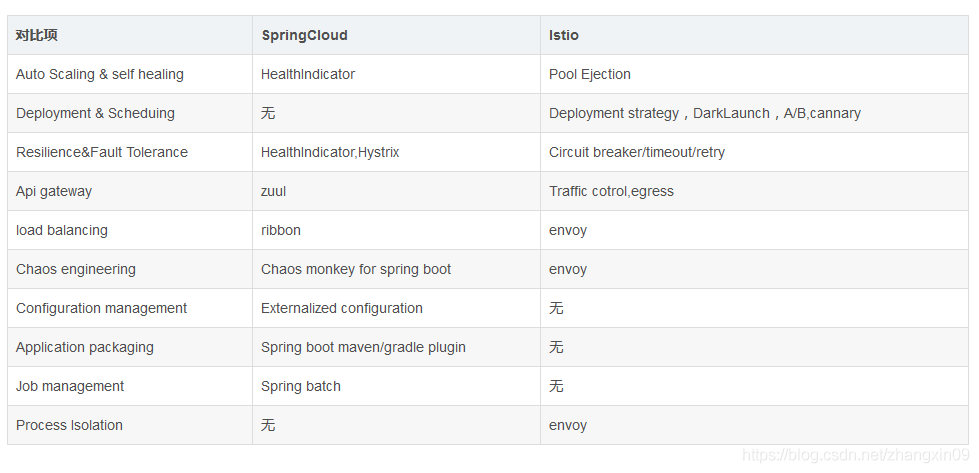

# Service Mesh

**Apache ServiceComb**：微服务解决方案

**lstio**：Connect, secure, control, and observe services.

**linkerd**：Ultralight service mesh for Kubernetes and beyond

**SpringCloud对比Istio**

## 微服务通信

在微服务架构中，随着微服务的增多，**微服务间的通信**需要

1）服务发现：消费方Consumer如何发现服务方Provider？

2）负载均衡：服务方多个实例如何能够负载均衡？

### 方案

在服务消费方和服务提供方之间加上一层代理，由代理负责服务发现和负载均衡功能，消费方通过代理间接访问目标服务。

#### 传统集中式

在服务消费者和生产者之间，**代理作为独立一层集中部署**，由独立团队(一般是运维或框架)负责治理和运维。

#### 客户端嵌入式

代理(包括服务发现和负载均衡逻辑)以客户库(如 jar 包)的形式嵌入在应用程序中。

一般需要**独立的服务注册中心组件**配合，服务启动时自动注册到注册中心并定期报心跳，**客户端代理则发现服务并做负载均衡**。

案例：**如阿里开源的Dubbo，华为的ServiceComb**。

#### 主机独立进程

折中模式，**代理作为独立进程部署**在每一个主机上，主机上的多个消费者共用代理。这个模式一般也需要**独立的服务注册中心组件**配合。

#### 对比分析

模式一相对比较重，有单点问题和性能问题；

模式二则有客户端复杂，支持多语言困难，无法集中治理的问题。

模式三是折中，分布式、没有单点问题，语言和业务程序无关，**分布式部署运维管理开销大**。

### Service Mesh（服务网格）

**本质上就是上面提到的主机独立进程模式**，代理除了负责**服务发现**和**负载均衡**，还负责**动态路由**、**容错限流**、**监控度量**和**安全日志**等业务无关的功能。

在实践中，Service Mesh通常由服务与轻量级网络代理（Sidecar，与服务部署在一起）组合而成。

**容器化是Service Mesh高效落地的基础**，**Kubernetes基于ETCD的注册中心机制依然是推荐的容器化+Service Mesh下的注册中心选择**