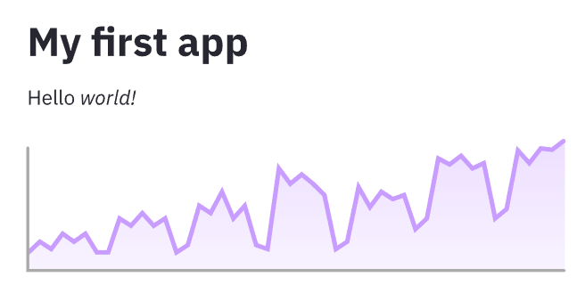

# Streamlint

> 主要定位于实现**机器学习和数据科学**的web应用的工具。

[Streamlit](https://link.zhihu.com/?target=https%3A//docs.streamlit.io/en/stable/) 是可以用于快速搭建Web应用的Python库。

## 特色

- API简单明了，易上手

API非常友好，事实上一天就能学会。

- **无须学习前端知识**（html、css、javascript）

Streamlit 基于tornado框架，封装了大量互动组件，同时也支持大量表格、图表、数据表等对象的渲染，并且支持栅格化响应式布局。

- 支持**markdown和html文本**的渲染

Streamlit的默认渲染语言就是markdown；除此以外，Streamlit也支持html文本的渲染，这意味着你也可以将任何html代码嵌入到streamlit应用里


## 使用

### 快速开始

```
pip install streamlit
streamlint hello
```


### My First App

```python
import streamlint as st
import pandas as pd

st.write("""
# My first app Hello *world*
""")

df = pd.read_csv("my_data.csv")
st.line_chart(df)
```

