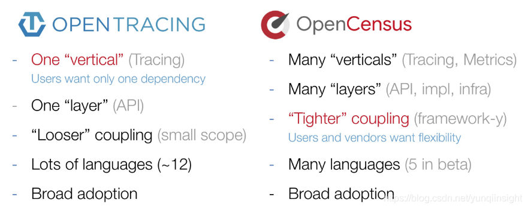

# [OpenTelemetry](https://opentelemetry.io/)

OpenTelemetry的发起者都是OpenTracing和OpenCensus的人，所以项目的第一宗旨就是：**兼容OpenTracing和OpenCensus**。对于使用OpenTracing或OpenCensus的应用不需要重新改动就可以接入OpenTelemetry。

核心工作主要集中在3个部分：

1. 规范的制定，包括概念、协议、API，除了自身的协议外，还需要把这些规范和W3C、GRPC这些协议达成一致；
2. 相关SDK、Tool的实现和集成，包括各类语言的SDK、代码自动注入、其他三方库（Log4j、LogBack等）的集成；
3. 采集系统的实现，目前还是采用OpenCensus的采集架构，包括Agent和Collector。

## 架构

官方目前推荐的是用Prometheus去做Metrics的Backend、用 Jaeger 去做Tracing的Backend。

**OpenTelemetry的终态就是实现Metrics、Tracing、Logging的融合，作为CNCF可观察性的终极解决方案。**

**Tracing**：提供了一个请求从接收到处理完毕整个生命周期的跟踪路径，通常请求都是在分布式的系统中处理，所以也叫做分布式链路追踪。

**Metrics**：提供量化的系统内/外部各个维度的指标，一般包括Counter、Gauge、Histogram等。

**Logging**：提供系统/进程最精细化的信息，例如某个关键变量、事件、访问记录等。
