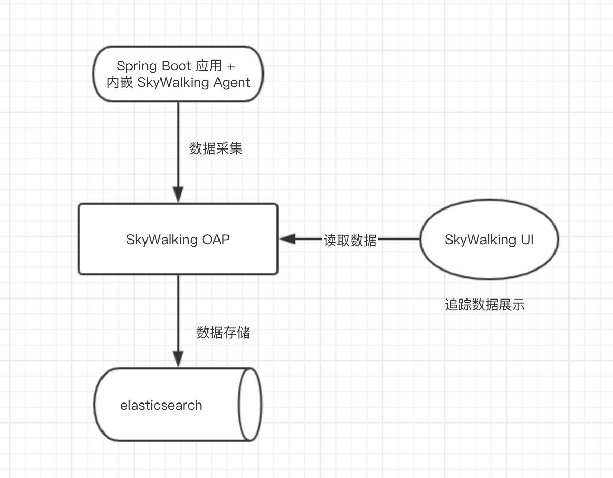

# Apache SkyWalking

> 分布式系统的应用程序性能监视工具，专为微服务、云原生架构和基于容器（Docker、K8s、Mesos）架构而设计。
>
> 提供分布式追踪、服务网格遥测分析、度量聚合和可视化一体化解决方案。

## 架构

> 考虑到让描述更简单，我们舍弃掉 Metric 指标相关，而着重在 Tracing 链路相关功能。

- 上部分 **Agent** ：负责从应用中，收集链路信息，发送给 SkyWalking OAP 服务器。**目前支持 SkyWalking、Zikpin、Jaeger 等提供的 Tracing 数据信息**。而我们目前采用的是，SkyWalking Agent 收集 SkyWalking Tracing 数据，传递给服务器。

- 下部分 **SkyWalking OAP** ：**负责接收 Agent 发送的 Tracing 数据信息，然后进行分析(Analysis Core) ，存储到外部存储器( Storage )，最终提供查询( Query )功能**。
- 右部分 **Storage** ：Tracing 数据存储。目前支持 ES、MySQL、Sharding Sphere、TiDB、H2 多种存储器。而我们目前采用的是 **ES** ，主要考虑是 SkyWalking 开发团队自己的生产环境采用 ES 为主。
- 左部分 **SkyWalking UI** ：负责提供控台，查看链路等等。

## Java Agent

https://github.com/apache/skywalking/tree/v8.2.0/docs/en/setup/service-agent/java-agent

### log

## 使用

### 集群

 SkyWalking **集群**环境，步骤如下：

- 第一步，搭建一个 Elasticsearch 服务的**集群**。
- 第二步，搭建一个注册中心的**集群**。目前 SkyWalking 支持 **Zookeeper、Kubernetes、Consul、Nacos 作为注册中心**。
- 第三步，搭建一个 **SkyWalking OAP 服务的集群**，同时参考[《SkyWalking 文档 —— 集群管理》](https://github.com/SkyAPM/document-cn-translation-of-skywalking/blob/master/docs/zh/master/setup/backend/backend-cluster.md)，将 SkyWalking OAP 服务注册到注册中心上。
- 第四步，启动一个 Spring Boot 应用，并配置 SkyWalking Agent。另外，在设置 SkyWaling Agent 的 `SW_AGENT_COLLECTOR_BACKEND_SERVICES` 地址时，需要设置多个 SkyWalking OAP 服务的地址数组。
- 第五步，搭建一个 SkyWalking UI 服务的**集群**，同时使用 Nginx 进行负载均衡。另外，在设置 SkyWalking UI 的 `collector.ribbon.listOfServers` 地址时，也需要设置多个 SkyWalking OAP 服务的地址数组。

