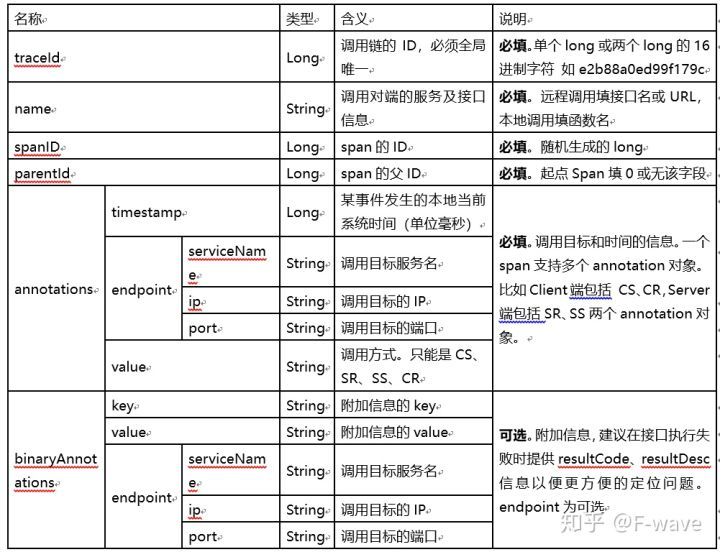
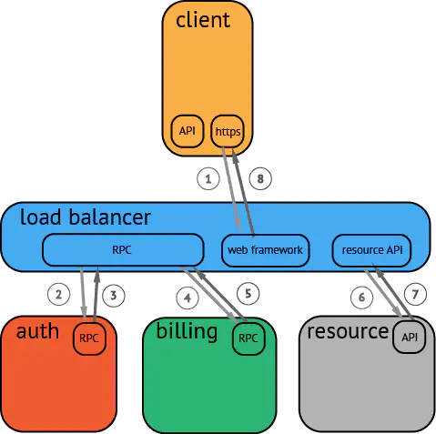
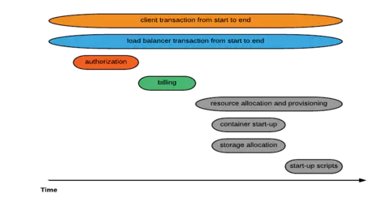

# Trace

- Trace：一次完整的分布式调用跟踪链路。
- Span：跨服务的一次调用； 多个 Span 组合成一次 Trace 追踪记录。

一个完整的调用链跟踪系统，包括**调用链埋点**，**调用链数据收集**，**调用链数据存储和处理**，**调用链数据检索**（除了提供检索的 APIServer，一般还要包含一个酷炫的调用链前端）等若干重要组件。

按照调用时间进行排序的调用过程图示：

## 相关工作

- [Dapper](./pdf/Dapper, a Large-Scale Distributed Systems Tracing Infrastructure（2010）.pdf)：Google 生产环境下的分布式跟踪系统，鼻祖；
- [Zipkin](https://zipkin.io/)：分布式日志链路跟踪系统，OpenZipkin 社区管理；
- [Sleuth](https://spring.io/projects/spring-cloud-sleuth)：Spring Cloud，分布式追踪解决方案，其兼容了Zipkin、OpenTracing；
- [Jaeger]()：CNCF，分布式跟踪系统；
- [SkyWalking](https://skywalking.apache.org/)：Apache，Tracing + Metrics + Logging；
- [OpenTelemetry](https://opentelemetry.io/)：CNCF，集成OpenTracing和OpenCensus两个项目形成，Tracing + Metrics + Logging；

## OpenTelemetry

OpenTelemetry的发起者都是OpenTracing和OpenCensus的人，所以项目的第一宗旨就是：**兼容OpenTracing和OpenCensus**。对于使用OpenTracing或OpenCensus的应用不需要重新改动就可以接入OpenTelemetry。

核心工作主要集中在3个部分：

1. 规范的制定，包括概念、协议、API，除了自身的协议外，还需要把这些规范和W3C、GRPC这些协议达成一致；
2. 相关SDK、Tool的实现和集成，包括各类语言的SDK、代码自动注入、其他三方库（Log4j、LogBack等）的集成；
3. 采集系统的实现，目前还是采用OpenCensus的采集架构，包括Agent和Collector。

官方目前推荐的是用Prometheus去做Metrics的Backend、用 Jaeger 去做Tracing的Backend。

**OpenTelemetry的终态就是实现Metrics、Tracing、Logging的融合，作为CNCF可观察性的终极解决方案。**

**Tracing**：提供了一个请求从接收到处理完毕整个生命周期的跟踪路径，通常请求都是在分布式的系统中处理，所以也叫做分布式链路追踪。

**Metrics**：提供量化的系统内/外部各个维度的指标，一般包括Counter、Gauge、Histogram等。

**Logging**：提供系统/进程最精细化的信息，例如某个关键变量、事件、访问记录等。